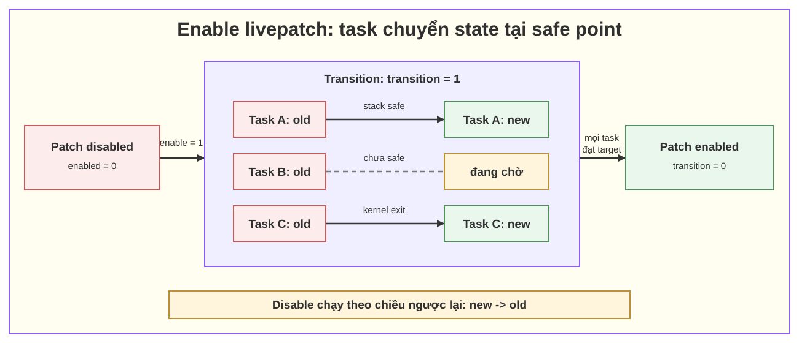

# 02. Transition state, safe state và consistency model

## 1. Vấn đề cốt lõi

Giả sử hàm cũ khóa theo thứ tự `A -> B`, còn bản sửa đổi thành `B -> A`. Nếu một task đang chạy nửa đầu code cũ rồi đột ngột nhảy sang nửa sau code mới, lock có thể bị lấy/thả sai thứ tự. Tương tự, code cũ và mới có thể hiểu một field hoặc trạng thái tạm thời theo hai nghĩa khác nhau.

Vì vậy livepatch không chỉ cần “đổi địa chỉ hàm”. Nó cần một **consistency model** trả lời:

1. Đơn vị chuyển đổi là gì?
2. Khi nào đơn vị đó an toàn để chuyển?
3. Trong lúc hệ thống có cả code cũ lẫn mới, lời gọi nào phải đi về phiên bản nào?

Linux livepatch dùng mô hình **per-task consistency** kết hợp stack checking và kernel/user boundary switching.

## 2. Ba khái niệm phải tách biệt

### 2.1. Patch state của một task

Trong lúc transition, mỗi task thuộc một trong hai phía:

- **unpatched/old state (`0`)**: các hàm thuộc patch tiếp tục đi vào implementation cũ;
- **patched/new state (`1`)**: các hàm thuộc patch được chuyển sang implementation mới.

Có thể xem qua `/proc/<pid>/patch_state` hoặc chính xác theo thread qua `/proc/<tgid>/task/<tid>/patch_state` nếu kernel cung cấp interface này.

Ngoài transition, file thường trả `-1`, nghĩa là hiện không có transition cần biểu diễn — **không có nghĩa task bị lỗi hoặc chắc chắn unpatched**.

### 2.2. Transition state của patch

`/sys/kernel/livepatch/<patch>/transition`:

- `1`: đang chuyển; vẫn còn task chưa hội tụ về target state;
- `0`: transition hoàn tất.

Mỗi thời điểm chỉ có một patch được transition. Khi enable, hướng là old → new. Khi disable, hướng là new → old.

### 2.3. Safe state/safe point

Safe state không phải một giá trị sysfs riêng. Đây là **điều kiện tại đó việc đổi patch state của task không làm task trộn code cũ và mới một cách nguy hiểm**.

Ví dụ:

- stack của sleeping task không chứa bất kỳ hàm bị patch nào;
- task vừa ra khỏi kernel về userspace;
- idle task hoặc kthread đi đến patch point được đặt ở nơi không giữ lock và dữ liệu đang nhất quán.

## 3. State machine khi enable



*Hình 1 — patch chỉ hết transition khi tất cả task đã đạt target state; task chưa safe vẫn ở old state.*

Khi disable, mũi tên đảo chiều. `enabled` diễn tả target của patch; `transition` cho biết mọi task đã đạt target hay chưa.

## 4. Kernel xác định safe state như thế nào

### 4.1. Stack checking cho sleeping task

Nếu kiến trúc có `CONFIG_HAVE_RELIABLE_STACKTRACE`, kernel có thể lấy stack đáng tin cậy của task đang ngủ:

- nếu không có hàm bị patch trên stack → có thể đổi state ngay;
- nếu còn hàm bị patch trên stack → giữ state cũ và thử lại định kỳ.

Điều quan trọng:

> Task đang ở kernel space vẫn có thể chuyển an toàn nếu stack không chứa hàm thuộc livepatch.

Ngược lại, một task ngủ sâu trong hàm bị patch có thể chặn transition dù không dùng CPU.

### 4.2. Kernel-exit/syscall barrier switching

Task userspace được chuyển khi đi qua ranh giới kernel → userspace, ví dụ:

- return khỏi syscall;
- return khỏi interrupt phát sinh khi task đang ở userspace;
- return theo đường xử lý signal.

Tại ranh giới này, call stack kernel của lần vào trước đã được tháo, nên task có thể bắt đầu lần vào kernel kế tiếp hoàn toàn theo patch state mới.

Tên “syscall barrier” dễ gây hiểu nhầm: safe boundary không chỉ xuất hiện ở một syscall cụ thể; ý chính là task hoàn tất kernel execution context hiện tại trước khi đổi state.

### 4.3. Idle task

Idle/swapper task không trở về userspace. Kernel đặt `klp_update_patch_state()` trong idle loop để nó đổi state tại vị trí an toàn trước khi CPU idle.

### 4.4. Kernel thread

Kthread cũng không trở về userspace. Hai khả năng chính:

- reliable stack checking xác nhận stack không chứa hàm bị patch;
- kthread có lời gọi `klp_update_patch_state()` tại safe point trong loop.

Workqueue/kthread worker thường có vòng lặp chung nên dễ chọn safe point hơn. Kthread có custom loop, ngủ vô hạn hoặc giữ resource đặc biệt cần phân tích theo từng trường hợp.

## 5. Ftrace giữ per-task consistency ra sao

Trong transition, ftrace handler không luôn luôn chọn code mới. Nó dựa vào patch state của `current` task:


*Hình 2 — trong transition, cùng một function entry có thể dẫn tới code cũ hoặc mới tùy `patch_state` của task hiện tại.*

Nhờ đó, task chưa safe tiếp tục dùng toàn bộ phiên bản cũ; task đã safe dùng phiên bản mới. Interrupt handler kế thừa patch state của task bị interrupt, và task mới fork kế thừa state của parent.

## 6. Ví dụ dễ hình dung

Patch thay `validate_request()` và `process_request()` theo cùng một semantics mới.

- Thread T1 đang ngủ bên trong `validate_request()` cũ: chưa được chuyển.
- Thread T2 đang ngủ ở `schedule_timeout()` nhưng stack không đi qua hai hàm trên: stack checking có thể chuyển T2 dù nó vẫn ở kernel.
- Thread T3 đang chạy userspace: lần vào kernel kế tiếp có thể chạy theo state mới.

Nếu T1 được wake và return khỏi `validate_request()`, đến khi stack không còn affected function hoặc nó return về userspace, T1 mới đổi state. Transition hoàn tất khi T1, T2, T3 và mọi task khác đều hội tụ.

## 7. Vì sao transition có thể kéo dài vô hạn

- Task ngủ lâu trong chính hàm bị patch.
- Task ở uninterruptible sleep (`D`) chờ I/O/hardware.
- Kthread không được wake hoặc không có safe patch point.
- Function bị patch nằm trong loop dài/không return.
- Stack trace không reliable nên kernel không thể chứng minh task an toàn.
- Probe/tracing khác xung đột với ftrace/livepatch.
- Patch chọn một hàm rất phổ biến làm nơi ngủ, khiến luôn có task giữ hàm trên stack.

Transition lâu không tự động có nghĩa kernel crash. Trong mô hình per-task, hệ thống có thể tiếp tục chạy với hai nhóm task; tuy nhiên patch **chưa áp đầy đủ**, CVE vẫn có thể còn exploitable qua task ở old state, và không thể coi rollout thành công.

## 8. Quan sát trạng thái

```bash
# Liệt kê patch
sudo kpatch list

# Mỗi patch một thư mục
ls -l /sys/kernel/livepatch/

# 1 = target enable, 0 = target disable
cat /sys/kernel/livepatch/<patch>/enabled

# 1 = đang transition, 0 = đã hội tụ
cat /sys/kernel/livepatch/<patch>/transition

# Trạng thái của một process/thread trong transition
cat /proc/<pid>/patch_state
cat /proc/<tgid>/task/<tid>/patch_state
```

Đừng chỉ kiểm tra `lsmod`: module đã được nạp không chứng minh transition hoàn tất. Tối thiểu phải xác nhận `transition=0`, `enabled=1`, log không có lỗi và kết quả functional/security test đạt.

## 9. Hủy transition và force khác nhau hoàn toàn

### Hủy/reverse

Khi đang enable mà muốn hủy, ghi target ngược lại:

```bash
echo 0 | sudo tee /sys/kernel/livepatch/<patch>/enabled
```

Các task sẽ hội tụ về old state. Chỉ gỡ module sau khi reverse transition hoàn tất. Thực tế nên ưu tiên lệnh quản lý của distro/kpatch thay vì thao tác sysfs trực tiếp.

### Force

```bash
echo 1 | sudo tee /sys/kernel/livepatch/<patch>/force
```

`force` xóa pending flag để đánh dấu các task đã chuyển mà không chứng minh stack an toàn. Hậu quả theo tài liệu kernel:

- có thể làm hệ thống sai semantics hoặc crash;
- patch module bị cấm remove vĩnh viễn trong phiên boot đó;
- có thể ảnh hưởng livepatch tiếp theo;
- sau khi force phải lên kế hoạch reboot và không áp thêm livepatch.

Không dùng force như cách “đạt KPI transition=0”. Chỉ thực hiện khi đã thu thập stack, patch vendor/nhóm kernel xác nhận affected stack an toàn và có kế hoạch reboot.

## 10. Nguồn

- [Linux kernel Livepatch — Consistency model](https://docs.kernel.org/livepatch/livepatch.html#consistency-model)
- [Linux kernel Livepatch — life-cycle and sysfs](https://docs.kernel.org/livepatch/livepatch.html#livepatch-life-cycle)
- [Linux kernel livepatch source document](https://github.com/torvalds/linux/blob/master/Documentation/livepatch/livepatch.rst)
