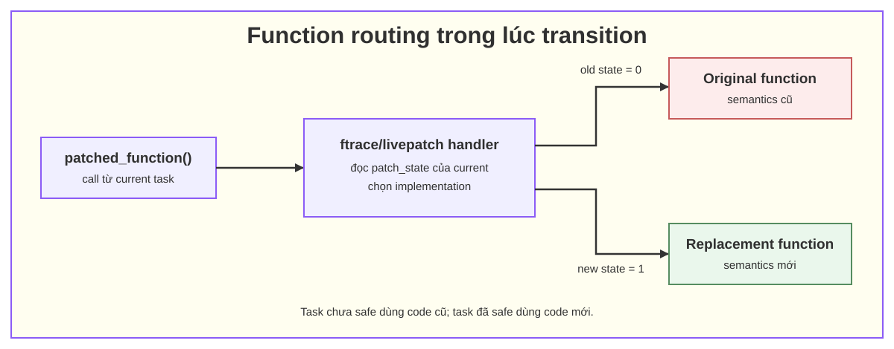
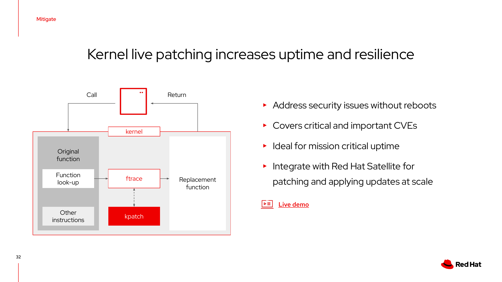

# 03. ftrace và cơ chế redirect hàm

## 1. ftrace là gì?

ftrace là framework tracing nằm trong Linux kernel. Nó có thể ghi lại function call, function graph, event, latency khi tắt IRQ/preemption và nhiều loại trace khác. Với livepatch, vai trò quan trọng của ftrace là cung cấp một điểm móc động gần đầu hàm để chuyển hướng execution.

Không nên hiểu ftrace chỉ là công cụ `echo function > current_tracer`. Phần người vận hành thấy trong `tracefs` và phần dynamic ftrace mà livepatch dùng chung một hạ tầng, nhưng mục đích khác nhau.

## 2. Điểm móc được tạo lúc build kernel

Khi kernel được compile với các option phù hợp, compiler chèn call site `mcount` hoặc `__fentry__` gần đầu các hàm có thể trace. `recordmcount`/build tooling thu thập các vị trí này vào section để dynamic ftrace quản lý.

Khi boot:

- các call site thường được đổi thành NOP để overhead thấp khi không tracing;
- khi một ftrace user đăng ký callback, kernel sửa call site tương ứng để đi vào ftrace trampoline/handler;
- việc sửa instruction được đồng bộ giữa CPU theo cơ chế của architecture.

Trên x86_64, livepatch cần điểm fentry đủ sớm, trước khi stack/parameter bị thay đổi theo cách làm redirect không an toàn.

## 3. Livepatch dùng ftrace như thế nào



*Hình 1 — ftrace đưa execution tới livepatch handler; handler chọn original hoặc replacement function theo state của `current` task.*

Livepatch handler thay đổi instruction pointer để execution tiếp tục ở hàm replacement. Trong transition, handler chọn phiên bản dựa trên patch state của task hiện tại; sau transition, mọi task chọn cùng target version.

Đây là mối liên hệ cần nhớ:

> kpatch tạo code mới và metadata; Linux livepatch quản lý consistency; ftrace thực hiện redirect tại function entry.

Hình dưới bổ sung góc nhìn tổng quan về phần trách nhiệm giữa original function, ftrace, kpatch và replacement function.



*Hình 2 — tổng quan function redirection trong kpatch.*

## 4. Điều cần kiểm tra trên kernel mục tiêu

Các option thường liên quan là `CONFIG_LIVEPATCH`, `CONFIG_FTRACE`, `CONFIG_DYNAMIC_FTRACE` và `CONFIG_HAVE_RELIABLE_STACKTRACE`:

```bash
grep -E 'CONFIG_(LIVEPATCH|FTRACE|DYNAMIC_FTRACE|HAVE_RELIABLE_STACKTRACE)' \
  /boot/config-"$(uname -r)"
```

Kiểm tra hàm cần patch có điểm ftrace:

```bash
grep -w '<function_name>' /sys/kernel/tracing/available_filter_functions
```

Nếu không thấy, chưa nên kết luận ngay. Hàm có thể đã bị inline, optimize mất, đánh dấu `notrace`, nằm trong module chưa load hoặc có tên khác trên vendor kernel.

Với patch KVM còn phải xác nhận hàm thuộc đúng object: `vmlinux`, `kvm`, `kvm_intel` hay `kvm_amd`. Danh sách hàm thực tế từ `kpatch-build` phải khớp với những gì dự đoán khi đọc source diff; hàm thừa hoặc thiếu đều cần giải thích.

## 5. Dùng ftrace để quan sát trong lab

Ví dụ trace hẹp một nhóm hàm KVM:

```bash
cd /sys/kernel/tracing
echo function | sudo tee current_tracer
echo 'kvm_*' | sudo tee set_ftrace_filter
echo 1 | sudo tee tracing_on
# Chạy workload ngắn
echo 0 | sudo tee tracing_on
sudo cat trace
echo nop | sudo tee current_tracer
```

Không nên trace rộng trên host đang chạy nhiều VM vì có thể tạo overhead và lượng log lớn. ftrace chỉ cho biết đường code đã chạy; nó không chứng minh transition đã hoàn tất, locking/data invariant vẫn đúng hoặc CVE đã được vá đầy đủ.

## 6. Nguồn

- [Linux kernel: ftrace — Function Tracer](https://docs.kernel.org/trace/ftrace.html)
- [Linux kernel: Livepatch — Kprobes, Ftrace, Livepatching](https://docs.kernel.org/livepatch/livepatch.html#kprobes-ftrace-livepatching)
- [kpatch README — how `create-diff-object` emits function metadata](https://github.com/dynup/kpatch/blob/master/README.md#how-it-works)
