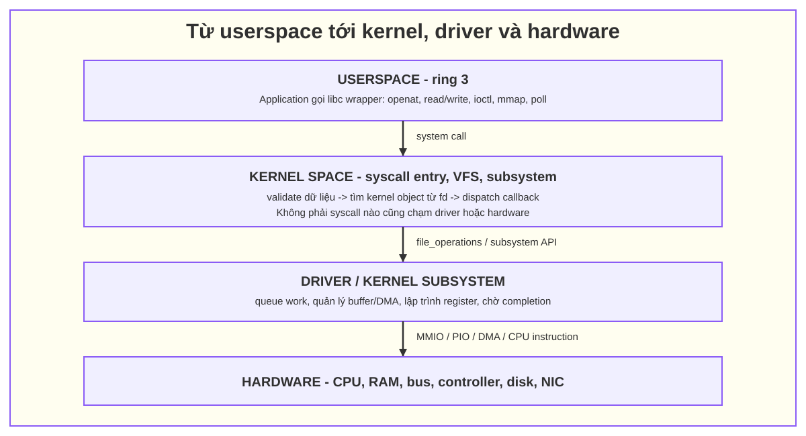
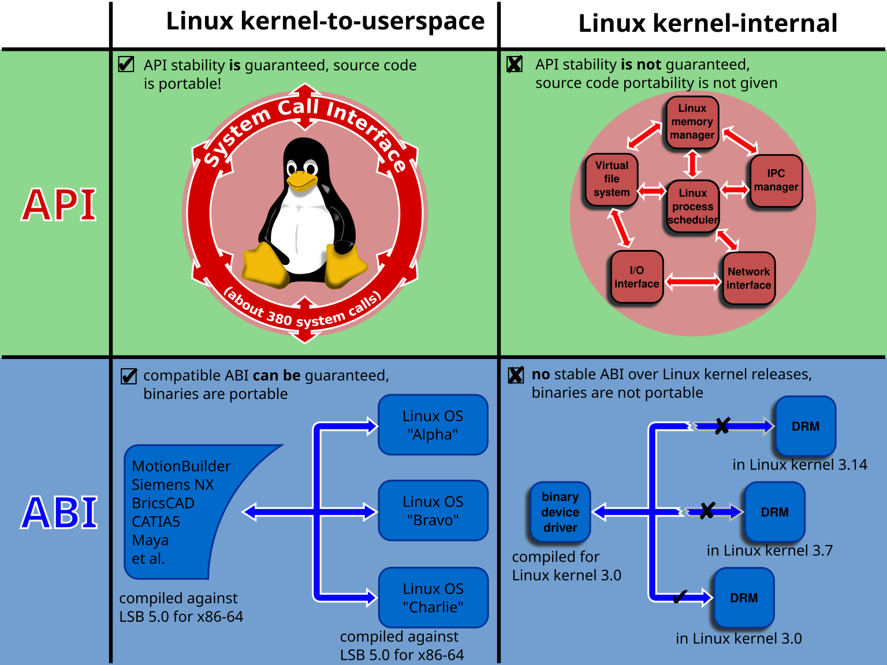
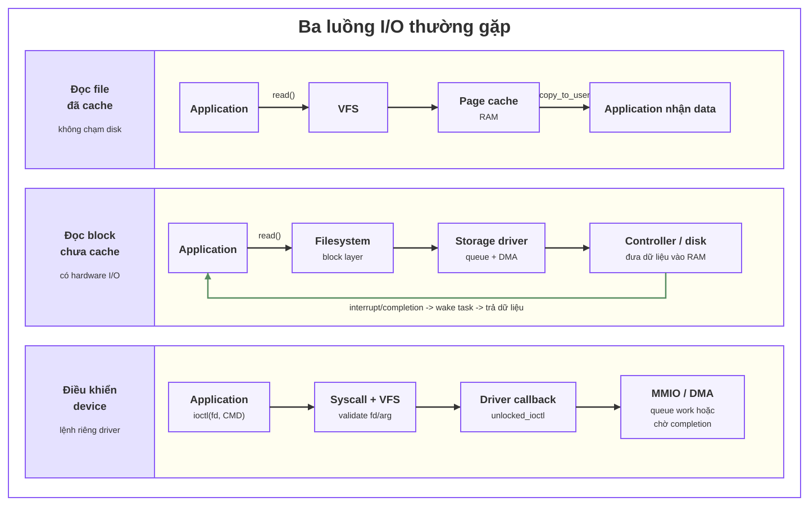

# 04. Từ userspace xuống kernel, driver và hardware

## 1. Bốn lớp cần phân biệt



*Hình 1 — mô hình bốn lớp và các cơ chế trao đổi với hardware.*

Đây là mô hình tư duy, không phải mọi request đều đi đúng đủ bốn ô:

- syscall về process/file có thể không chạm driver hay hardware;
- dữ liệu đã cache có thể được trả hoàn toàn từ RAM;
- KVM dùng chính CPU virtualization extension, không phải một peripheral driver truyền thống;
- sau `mmap()`, nhiều lần userspace đọc/ghi memory không tạo syscall cho từng access; page fault vẫn có thể vào kernel;
- thiết bị có thể DMA trực tiếp với RAM rồi báo hoàn tất bằng interrupt.

Sơ đồ dưới đây mở rộng mô hình trên thành các interface và subsystem thực tế của Linux. Khi đọc, đi theo chiều từ applications ở trên, qua system call interface, các subsystem/driver trong kernel, rồi tới hardware interfaces ở dưới.



*Hình 2 — Linux kernel interfaces. Nguồn: [Wikimedia Commons](https://commons.wikimedia.org/wiki/File:Linux_kernel_interfaces.svg)*

## 2. Library call khác system call

Ứng dụng C thường gọi wrapper của glibc như `read()`, `ioctl()`, `mmap()`. Wrapper chuẩn bị syscall number và argument rồi dùng instruction chuyển privilege level (`syscall` trên x86-64, `svc` trên arm64). CPU vào entry code của kernel, kernel validate dữ liệu từ userspace và dispatch đến implementation.

Không phải mọi hàm thư viện là syscall:

- `strlen()` chạy hoàn toàn ở userspace;
- `printf()` xử lý format ở userspace, sau đó có thể gọi `write()`;
- `malloc()` thường cấp phát từ heap đã có; thỉnh thoảng mới cần `brk()`/`mmap()`;
- vDSO có thể cung cấp một số operation mà không trap vào kernel ở common path.

## 3. File descriptor là handle tới kernel object

Linux biểu diễn file, socket, device, epoll instance, KVM VM/vCPU... bằng file descriptor (fd). Ví dụ:

```c
int fd = open("/dev/example", O_RDWR);
ioctl(fd, EXAMPLE_START, &cfg);
read(fd, buffer, sizeof(buffer));
close(fd);
```

Với character device, syscall đi qua VFS tới callback trong `struct file_operations`, ví dụ:

```text
read()   -> ... -> file_operations.read/read_iter
write()  -> ... -> file_operations.write/write_iter
ioctl()  -> ... -> file_operations.unlocked_ioctl
mmap()   -> ... -> file_operations.mmap
poll()   -> ... -> file_operations.poll
```

Tên hàm cụ thể thay đổi theo subsystem/version; đây là pattern, không phải call graph cố định.

## 4. Phân biệt các syscall/giao diện thường dùng

### 4.1. `openat()`/`close()` — lấy và thả handle

- **Khi dùng:** mở file/device node và lấy fd; đóng reference.
- **Driver/hardware:** `open` có thể chỉ tăng refcount/khởi tạo context, hoặc có thể bật thiết bị tùy driver. `close` không đồng nghĩa dữ liệu đã xuống hardware nếu API không quy định như vậy.

Nhiều libc hiện thực `open()` bằng `openat()`; khi dùng `strace`, thấy `openat` là bình thường.

### 4.2. `read()`/`write()` — truyền data dạng byte stream

- **Khi dùng:** semantics tự nhiên là đọc/ghi chuỗi byte.
- **Ví dụ:** file, pipe, socket, character device.
- **Có chạm hardware ngay không:** không chắc. Page cache, buffer, queue và asynchronous I/O có thể tách thời điểm syscall return khỏi thời điểm hardware hoàn tất.

### 4.3. `ioctl()` — lệnh điều khiển theo device/subsystem

- **Khi dùng:** operation không biểu diễn tốt bằng byte stream, ví dụ tạo VM, set register, query capability, start device.
- **Cách dùng:** fd xác định object; request number xác định command; argument thường trỏ tới UAPI struct.
- **Điểm cần nhớ:** `ioctl` là **một syscall multiplex**; `KVM_RUN`, `KVM_CREATE_VM` không phải syscall number riêng mà là command của `ioctl()`.

Direction macro `_IO`, `_IOR`, `_IOW`, `_IOWR` mô tả argument không dữ liệu, kernel → user, user → kernel hoặc hai chiều. Tên `read/write` trong macro được nhìn từ phía userspace.

### 4.4. `mmap()`/`munmap()` — chia sẻ hoặc ánh xạ memory

- **Khi dùng:** cần zero-copy/shared buffer, map file/device memory, hoặc shared control page.
- `mmap()` thiết lập VMA/page mapping; các load/store sau đó thường không cần syscall cho từng access.
- First access có thể page fault và vào kernel để cấp/map page.
- Memory ordering, ownership và synchronization vẫn phải theo API; shared mapping không tự tạo consistency.

KVM dùng `mmap(vcpu_fd, ...)` để userspace và kernel chia sẻ `struct kvm_run`.

### 4.5. `poll()`/`select()`/`epoll_*()` — đợi event/readiness

- **Khi dùng:** chờ nhiều fd sẵn sàng mà không busy-loop.
- Driver/subsystem triển khai callback readiness và wake wait queue khi có event.
- `epoll` phù hợp số lượng fd lớn và API lâu dài; không phải mọi device đều hỗ trợ mọi event.

## 5. Kernel trao đổi với hardware như thế nào

### 5.1. MMIO

Driver map register của device vào kernel address space bằng `ioremap()`/helper theo bus, rồi dùng accessor như `readl()`/`writel()`. Không dereference `__iomem` tùy tiện. Barrier và ordering rất quan trọng; PCI write có thể là posted write.

### 5.2. Port I/O

Một số architecture/device, đặc biệt legacy x86, dùng I/O port riêng với `inb/inw/inl` và `outb/outw/outl`.

### 5.3. DMA

Driver chuẩn bị buffer và DMA mapping; device đọc/ghi RAM không cần CPU copy từng byte. Kernel vẫn phải quản lý ownership, cache coherency, IOMMU và lifetime. Completion thường được báo bằng interrupt hoặc polling.

### 5.4. Interrupt

Device phát interrupt; CPU chạy interrupt handler trong kernel, driver acknowledge hardware và thường defer phần việc nặng sang threaded IRQ/workqueue/softirq. Interrupt không phải syscall vì nó do hardware khởi phát, không do userspace gọi đồng bộ.

### 5.5. CPU instructions

KVM trên x86 dùng VT-x/VMX hoặc AMD-V/SVM. Kernel KVM chuẩn bị control state rồi thực hiện VM-entry. Guest chạy trực tiếp trên CPU ở chế độ non-root/guest; sự kiện cần hypervisor xử lý gây VM-exit về KVM. Đây là tương tác với capability của CPU, không phải MMIO tới `/dev/kvm`.

## 6. Ba luồng ví dụ



*Hình 3 — đọc file đã cache dừng ở RAM; cache miss đi qua block layer, driver, DMA và interrupt; `ioctl` đi tới callback riêng của driver*

Ở luồng thứ nhất không cần disk I/O. Hai luồng còn lại có thể return ngay hoặc sleep chờ completion, tùy API và trạng thái thiết bị.

## 7. Công cụ quan sát

### `strace`: userspace gọi syscall nào

```bash
strace -f -tt -T -e trace=openat,read,write,ioctl,mmap,munmap,poll,ppoll \
  <command>
```

`strace` chỉ cho biết syscall boundary và thời gian nhìn từ process; không hiển thị toàn bộ call graph trong kernel.

## 8. Những nhầm lẫn thường gặp

- “Userspace gọi trực tiếp driver” — thực tế đi qua syscall/VFS hoặc UAPI của subsystem.
- “Mọi syscall đều xuống hardware” — sai; nhiều syscall chỉ thao tác state/memory kernel.
- “Mỗi access sau mmap là syscall” — sai; load/store thường trực tiếp, trừ page fault hoặc operation đồng bộ khác.
- “`ioctl` là một loại driver” — sai; nó là syscall chuyển command tới object đứng sau fd.
- “Interrupt là syscall từ hardware” — sai; hai loại entry vào kernel có nguồn và semantics khác nhau.
- “KVM_RUN là syscall riêng” — sai; nó là request code của `ioctl(vcpu_fd, KVM_RUN, ...)`.

## 9. Nguồn

- [Linux kernel: Adding a New System Call — alternatives and syscall implementation](https://docs.kernel.org/process/adding-syscalls.html)
- [Linux kernel: ioctl based interfaces](https://docs.kernel.org/driver-api/ioctl.html)
- [Linux kernel: Bus-Independent Device Accesses](https://docs.kernel.org/driver-api/device-io.html)
- [Linux man-pages: ioctl(2)](https://man7.org/linux/man-pages/man2/ioctl.2.html)
- [Linux man-pages: mmap(2)](https://man7.org/linux/man-pages/man2/mmap.2.html)
