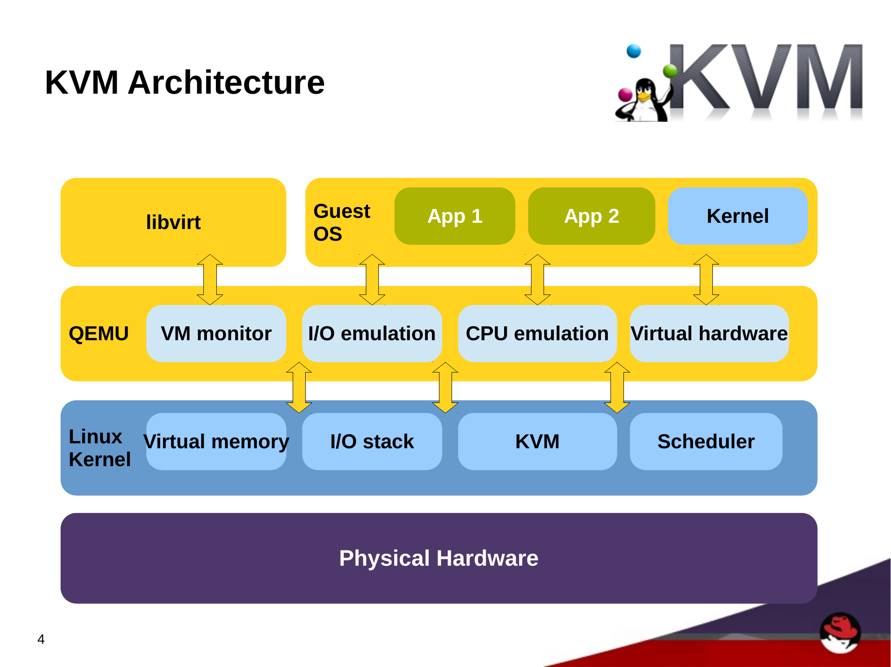
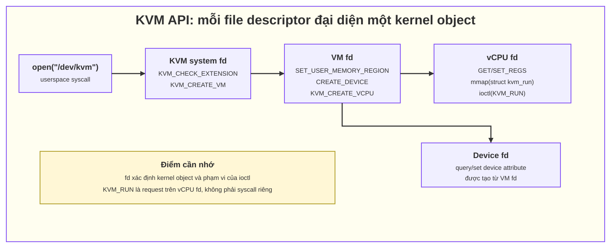
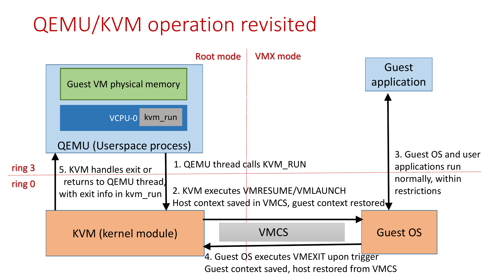

# 05. KVM trong luồng userspace → kernel → hardware

## 1. Vai trò của QEMU và KVM

- **QEMU userspace/VMM:** tạo VM, cấp RAM, mô phỏng hoặc điều phối thiết bị, quản lý lifecycle/migration và có một thread cho mỗi vCPU trong mô hình phổ biến.
- **KVM kernel subsystem:** cung cấp `/dev/kvm`, quản lý VM/vCPU state, memory translation, interrupt virtualization và chạy guest bằng hỗ trợ virtualization của CPU.
- **Hardware:** CPU VT-x/AMD-V, IOMMU, interrupt controller và thiết bị vật lý. Thiết bị guest có thể được QEMU emulation, virtio kernel/userspace backend hoặc passthrough/VFIO phục vụ.

Gọi KVM là “driver” có thể chấp nhận ở mức khái quát vì nó expose character device `/dev/kvm`, nhưng chính xác hơn KVM là **kernel virtualization subsystem** gồm core module và module architecture-specific.



*Hình 1 — kiến trúc tổng quan QEMU/KVM. Nguồn: Karen Noel, [KVM: Virtual vs. Physical Machines, trang 4](https://www.linux-kvm.org/images/9/95/KVM_Virtual_vs_Physical.pdf), DevConf.cz 2014.*

## 2. KVM API dựa trên fd và ioctl



*Hình 2 — `/dev/kvm` tạo system fd, từ đó tạo VM fd và vCPU fd; mỗi cấp nhận nhóm `ioctl` khác nhau.*

Phân loại ioctl:

| fd nhận ioctl | Phạm vi | Ví dụ |
|---|---|---|
| System fd `/dev/kvm` | Toàn KVM subsystem | `KVM_GET_API_VERSION`, `KVM_CHECK_EXTENSION`, `KVM_CREATE_VM` |
| VM fd | Cả VM | set memory region, create vCPU/device |
| vCPU fd | Một vCPU | set/get register, `KVM_RUN` |
| Device fd | Một virtual device | thuộc tính device tương ứng |

## 3. Luồng khởi tạo rút gọn

1. QEMU `openat()` `/dev/kvm`.
2. Query API/capability bằng `ioctl()`.
3. `KVM_CREATE_VM` trả VM fd.
4. QEMU cấp host virtual memory cho guest RAM rồi `KVM_SET_USER_MEMORY_REGION` đăng ký các memory slot.
5. `KVM_CREATE_VCPU` trả vCPU fd cho từng vCPU.
6. QEMU hỏi `KVM_GET_VCPU_MMAP_SIZE`, rồi `mmap()` vCPU fd để chia sẻ `struct kvm_run` với kernel.
7. QEMU cấu hình register/device/interrupt và đưa mỗi vCPU vào run loop.

## 4. `KVM_RUN` hoạt động thế nào

Một vCPU thread gọi:

```c
ioctl(vcpu_fd, KVM_RUN, 0);
```

Rút gọn trên x86:



*Hình 3 — QEMU vCPU thread gọi `KVM_RUN`; CPU chạy guest cho tới VM-exit, KVM xử lý rồi tiếp tục guest hoặc trả control về QEMU qua `struct kvm_run`.*

`KVM_RUN` không nhất thiết return về QEMU sau mọi VM-exit. KVM có thể xử lý nhiều exit ngay trong kernel và tiếp tục guest. Chỉ exit cần userspace, signal/error hoặc điều kiện thích hợp mới làm ioctl return.

`struct kvm_run` là shared memory để giảm copy/đối số syscall. QEMU ghi input trước `KVM_RUN` và đọc `exit_reason`/output khi call trả về.

## 5. Liên hệ với livepatch transition

Một vCPU thread có thể ở kernel lâu trong `KVM_RUN`, nhưng **không mặc định là blocker**:

- Nếu reliable stack checking chứng minh stack của thread không chứa affected function, nó có thể đổi patch state khi đang sleep trong kernel.
- Nếu thread chạy/return tới safe boundary, nó có thể đổi state theo kernel-exit switching.
- Nếu affected KVM function còn nằm trên stack hoặc run loop không đạt safe condition, thread có thể giữ old state và làm transition kéo dài.

Điều cần hỏi không phải chỉ là “QEMU đã về userspace chưa?” mà là:

> Thread nào chưa đạt target patch state, stack của nó có affected function nào, và có cách nào đưa nó tới safe state mà không phá SLA VM?

## 6. Vì sao CVE KVM cần review theo module và CPU vendor

Code có thể nằm trong:

- KVM common/core (`kvm.ko` hoặc built-in tùy kernel);
- x86 common;
- Intel VMX (`kvm_intel.ko`);
- AMD SVM (`kvm_amd.ko`);
- MMU, interrupt/APIC, nested virtualization, device assignment hoặc kiến trúc khác.

Một patch chạm `kvm_intel` không bảo vệ đường AMD, và ngược lại. Một source file được build-in trên kernel này có thể là module trên kernel khác. Metadata livepatch phải ánh xạ đúng object chứa symbol ở runtime.

Các lệnh điều tra ban đầu:

```bash
uname -r
lscpu | grep -E 'Architecture|Vendor ID|Virtualization'
lsmod | grep -E '^(kvm|kvm_intel|kvm_amd)\b'
modinfo kvm
modinfo kvm_intel 2>/dev/null || true
modinfo kvm_amd 2>/dev/null || true
```

## 7. Ví dụ CVE path cần phân tích

Nếu fix thay hàm trên vCPU run path:

1. Tìm symbol thuộc object nào.
2. Xem hàm có inline/assembly/static call/static key không.
3. Xác định nó có thể nằm lâu trên stack của vCPU thread không.
4. Xem fix có đổi vCPU/VM data structure hoặc state-machine semantics không.
5. Kiểm tra task-level consistency: một vCPU đã patched và vCPU khác chưa patched có thể cùng thao tác VM state an toàn không?
6. Test cả đường hardware liên quan: Intel/AMD, nested virtualization nếu feature đó trong scope, SMP/multi-vCPU, memory pressure và I/O.

Điểm 5 rất quan trọng: consistency theo **task** không tự chứng minh consistency cho shared state cấp VM. Patch author phải chứng minh old/new semantics có thể cùng tồn tại trong transition hoặc thiết kế callback/quiescence phù hợp.

## 8. Quan sát QEMU/KVM

Tìm QEMU process và thread:

```bash
pgrep -a qemu
ps -T -p <qemu-pid> -o pid,tid,comm,state,wchan:32
```

Quan sát syscall ở lab:

```bash
sudo strace -f -p <qemu-pid> -e trace=ioctl -tt -T
```

Đính `strace` vào production QEMU có thể ảnh hưởng timing/performance; phải theo quy trình vận hành. Để chẩn đoán livepatch, `/proc/<tgid>/task/<tid>/stack`, `patch_state`, `wchan`, kernel log và tracepoint/filter hẹp thường có giá trị hơn trace toàn bộ ioctl.

Khi test patch, chỉ cần nhớ ba nhóm chính: chạy đúng reproducer của CVE, tạo workload đi qua affected KVM path, và theo dõi cả transition lẫn sức khỏe VM. Các feature như nested virtualization, passthrough hay migration chỉ cần test khi CVE hoặc môi trường thực tế có dùng.

## 9. Nguồn

- [Linux kernel: Definitive KVM API](https://docs.kernel.org/virt/kvm/api.html)
- [KVM API — `KVM_RUN`](https://docs.kernel.org/virt/kvm/api.html#kvm-run)
- [KVM API — `struct kvm_run`](https://docs.kernel.org/virt/kvm/api.html#the-kvm-run-structure)
- [KVM API — `KVM_SET_USER_MEMORY_REGION`](https://docs.kernel.org/virt/kvm/api.html#kvm-set-user-memory-region)
