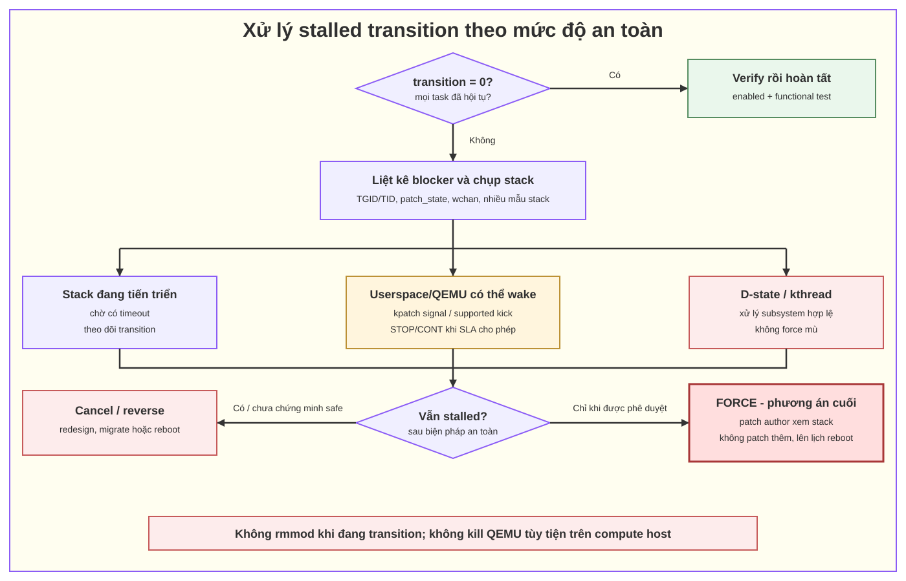

# 06. Xử lý stalled process khi livepatch transition không hoàn tất

## 1. Stalled transition thực sự là gì?

Khi enable patch, target state thường là `1`. Patch bị stalled khi sau một khoảng chờ vẫn còn task ở state `0` và kernel chưa thể chuyển chúng an toàn. Khi disable, hướng ngược lại: blocker còn ở `1` trong khi target là `0`.

Không được chẩn đoán chỉ dựa vào câu “process không exit khỏi kernel space”:

- task ở kernel nhưng không có affected function trên stack có thể được stack checking chuyển;
- task đã về userspace thường dễ chuyển ở boundary;
- kthread không bao giờ về userspace nhưng vẫn có thể chuyển nhờ reliable stack hoặc safe patch point;
- blocker thật phải được xác định bằng `transition`, `patch_state` và stack/wchan.

## 2. Nguyên tắc xử lý

**Thứ tự ưu tiên:** quan sát → chờ có giới hạn → signal/poke an toàn → quiesce/migrate phù hợp workload → hủy transition → chỉ force khi vendor/patch author phê duyệt.

Ba điều không làm:

1. Không `rmmod` module đang transition hoặc còn code đang được dùng.
2. Không kill/restart QEMU tùy tiện trên compute host vì có thể làm mất VM.
3. Không ghi `force=1` chỉ để trạng thái trông “completed”.

## 3. Xác nhận patch đang stalled

```bash
sudo kpatch list
ls -1 /sys/kernel/livepatch/

PATCH=<ten-thu-muc-patch>
cat "/sys/kernel/livepatch/$PATCH/enabled"
cat "/sys/kernel/livepatch/$PATCH/transition"

dmesg -T | tail -n 200
journalctl -k --since '-10 min'
```

Diễn giải:

| `enabled` | `transition` | Ý nghĩa |
|---:|---:|---|
| 1 | 1 | Đang enable; task phải hội tụ về patched state. |
| 1 | 0 | Enable hoàn tất. |
| 0 | 1 | Đang disable/reverse; task phải hội tụ về unpatched state. |
| 0 | 0 | Disable hoàn tất; lúc này mới xét remove module. |

`kpatch load` ở một số phiên bản tự chờ, signal stalled tasks rồi reverse/unload nếu vẫn timeout. Không giả định hành vi/timeout giống nhau trên mọi distro; log thực tế là nguồn xác nhận.

## 4. Tìm thread chặn transition

### 4.1. Liệt kê thread chưa đạt target state

Chạy bằng root trong lúc `transition=1`:

```bash
PATCH=<ten-thu-muc-patch>
TARGET=$(cat "/sys/kernel/livepatch/$PATCH/enabled")

for STATE_FILE in /proc/[0-9]*/task/[0-9]*/patch_state; do
    STATE=$(cat "$STATE_FILE" 2>/dev/null) || continue
    [ "$STATE" = "$TARGET" ] && continue

    TID=${STATE_FILE%/patch_state}
    TID=${TID##*/}
    TGID_PATH=${STATE_FILE%/task/*}
    TGID=${TGID_PATH##*/}
    COMM=$(cat "/proc/$TGID/task/$TID/comm" 2>/dev/null)
    printf 'blocker tgid=%s tid=%s state=%s target=%s comm=%s\n' \
        "$TGID" "$TID" "$STATE" "$TARGET" "$COMM"
done
```

Task có thể thoát giữa lúc scan nên lỗi `No such file` là race bình thường. Nếu kernel chỉ expose `/proc/<pid>/patch_state`, điều chỉnh theo interface thực tế.

### 4.2. Xem trạng thái và stack của blocker

```bash
TGID=<process-id>
TID=<thread-id>

ps -T -p "$TGID" -o pid,tid,ppid,comm,state,wchan:40
cat "/proc/$TGID/task/$TID/stack"
cat "/proc/$TGID/task/$TID/wchan"
cat "/proc/$TGID/task/$TID/syscall"
```

Ghi lại nhiều mẫu stack theo thời gian ngắn:

- stack thay đổi → task đang tiến triển, có thể chờ thêm;
- stack giống hệt ở affected function → blocker ổn định;
- state `D` → có thể đang chờ I/O không interruptible;
- `comm` là QEMU vCPU thread → mọi thao tác dừng phải xét guest SLA;
- kernel thread (`[name]` trong `ps`) → không có userspace return boundary.

## 5. Phân loại nguyên nhân

| Quan sát | Khả năng | Hướng xử lý ban đầu |
|---|---|---|
| Userspace task ngủ interruptible, stack qua affected function | Chờ I/O/event trong hàm cũ | `kpatch signal`; wake/quiesce workload theo API. |
| QEMU vCPU thread trong KVM path | `KVM_RUN`/affected run-loop chưa đạt safe state | Ưu tiên fake signal/kick được hỗ trợ; cân nhắc migrate VM trước thao tác gây pause. |
| Task state `D` | I/O/hardware/lock wait không interruptible | Điều tra nguyên nhân I/O; signal thường không đủ. Không force mù. |
| Kthread ngủ lâu | Không có userspace boundary hoặc safe point | Wake bằng subsystem hợp lệ; nếu không, hủy patch và xem lại thiết kế. |
| Affected function luôn hiện trên stack nhiều task | Chọn function hay ngủ/đường hot | Có thể cần redesign patch hoặc vendor đánh giá force-safe. |
| Không có reliable stacktrace | Kernel không chứng minh safe bằng stack | Phụ thuộc boundary/patch point; khả năng stall cao hơn. |
| Kernel warning, lockup, hardware error | Không còn chỉ là livepatch wait | Kích hoạt incident/rollback/reboot theo mức độ. |

## 6. Xử lý theo mức tăng dần

### Mức A: chờ có giới hạn và theo dõi tiến triển

Kernel định kỳ thử stack checking và trên kernel mới có thể gửi fake signal cho pending tasks. Chờ là hợp lý khi:

- stack đang tiến triển;
- workload sẽ sớm kết thúc operation;
- CVE exposure trong khoảng chờ được chấp nhận;
- chưa vượt timeout runbook.

Không chờ vô hạn. Transition có thể tồn tại vô hạn nếu task không đạt safe state.

### Mức B: dùng `kpatch signal`

```bash
sudo kpatch signal
```

Lệnh yêu cầu kernel “poke” các process đang chặn trên hệ thống có sysfs signal interface; trên hệ thống không hỗ trợ, lệnh có thể là no-op. Đây thường tốt hơn gửi signal thật vì fake signal không đưa payload vào pending signal structures nhưng có thể interrupt/wake task để nó cập nhật patch state.

Sau đó kiểm tra lại:

```bash
cat "/sys/kernel/livepatch/$PATCH/transition"
sudo kpatch list
```

### Mức C: `SIGSTOP`/`SIGCONT` có kiểm soát cho userspace task

Tài liệu kernel nêu `SIGSTOP` rồi `SIGCONT` có thể buộc I/O-bound userspace task thoát kernel và đổi state:

```bash
sudo kill -STOP <pid>
sudo kill -CONT <pid>
```

Chỉ làm khi đã xác định đúng process và hiểu tác động:

- group-stop có thể dừng toàn bộ process/thread group;
- với QEMU, guest có thể bị pause và watchdog/time-sensitive workload bị ảnh hưởng;
- task ở `D` state không nhất thiết phản ứng cho tới khi wait kết thúc;
- đây không phải cách xử lý chung cho kthread.

Trong cloud, nếu SLA không cho phép pause, ưu tiên migrate VM khỏi host bằng control plane trước. Migration là thay đổi workload có quy trình riêng, không nên tự động làm chỉ từ script livepatch.

### Mức D: quiesce/wake theo subsystem

Nếu biết blocker đang chờ ở đâu, dùng operation hợp lệ của subsystem để nó hoàn tất và return:

- kết thúc hoặc thoát một job không quan trọng;
- tạo event/I/O completion mà task đang chờ một cách hợp lệ;
- migrate workload khỏi canary host;
- wake kthread qua interface của subsystem nếu có và đã được xác nhận.

Không chọc trực tiếp lock, waitqueue hoặc memory kernel bằng debugger trên production.

### Mức E: hủy/reverse transition

Đây là lựa chọn an toàn hơn force khi không thể chứng minh chuyển đổi an toàn.

Ưu tiên command của tool/distro, ví dụ:

```bash
sudo kpatch unload <patch-module-or-name>
```

Nếu runbook dùng sysfs trực tiếp khi đang enable:

```bash
echo 0 | sudo tee "/sys/kernel/livepatch/$PATCH/enabled"
```

Sau đó:

1. chờ `transition=0`;
2. xác nhận mọi task đã hội tụ về target cũ;
3. chỉ remove module nếu tool/kernel báo an toàn;
4. giữ log/stack để sửa patch hoặc mở case với vendor.

Reverse cũng là một transition và cũng có thể stall. Không remove cưỡng bức module.

### Mức F: force — phương án cuối cùng có phê duyệt

Chỉ sau khi patch distributor/patch author xem stack và xác nhận việc force an toàn:

```bash
echo 1 | sudo tee "/sys/kernel/livepatch/$PATCH/force"
```

Sau force:

- coi kernel cần reboot sớm;
- không áp thêm livepatch;
- patch module không được unload trong phiên boot;
- tăng monitoring kernel/VM;
- ghi đầy đủ người phê duyệt, affected stacks, thời điểm và lý do.

Nếu không có xác nhận, chọn cancel/migrate/reboot thay vì force.

## 7. Trường hợp đặc biệt: QEMU/KVM process không ra userspace

### Câu trả lời ngắn cho câu hỏi của mentor

Kpatch/Linux livepatch không lập tức thay code cho mọi process. Nó giữ QEMU/vCPU thread ở old state cho tới khi thread đạt safe state. Kernel thử stack checking, kernel-exit boundary và fake signal. Nếu transition stalled:

1. tìm chính xác TID còn khác target state;
2. chụp stack để xem affected KVM function nào còn trên stack;
3. dùng `kpatch signal`/cơ chế kick an toàn trước;
4. nếu cần thao tác làm QEMU pause, migrate VM hoặc xin phê duyệt theo SLA;
5. nếu không thể đưa thread về safe state, hủy patch và sửa thiết kế/nhờ vendor;
6. chỉ force sau xác nhận chuyên môn, rồi lên kế hoạch reboot.

### Tại sao không cứ signal QEMU?

KVM API cho phép signal làm `KVM_RUN` return `EINTR` trong một số trường hợp, và VMM thường có cơ chế kick vCPU. Tuy nhiên:

- signal mask/handler và implementation phụ thuộc QEMU/version;
- `SIGSTOP` là group-stop, không phải vCPU kick nhẹ;
- thread có thể đang chờ không interruptible;
- return khỏi `KVM_RUN` chỉ hữu ích nếu đó là safe boundary cho patch cụ thể.

Do đó dùng `kpatch signal` hoặc cơ chế quản trị VMM đã hỗ trợ trước; không gửi signal ngẫu nhiên.

## 8. Decision tree rút gọn



*Hình 1 — cây quyết định ưu tiên thao tác ít ảnh hưởng, có đường riêng cho QEMU/vCPU và đặt `force` sau bước phê duyệt chuyên môn.*

## 9. Nguồn

- [Linux kernel Livepatch — consistency model, stalled task, signal, force](https://docs.kernel.org/livepatch/livepatch.html#consistency-model)
- [kpatch man page — `kpatch signal`](https://github.com/dynup/kpatch/blob/master/man/kpatch.1)
- [kpatch Patch Author Guide](https://github.com/dynup/kpatch/blob/master/doc/patch-author-guide.md)
- [KVM API — `KVM_RUN` and `EINTR`](https://docs.kernel.org/virt/kvm/api.html#kvm-run)
