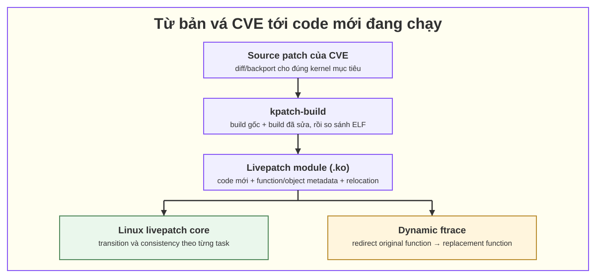

# Kiến thức nền cho task live patch CVE KVM bằng kpatch

## 1. Bối cảnh task

Compute host của cloud đang chạy nhiều máy ảo (VM). Cách cập nhật kernel thông thường là migrate hoặc dừng VM, cài kernel mới rồi reboot host. Task này yêu cầu nghiên cứu và triển khai live patch cho CVE liên quan KVM để giảm hoặc tránh downtime, với công cụ đang dùng là **kpatch**.

> **Phạm vi của bộ tài liệu:** cung cấp nền tảng để đọc một bản vá CVE, đánh giá khả năng live patch, hiểu điều gì xảy ra khi load patch và xử lý transition bị kẹt. Tài liệu chưa thể thay thế runbook production cụ thể vì còn phụ thuộc CVE, phiên bản kernel, bản phân phối, kiến trúc CPU và chính sách của nhà cung cấp.

## 2. Mục lục

1. [01-kpatch-tong-quan.md](01-kpatch-tong-quan.md) — kpatch là gì, các thành phần, vòng đời build/load và giới hạn.
2. [02-transition-safe-state.md](02-transition-safe-state.md) — consistency model, transition state, safe state và trạng thái theo từng task.
3. [03-ftrace-va-co-che-redirect.md](03-ftrace-va-co-che-redirect.md) — ftrace tạo điểm móc và livepatch chuyển hướng hàm như thế nào.
4. [04-userspace-kernel-driver-hardware.md](04-userspace-kernel-driver-hardware.md) — syscall, file descriptor, driver, MMIO/DMA/interrupt và cách chọn giao diện.
5. [05-kvm-trong-luong-xu-ly.md](05-kvm-trong-luong-xu-ly.md) — đặt kiến thức trên vào QEMU/KVM và giải thích `KVM_RUN`.
6. [06-xu-ly-stalled-transition.md](06-xu-ly-stalled-transition.md) — runbook chẩn đoán và xử lý process/kthread làm transition không hoàn tất.

*Hình 1 — quan hệ giữa kpatch-build, livepatch module, Linux livepatch core và ftrace. Sơ đồ biên soạn riêng cho bộ tài liệu này.*

Ba tên dễ bị dùng lẫn:

| Thành phần | Vai trò |
|---|---|
| **kpatch** | Bộ công cụ build và quản lý patch do dự án kpatch cung cấp. |
| **Linux livepatch** (`CONFIG_LIVEPATCH`) | Hạ tầng trong upstream kernel quản lý patch, object, function và consistency theo task. |
| **ftrace** | Hạ tầng tracing/hooking động được livepatch dùng để đổi hướng tại đầu hàm. |

## 4. Tài liệu tham khảo

- [kpatch README — dynup/kpatch](https://github.com/dynup/kpatch/blob/master/README.md)
- [Linux kernel — Livepatch](https://docs.kernel.org/livepatch/livepatch.html)
- [Linux kernel — ftrace](https://docs.kernel.org/trace/ftrace.html)
- [Linux kernel — KVM API](https://docs.kernel.org/virt/kvm/api.html)
- [Red Hat — Applying patches with kernel live patching](https://docs.redhat.com/en/documentation/red_hat_enterprise_linux/7/html/kernel_administration_guide/applying_patches_with_kernel_live_patching)
