# Lab 01 - Dựng KVM host và hai VM trên bridge network

## 1. Yêu cầu bài lab

Tạo một KVM host chạy Ubuntu 24.04 Live Server với kernel `6.8.0-138-generic`, sau đó:

- cài KVM, QEMU và libvirt;
- tạo hai VM bằng libvirt;
- nối hai VM vào cùng một bridge network;
- giữ ping thông giữa hai VM;
- kiểm tra TCP bằng `iperf3` theo cả chiều đi và chiều trả về.


## 2. Topology đã triển khai

| Thành phần | Interface | Địa chỉ | Vai trò |
|---|---|---|---|
| KVM host | `ens33` | `192.168.159.196/24` | Kết nối mạng ngoài, default route qua `192.168.159.2`. |
| KVM host | `br0` | `10.10.10.1/24` | Bridge nội bộ cho hai VM. |
| `vm01` | `eth0` | `10.10.10.11/24` | Máy kiểm thử thứ nhất. |
| `vm02` | `eth0` | `10.10.10.12/24` | Máy kiểm thử thứ hai và `iperf3` server. |

Hai VM đi theo đường:

```text
vm01/eth0 -> vnet0 -> br0 -> vnet1 -> vm02/eth0
```

`virbr0` là network NAT mặc định của libvirt nhưng không được dùng trong bài này. Vì `br0` khai báo `interfaces: []`, đây là bridge nội bộ; VM không tự đi Internet qua `ens33`. Cấu hình này vẫn đáp ứng yêu cầu hai VM giao tiếp qua bridge.

## 3. Chuẩn bị KVM host

### 3.1. Kiểm tra OS và kernel

```bash
cat /etc/os-release
uname -r
uname -a
```

Kiểm tra image, modules và headers của đúng kernel đang chạy:

```bash
dpkg-query -W -f='${Package} ${Version}\n' \
  "linux-image-$(uname -r)" \
  "linux-modules-$(uname -r)" \
  "linux-headers-$(uname -r)"

ls -l "/lib/modules/$(uname -r)/build"
```

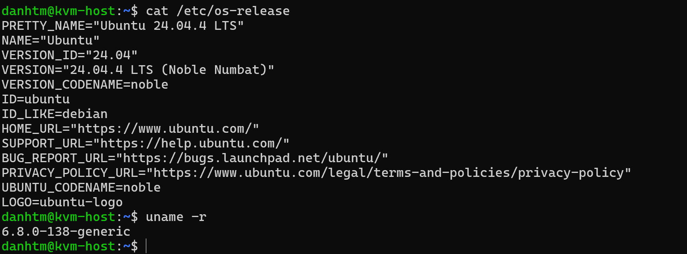

Đường dẫn `/lib/modules/$(uname -r)/build` phải tồn tại và trỏ tới bộ header `6.8.0-138-generic`. Header khác version có thể khiến việc build kernel module hoặc live patch thất bại dù host vẫn boot bình thường.

### 3.2. Cài KVM, QEMU và libvirt

```bash
sudo apt update
sudo apt install -y \
  qemu-kvm \
  qemu-utils \
  libvirt-daemon-system \
  libvirt-clients \
  virtinst \
  bridge-utils \
  cpu-checker \
  cloud-image-utils \
  iperf3 \
  tcpdump \
  tmux

sudo systemctl enable --now libvirtd
sudo usermod -aG libvirt,kvm "$USER"
```

Đăng xuất rồi đăng nhập lại nếu muốn dùng `virsh` không cần `sudo`. Kiểm tra hardware virtualization:

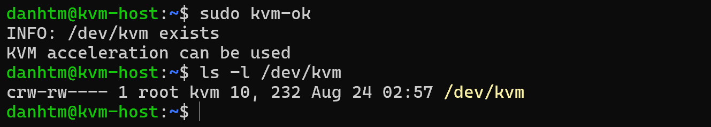

## 4. Tạo bridge nội bộ `br0`

Tạo `/etc/netplan/60-kpatch-br0.yaml`:

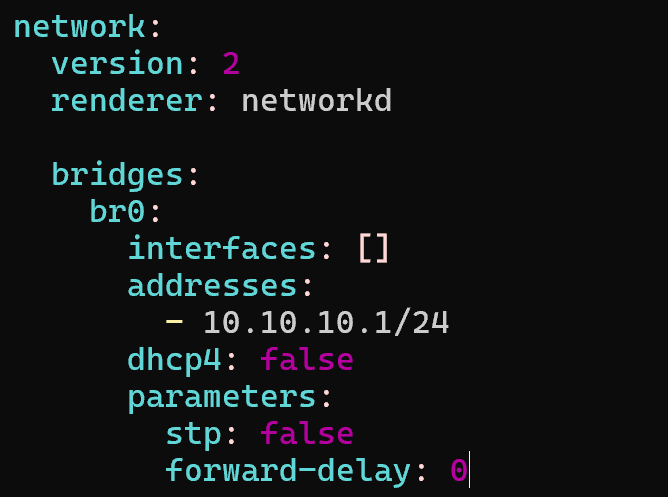

Áp dụng cấu hình:

```bash
sudo chmod 600 /etc/netplan/60-kpatch-br0.yaml
sudo netplan generate
sudo netplan try
sudo netplan apply
```

Nếu đang SSH từ xa, ưu tiên `netplan try` để cấu hình tự rollback khi mất kết nối.

Kiểm tra:

```bash
ip -br addr show br0
ip route
bridge link
```

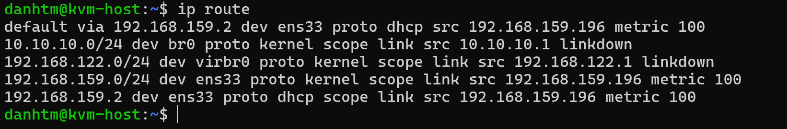

Trong ảnh, route của `br0` có trạng thái `linkdown` vì lúc đó chưa có port VM hoạt động. Sau khi VM chạy, `vnet0` và `vnet1` được gắn vào bridge và kết nối giữa hai VM hoạt động.

## 5. Chuẩn bị image và tạo hai VM

### 5.1. Tải CirrOS và tạo overlay

```bash
sudo install -d -m 0755 /var/lib/libvirt/images/kpatch-lab
cd /var/lib/libvirt/images/kpatch-lab

sudo wget -O cirros-base.img \
  https://download.cirros-cloud.net/0.6.3/cirros-0.6.3-x86_64-disk.img

sudo qemu-img create -f qcow2 -F qcow2 \
  -b /var/lib/libvirt/images/kpatch-lab/cirros-base.img \
  /var/lib/libvirt/images/kpatch-lab/vm01.qcow2

sudo qemu-img create -f qcow2 -F qcow2 \
  -b /var/lib/libvirt/images/kpatch-lab/cirros-base.img \
  /var/lib/libvirt/images/kpatch-lab/vm02.qcow2

sudo qemu-img info --backing-chain vm01.qcow2
sudo qemu-img info --backing-chain vm02.qcow2
```

Mỗi VM phải dùng overlay riêng; không cho hai VM cùng ghi trực tiếp vào một qcow2.

### 5.2. Tạo `vm01`

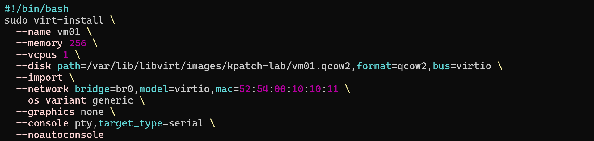

### 5.3. Tạo `vm02`
Tương tự như vm01

```bash
sudo virt-install \
  --name vm02 \
  --memory 256 \
  --vcpus 1 \
  --disk path=/var/lib/libvirt/images/kpatch-lab/vm02.qcow2,format=qcow2,bus=virtio \
  --import \
  --network bridge=br0,model=virtio,mac=52:54:00:10:10:12 \
  --os-variant generic \
  --graphics none \
  --console pty,target_type=serial \
  --noautoconsole
```

### 5.4. Kiểm tra libvirt và bridge attachment

```bash
sudo virsh list --all
sudo virsh domiflist vm01
sudo virsh domiflist vm02
```

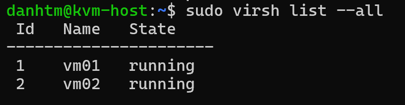

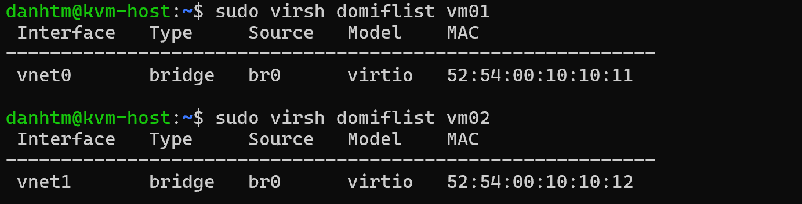

## 6. Đặt IP tĩnh trong hai VM

Kết nối serial console:

```bash
sudo virsh console vm01
```

Nhấn `Enter` để thấy login prompt. Với image CirrOS mặc định, tài khoản thường là `cirros`; xem thông tin đăng nhập mà image in ra trên console. Thoát `virsh console` bằng `Ctrl+]`.

Trên `vm01`:

```bash
sudo pkill dhcpcd 2>/dev/null || true
sudo ip link set eth0 up
sudo ip addr flush dev eth0
sudo ip addr add 10.10.10.11/24 dev eth0
ip -br addr show eth0
```

Trên `vm02`:

```bash
sudo pkill dhcpcd 2>/dev/null || true
sudo ip link set eth0 up
sudo ip addr flush dev eth0
sudo ip addr add 10.10.10.12/24 dev eth0
ip -br addr show eth0
```

Cấu hình bằng `ip addr` chỉ có hiệu lực tới lần reboot. Điều này đủ cho lab ngắn; nếu cần lưu lâu dài thì phải cấu hình theo cơ chế network của guest image.

## 7. Giữ ping thông hai chiều

Kiểm tra nhanh từ `vm01`:

```bash
ping -c 5 10.10.10.12
```

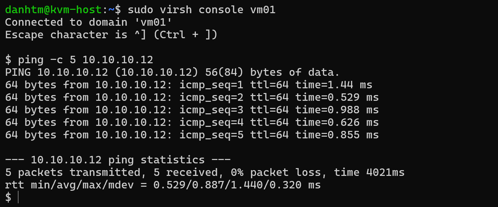

Kiểm tra từ `vm02`:

```bash
ping -c 5 10.10.10.11
```

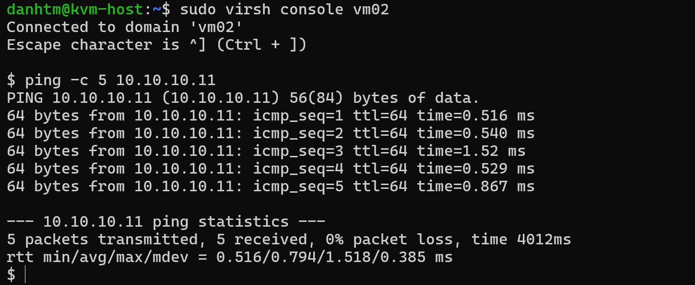

Hai ảnh đều cho kết quả `5 transmitted, 5 received, 0% packet loss`.

Để đáp ứng yêu cầu “hold ping”, mở hai terminal hoặc hai pane `tmux` và chạy không giới hạn `-c`:

```bash
# Trên vm01
ping -i 1 10.10.10.12

# Trên vm02
ping -i 1 10.10.10.11
```

Giữ hai lệnh chạy trong lúc thực hiện `iperf3`; dừng bằng `Ctrl+C` sau khi đã ghi nhận packet loss.

## 8. Kiểm tra `iperf3` TCP hai chiều

### 8.1. Khởi động server trên `vm02`

```bash
iperf3 -s
```

Mặc định server lắng nghe TCP port `5201`.

### 8.2. Chiều đi: `vm01 -> vm02`

Trên `vm01`:

```bash
iperf3 -c 10.10.10.12 -t 10 -i 1
```

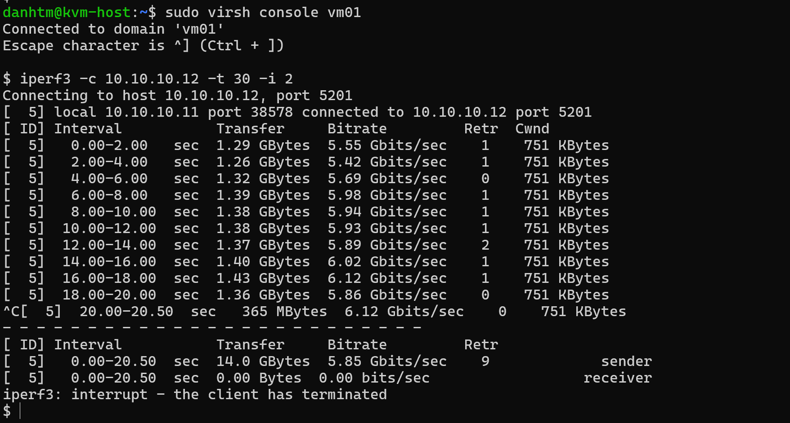

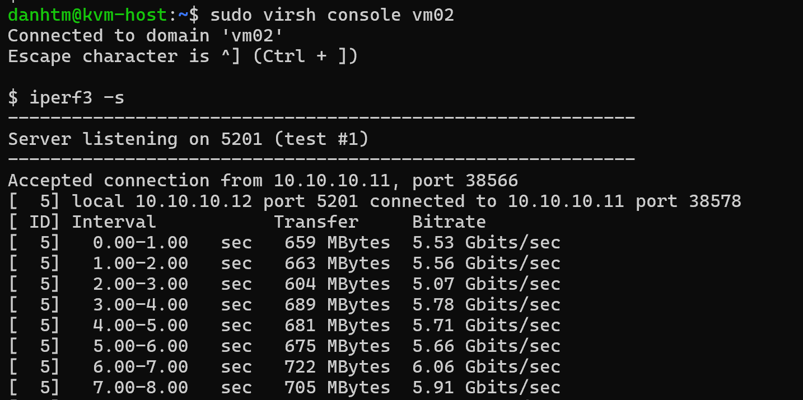

Ảnh chứng minh TCP traffic đã chạy ở khoảng 5-6 Gbit/s.

### 8.3. Chiều trả về: `vm02 -> vm01`

Vẫn chạy client từ `vm01`, thêm `-R` để server gửi data ngược về client:

```bash
iperf3 -c 10.10.10.12 -t 10 -i 1 -R
```

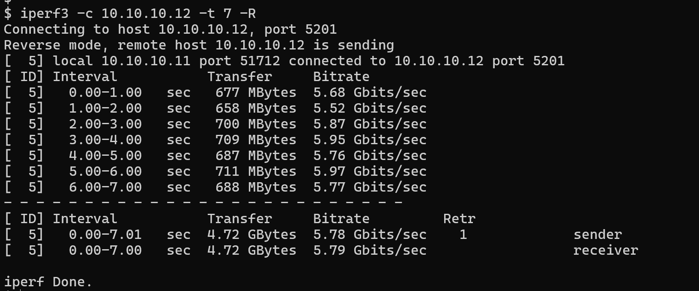

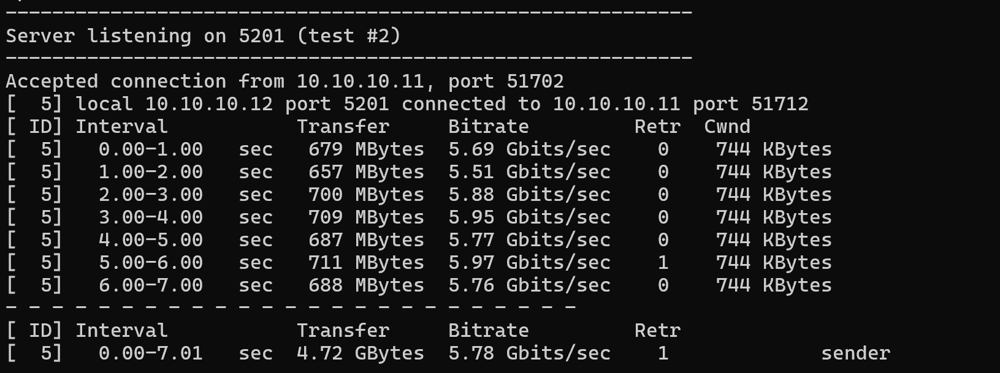

Ảnh reverse hoàn tất bình thường, đạt khoảng `5.79 Gbit/s` ở phía receiver. Như vậy đường TCP chiều trả về đã được xác nhận.

## 9. Nguồn tham khảo

- [Ubuntu Noble - linux-image-generic 6.8](https://packages.ubuntu.com/noble/linux-image-generic-6.8)
- [libvirt - virt-install manual](https://www.mankier.com/1/virt-install)
- [Netplan - configuring network bridges](https://netplan.readthedocs.io/en/stable/examples/#configuring-network-bridges)
- [iperf3 documentation](https://software.es.net/iperf/invoking.html)
