# Lab 02 - Build và kiểm chứng livepatch module bằng kpatch-build

## 1. Yêu cầu bài lab

Sử dụng `kpatch-build` để tạo một kernel livepatch object, đồng thời xác định cụ thể các điều kiện và material cần có để object đó có thể live patch vào KVM host đã dựng ở Lab 01.

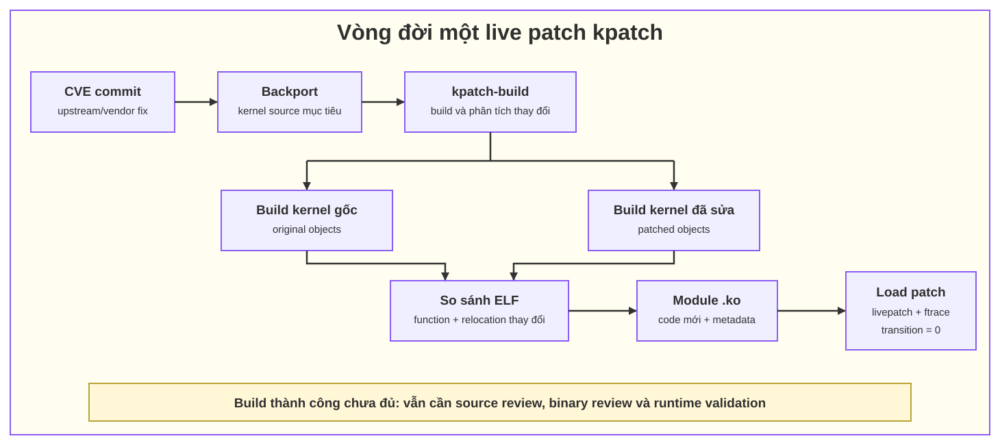

## 2. Kết quả thực hành

| Thành phần | Giá trị |
|---|---|
| Host | KVM host của Lab 01 |
| OS | Ubuntu 24.04.4 LTS |
| Kiến trúc | `x86_64` |
| Kernel đang chạy | `6.8.0-138-generic` |
| Ubuntu kernel package version | `6.8.0-138.138` |
| kpatch | `0.9.11` |
| Source object thay đổi | `fs/proc/meminfo.o` |
| Function thay đổi | `meminfo_proc_show` |
| Target object | `vmlinux` |
| Livepatch module tạo ra | `lab02_meminfo.ko` |
| Thay đổi quan sát được | `VmallocChunk` thành `LAB02_Vmalloc` trong `/proc/meminfo` |
| Trạng thái sau khi load | `enabled = 1`, `transition = 0` |

Livepatch đã được load thành công vào đúng host, thay đổi có hiệu lực mà không reboot và hành vi ban đầu được khôi phục sau khi unload.

## 3. Hiểu đúng về "kernel object"

Trong bài lab có ba khái niệm dễ bị gọi chung là kernel object:

1. `fs/proc/meminfo.o` là object sinh ra khi biên dịch source `fs/proc/meminfo.c`.
2. `vmlinux` là kernel ELF chứa `meminfo.o` vì `meminfo.c` được build-in vào kernel, không nằm trong một module rời.
3. `lab02_meminfo.ko` là livepatch module do `kpatch-build` tạo ra để nạp vào kernel đang chạy.

Luồng thực tế của bài:

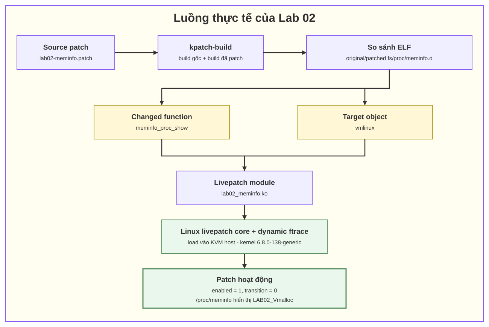

Vì vậy không thể lấy một file `.o` tùy ý rồi load trực tiếp. Patch phải áp dụng được vào đúng source tree, thay đổi phải được `kpatch-build` phân tích là patchable, sau đó mới được đóng gói thành livepatch module `.ko`.

## 4. Điều kiện và material để một object có thể live patch

### 4.1. Điều kiện ở KVM host

| Điều kiện | Cách kiểm tra | Tiêu chí đạt |
|---|---|---|
| Đúng kiến trúc | `uname -m` | Object và host cùng `x86_64`. |
| Đúng kernel release | `uname -r` | Khớp `6.8.0-138-generic`. |
| Đúng bộ package kernel | `dpkg-query` | Image, modules và headers cùng version `6.8.0-138.138`. |
| Có build headers | `readlink -f /lib/modules/$KREL/build` | Link tồn tại và thuộc đúng `$KREL`. |
| Kernel hỗ trợ module | kiểm tra `/boot/config-$KREL` | `CONFIG_MODULES=y`. |
| Kernel hỗ trợ livepatch | kiểm tra `/boot/config-$KREL` | `CONFIG_LIVEPATCH=y`. |
| Có dynamic ftrace | kiểm tra `/boot/config-$KREL` | `CONFIG_FUNCTION_TRACER=y`, `CONFIG_DYNAMIC_FTRACE=y`. |
| Có registers cho ftrace | kiểm tra `/boot/config-$KREL` | `CONFIG_DYNAMIC_FTRACE_WITH_REGS=y`. |
| Có reliable stacktrace | kiểm tra `/boot/config-$KREL` | `CONFIG_HAVE_RELIABLE_STACKTRACE=y`. |
| Cho phép unload module | kiểm tra `/boot/config-$KREL` | `CONFIG_MODULE_UNLOAD=y` nếu cần rollback bằng unload. |
| Chính sách module signing phù hợp | `mokutil --sb-state` và `modinfo -F signer` | Module được ký bằng key tin cậy hoặc host lab không enforce Secure Boot. |
| Đủ tài nguyên build | `df -h`, `free -h`, `nproc` | Nên có khoảng 15 GB trống; giới hạn `-j` để tránh thiếu RAM. |

### 4.2. Material phục vụ build

| Material | Vai trò |
|---|---|
| Source patch dạng unified diff | Mô tả chính xác thay đổi cần đưa vào kernel. |
| Kernel source đúng Ubuntu ABI | Dùng để build bản gốc và bản đã sửa. |
| `/boot/config-$KREL` | Bảo đảm source được build với cấu hình tương ứng kernel đích. |
| Headers đúng `$KREL` | Cung cấp Kbuild interface và generated headers. |
| Debug `vmlinux-$KREL` chưa strip | Cung cấp symbol và debug information để đối chiếu với kernel đang chạy. |
| Toolchain tương thích | Compiler/binutils khác có thể tạo binary diff giả hoặc vermagic không phù hợp. |
| `Module.symvers` phù hợp | Cần cho symbol CRC khi kernel bật `CONFIG_MODVERSIONS`. |
| kpatch và `kpatch-build` | Build, đóng gói và quản lý livepatch module. |
| Build log và audit manifest | Chứng minh object/function nào thay đổi và artifact được tạo từ môi trường nào. |

### 4.3. Điều kiện về nội dung patch

`kpatch-build` làm việc ở mức function. Build thành công chưa đủ để kết luận patch an toàn. Trước khi load cần review tối thiểu:

- patch chỉ thay đổi đúng function dự kiến;
- không thay đổi layout của `struct`, kích thước object hoặc ABI đang được code cũ sử dụng;
- không trực tiếp thay đổi static/global data đang tồn tại;
- không sửa hàm `__init` đã chạy xong trước thời điểm load;
- không sửa code `vdso` hoặc function không có khả năng được ftrace hook;
- không thay đổi semantics của lock, reference count, lifetime hoặc ownership theo cách làm code cũ và code mới mất tương thích;
- không có function phát sinh ngoài dự kiến do thay đổi header, inline function, macro hoặc compiler optimization;
- nếu function có thể đang nằm trên stack, phải để Linux livepatch consistency model chuyển task tại safe state;
- patch author phải xác nhận rollback vẫn an toàn; một số thay đổi system state chỉ có thể forward patch hoặc reboot.

Patch demo của bài chỉ đổi chuỗi label trong `meminfo_proc_show`, không thay đổi cấu trúc dữ liệu hay trạng thái kernel nên phù hợp để kiểm chứng pipeline.

## 5. Chuẩn bị workspace và biến môi trường

```bash
mkdir -p ~/lab02/audit
cd ~/lab02

export KREL="$(uname -r)"
printf 'KREL=%s\n' "$KREL"
```

Không update hoặc boot sang kernel khác giữa lúc build và lúc load. Nếu `uname -r` thay đổi thì artifact phải được build lại cho kernel mới.

## 6. Kiểm tra host trước khi build

### 6.1. OS, kiến trúc và kernel release

```bash
uname -r
uname -m
grep -E '^(PRETTY_NAME|VERSION_ID)=' /etc/os-release
```

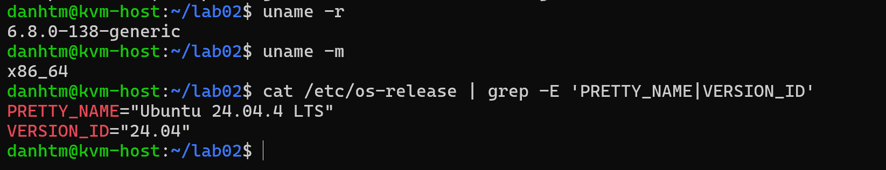

Kết quả thực tế:

```text
6.8.0-138-generic
x86_64
PRETTY_NAME="Ubuntu 24.04.4 LTS"
VERSION_ID="24.04"
```

### 6.2. Kernel image, modules và headers

```bash
dpkg-query -W -f='${Package} ${Version}\n' \
  "linux-image-$KREL" \
  "linux-modules-$KREL" \
  "linux-headers-$KREL"

readlink -f "/lib/modules/$KREL/build"
```

Ba package đều phải thuộc cùng Ubuntu ABI. Trong lần thực hành, cả ba cùng version `6.8.0-138.138`.

### 6.3. Kernel config liên quan livepatch

```bash
grep -E '^CONFIG_(KALLSYMS_ALL|LIVEPATCH|HAVE_RELIABLE_STACKTRACE|MODULES|MODULE_UNLOAD|FUNCTION_TRACER|DYNAMIC_FTRACE|DYNAMIC_FTRACE_WITH_REGS)=' \
  "/boot/config-$KREL"
```

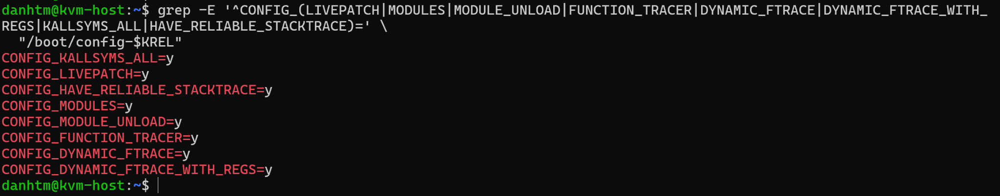

Kết quả ghi nhận:

```text
CONFIG_KALLSYMS_ALL=y
CONFIG_LIVEPATCH=y
CONFIG_HAVE_RELIABLE_STACKTRACE=y
CONFIG_MODULES=y
CONFIG_MODULE_UNLOAD=y
CONFIG_FUNCTION_TRACER=y
CONFIG_DYNAMIC_FTRACE=y
CONFIG_DYNAMIC_FTRACE_WITH_REGS=y
```

### 6.4. Kiểm tra compiler và Secure Boot

```bash
cat /proc/version
gcc --version | head -n 1
mokutil --sb-state
```

Không nên dùng `--skip-compiler-check` chỉ để ép build qua. Compiler khác với compiler dùng để build kernel có thể làm xuất hiện nhiều changed object giả.

Nếu Secure Boot đang enforce, custom `.ko` phải được ký bằng key đã enroll. Nếu không, kernel có thể trả về `Required key not available` dù `vermagic` đúng.

## 7. Cài toolchain và build dependencies

```bash
sudo apt update
sudo apt install -y \
  git \
  build-essential \
  libelf-dev \
  elfutils \
  dpkg-dev \
  devscripts \
  ccache \
  gawk \
  patchutils \
  mokutil \
  ubuntu-dbgsym-keyring

sudo apt-get build-dep -y linux
```

`apt-get build-dep linux` cần source repository của Ubuntu được enable. `kpatch-build` sử dụng kernel source và build dependency đầy đủ, không chỉ bộ headers.

Có thể giới hạn cache để tránh chiếm hết disk:

```bash
ccache --max-size=5G
ccache --show-stats
```

## 8. Cài debug kernel vmlinux đúng version

`vmlinuz` trong `/boot` là boot image đã nén/strip và không thay thế cho debug `vmlinux`. Bài lab cần file ELF chưa strip tại:

```text
/usr/lib/debug/boot/vmlinux-6.8.0-138-generic
```

### 8.1. Khai báo Ubuntu debug symbol repository

```bash
. /etc/os-release

sudo tee /etc/apt/sources.list.d/ddebs.sources >/dev/null <<EOF
Types: deb
URIs: http://ddebs.ubuntu.com
Suites: $VERSION_CODENAME $VERSION_CODENAME-updates $VERSION_CODENAME-security
Components: main restricted universe multiverse
Signed-By: /usr/share/keyrings/ubuntu-dbgsym-keyring.gpg
EOF

sudo apt update
```

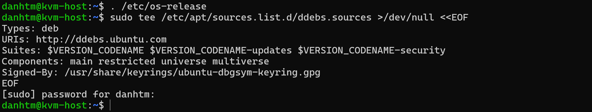

### 8.2. Cài và kiểm tra debug vmlinux

```bash
sudo apt install -y "linux-image-$KREL-dbgsym"

ls -lh "/usr/lib/debug/boot/vmlinux-$KREL"
file "/usr/lib/debug/boot/vmlinux-$KREL"
```

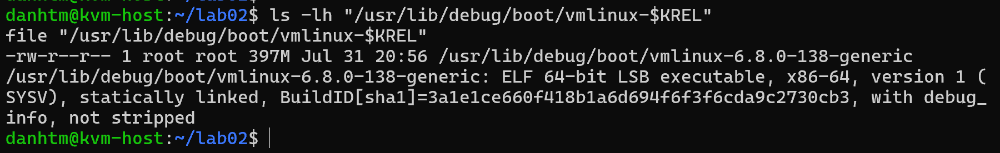

File thực tế khoảng 397 MB, là ELF 64-bit x86-64 và có debug information.

## 9. Build và cài kpatch

```bash
git clone --depth 1 https://github.com/dynup/kpatch.git
cd ~/lab02/kpatch

make -j2
sudo make install

kpatch version
kpatch-build --version
```

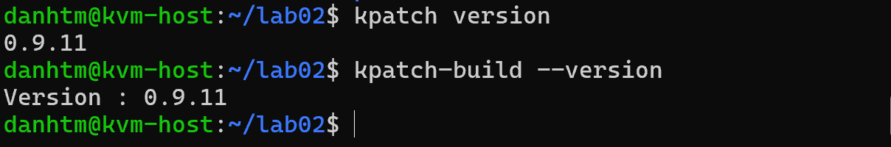

Phiên bản được dùng trong lần thực hành là `0.9.11`.

## 10. Tạo source patch thử nghiệm

Tạo `~/lab02/lab02-meminfo.patch`:

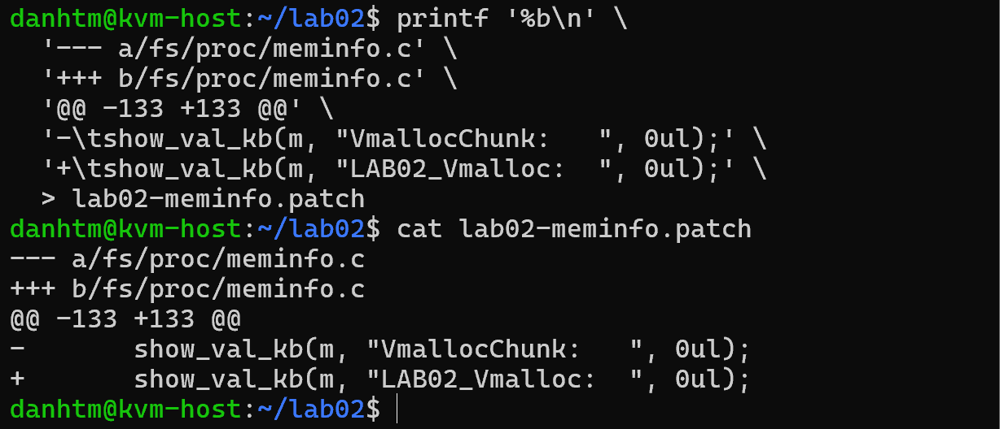

Kiểm tra patch không có whitespace error:

```bash
git apply --check --whitespace=error-all lab02-meminfo.patch
sha256sum lab02-meminfo.patch | tee audit/patch.sha256
```

Nếu lệnh `git apply --check` được chạy ngoài kernel source tree thì chỉ dùng nó sau khi `kpatch-build` đã tạo cache, hoặc kiểm tra trực tiếp trong source tree tương ứng.

## 11. Build livepatch module

### 11.1. Build command

Tạo `~/lab02/kpatch-build.sh`:

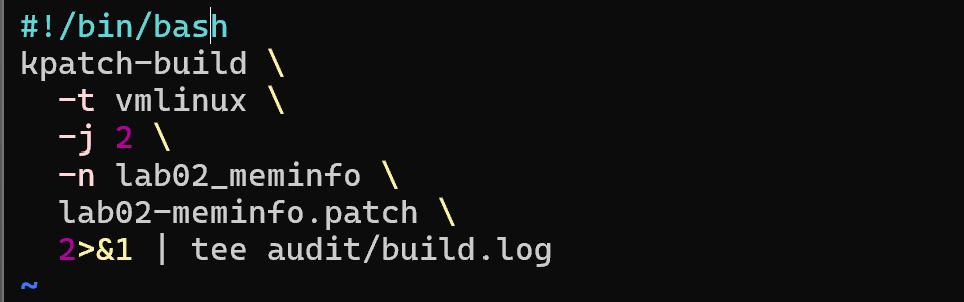

Trong đó:

- `-t vmlinux`: chỉ định Kbuild target là `vmlinux`;
- `-j 2`: giới hạn hai build job để tránh host lab thiếu RAM;
- `-n lab02_meminfo`: đặt tên module;
- `set -o pipefail`: không để `tee` che mất exit code lỗi của `kpatch-build`.


Chạy build bằng cùng một user trong suốt lab để cache có owner và đường dẫn nhất quán. Lần thực hành trong ảnh chạy bằng root:

```bash
cd ~/lab02
sudo bash kpatch-build.sh
```

### 11.2. Kết quả build

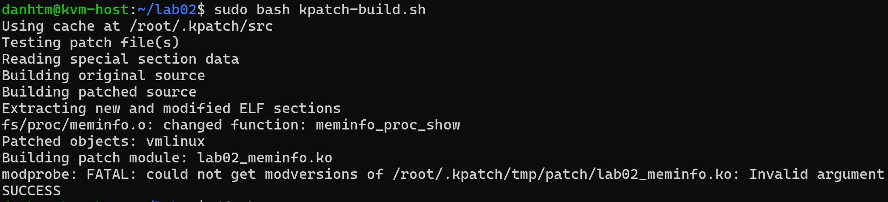

Các dòng cần audit trong log:

```text
Building original source
Building patched source
Extracting new and modified ELF sections
fs/proc/meminfo.o: changed function: meminfo_proc_show
Patched objects: vmlinux
Building patch module: lab02_meminfo.ko
SUCCESS
```

Đây là bằng chứng source diff chỉ làm thay đổi function dự kiến trong `meminfo.o` và object đích là `vmlinux`.

Log có cảnh báo:

```text
modprobe: FATAL: could not get modversions of .../lab02_meminfo.ko: Invalid argument
```
Trong lần thực hành, build vẫn kết thúc bằng `SUCCESS`, metadata đúng và module load thành công trên chính kernel đích. Với host khác, vẫn phải kiểm tra `CONFIG_MODVERSIONS`, `Module.symvers`, `vermagic` và kernel log; không được suy diễn rằng cảnh báo luôn vô hại.

## 12. Gate kiểm tra artifact trước khi load

```bash

printf 'Running kernel: %s\n' "$(uname -r)"
printf 'Module vermagic: %s\n' "$(modinfo -F vermagic ./lab02_meminfo.ko)"
printf 'Module name:     %s\n' "$(modinfo -F name ./lab02_meminfo.ko)"
printf 'Livepatch:       %s\n' "$(modinfo -F livepatch ./lab02_meminfo.ko)"
```

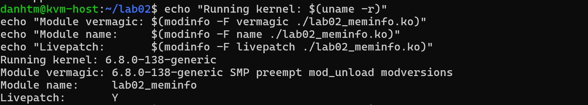

Kết quả:

```text
Running kernel: 6.8.0-138-generic
Module vermagic: 6.8.0-138-generic SMP preempt mod_unload modversions
Module name:     lab02_meminfo
Livepatch:       Y
```

Gate bắt buộc trước khi load:

- phần đầu `vermagic` phải khớp chính xác `uname -r`;
- kiến trúc ELF phải là x86-64;
- `modinfo -F livepatch` phải trả về `Y`;
- tên từ `modinfo -F name` được dùng làm tên thư mục trong `/sys/kernel/livepatch`;
- nếu Secure Boot enforce, `signer` phải là key được kernel tin cậy;
- danh sách changed function trong `audit/build.log` phải khớp source review.

## 13. Load livepatch và theo dõi transition

```bash
cd ~/lab02
sudo kpatch load ./lab02_meminfo.ko 2>&1 | tee audit/load-test.txt

MOD="$(modinfo -F name ./lab02_meminfo.ko)"

cat "/sys/kernel/livepatch/$MOD/enabled"
cat "/sys/kernel/livepatch/$MOD/transition"
kpatch list
```

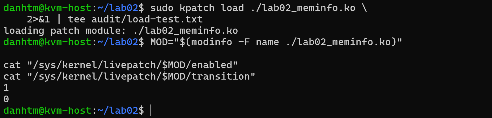

Ý nghĩa kết quả:

- `enabled = 1`: patch đang được bật;
- `transition = 0`: mọi task đã hội tụ, không còn task giữ patch state cũ;
- nếu `transition = 1` kéo dài, chưa được xem là hoàn tất và không được unload module tùy tiện.

## 14. Kiểm tra thay đổi runtime

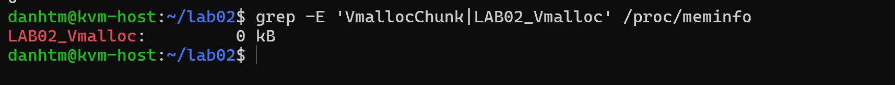

Kết quả sau khi load:

```text
LAB02_Vmalloc:       0 kB
```

Kiểm tra thêm kernel log:

```bash
sudo journalctl -k --since '-10 minutes' | tee audit/kernel-after-load.log
```

Pass khi behavior mới xuất hiện, `transition=0` và kernel log không có lỗi mới.

## 15. Unload và chứng minh rollback

Chỉ unload sau khi transition đã hoàn tất:

```bash
sudo kpatch unload ./lab02_meminfo.ko 2>&1 | tee audit/unload-test.txt
grep -E 'VmallocChunk|LAB02_Vmalloc' /proc/meminfo
```


Sau unload, kết quả trở lại:

```text
VmallocChunk:        0 kB
```


## 17. Kết luận

Bài lab đã chứng minh được pipeline kỹ thuật:

```text
source patch
-> meminfo.o thay đổi đúng một function
-> target object vmlinux
-> lab02_meminfo.ko có livepatch metadata
-> load vào đúng kernel 6.8.0-138-generic
-> enabled=1, transition=0
-> behavior mới có hiệu lực
-> unload và khôi phục behavior cũ
```

Điều kiện quyết định để một livepatch module có thể nạp vào KVM host không chỉ là file `.ko` được build thành công. Artifact phải khớp chính xác kernel/ABI/toolchain, source diff phải patchable và được human review, module metadata phải hợp lệ và transition phải hoàn tất.

## 18. Tài liệu tham khảo

- [kpatch README và kiến trúc kpatch-build](https://github.com/dynup/kpatch/blob/master/README.md)
- [kpatch Installation Guide](https://github.com/dynup/kpatch/blob/master/doc/INSTALL.md)
- [kpatch-build manual](https://github.com/dynup/kpatch/blob/master/man/kpatch-build.1)
- [kpatch Patch Author Guide](https://github.com/dynup/kpatch/blob/master/doc/patch-author-guide.md)
- [Linux kernel - Livepatch](https://docs.kernel.org/livepatch/livepatch.html)
- [Ubuntu - Debug Symbol Packages](https://wiki.ubuntu.com/Debug%20Symbol%20Packages)
- [Ubuntu Security - Secure Boot](https://documentation.ubuntu.com/security/docs/security-features/platform-protections/secure-boot/)
