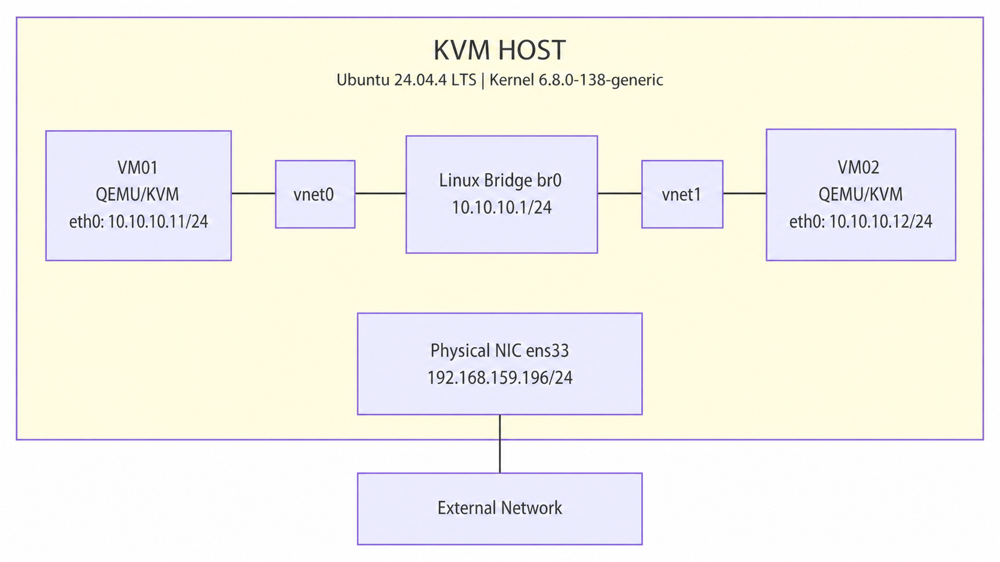
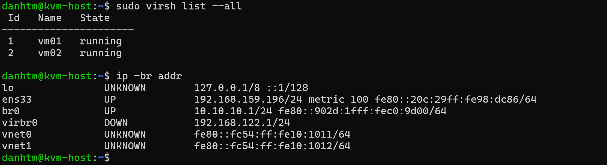
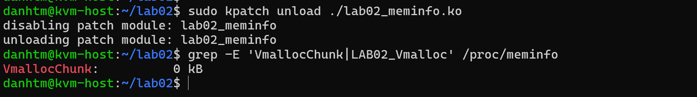
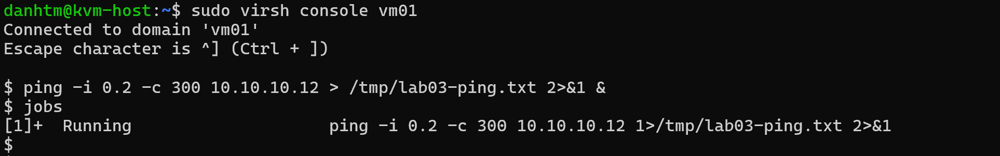
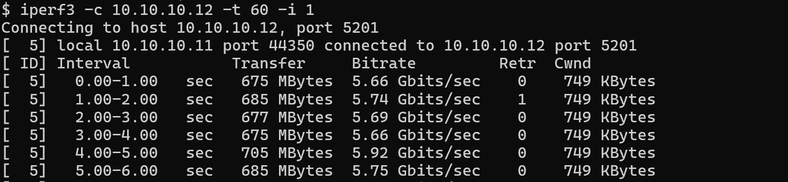
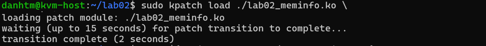
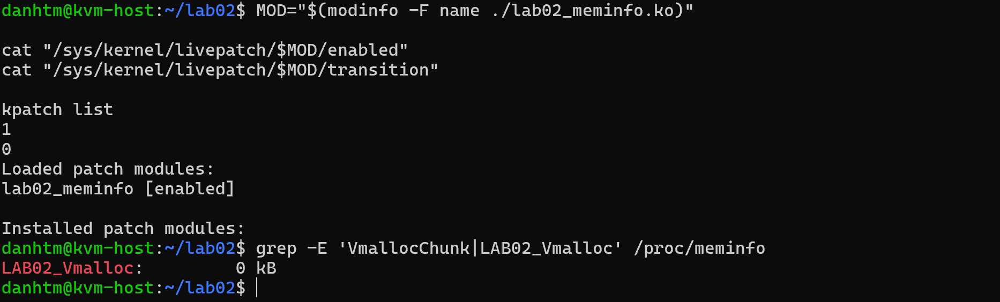
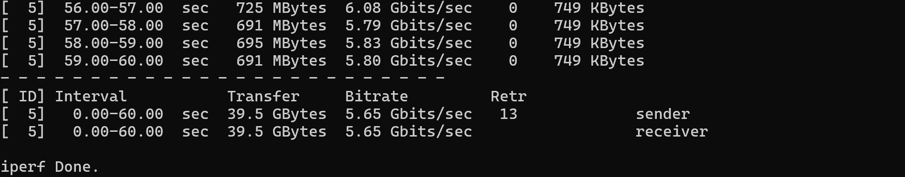
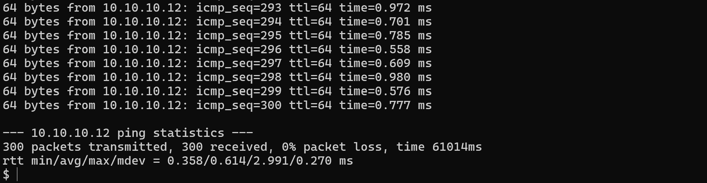

# Lab 03 - Load livepatch khi hai VM đang truyền TCP và ICMP

## 1. Yêu cầu bài lab

Load livepatch module vào kernel của KVM host trong khi hai VM vẫn đang chạy, đồng thời:

- giữ đường ping giữa hai VM;
- truyền TCP bằng `iperf3` giữa hai VM;
- quan sát quá trình load và livepatch transition;
- xác định ping hoặc phiên TCP có bị gián đoạn hay không;
- nếu có gián đoạn, phải định lượng mức độ bằng packet loss, RTT, retransmission, throughput và trạng thái phiên TCP.

## 2. Kết quả đầu ra

| Hạng mục | Kết quả thực tế | Đánh giá |
|---|---:|---|
| Trạng thái VM trước khi test | `vm01` và `vm02` đều `running` | Đạt |
| Livepatch transition | Hoàn tất trong 2 giây | Đạt |
| Trạng thái livepatch sau load | `enabled = 1`, `transition = 0` | Đạt |
| Ping | 300 gửi, 300 nhận, 0% packet loss | Không quan sát thấy mất kết nối ICMP |
| RTT ping | min/avg/max/mdev = `0.358/0.614/2.991/0.270 ms` | Không xuất hiện spike RTT đáng kể trong mẫu đo |
| TCP iperf3 | 60 giây, 39.5 GByte, trung bình 5.65 Gbit/s | Phiên chạy hết thời gian, không reset hoặc disconnect |
| TCP retransmission | 13 lần trong toàn bộ phiên 60 giây | Có retransmission nhưng chưa có bằng chứng quy cho thời điểm load patch |

Kết luận của lần đo này: **không quan sát thấy gián đoạn ICMP hoặc đứt phiên TCP do thao tác load livepatch**. Mức gián đoạn đo được là 0 gói ping bị mất và 0 lần TCP disconnect/reset. Có 13 TCP retransmissions trong toàn bộ bài test do livepatch gây ra.


**Đường traffic giữa hai VM:**


Module được load vào kernel của **KVM host**, không load vào kernel của hai guest VM. Vì QEMU/KVM và các `vnet` interface vẫn hoạt động trên host trong lúc transition, ping và TCP được dùng để phát hiện ảnh hưởng tới workload VM.

## 3. Chuẩn bị trước khi test

### 3.1. Xác nhận hai VM và bridge đang hoạt động

Trên KVM host:

```bash
sudo virsh list --all
```



Kết quả ghi nhận:

- `vm01` và `vm02` đều ở trạng thái `running`;
- `br0` ở trạng thái `UP` với địa chỉ `10.10.10.1/24`;
- `vnet0` và `vnet1` tồn tại để nối hai VM vào bridge.

Sau khi host hoặc VM reboot, địa chỉ đặt bằng lệnh `ip addr` của Lab 01 không còn được lưu. Khi đó cần cấu hình lại IP trong từng guest.

Trên `vm01`:

```bash
sudo pkill dhcpcd 2>/dev/null || true
sudo ip link set eth0 up
sudo ip addr flush dev eth0
sudo ip addr add 10.10.10.11/24 dev eth0
ip -br addr show eth0
```

Trên `vm02`:

```bash
sudo pkill dhcpcd 2>/dev/null || true
sudo ip link set eth0 up
sudo ip addr flush dev eth0
sudo ip addr add 10.10.10.12/24 dev eth0
ip -br addr show eth0
```

### 3.2. Đưa livepatch về trạng thái baseline

Vì module đã được dùng ở Lab 02, trước khi đo cần bảo đảm patch chưa active:

```bash
sudo kpatch unload ./lab02_meminfo.ko
grep -E 'VmallocChunk|LAB02_Vmalloc' /proc/meminfo
```



Kết quả `VmallocChunk: 0 kB` xác nhận code gốc đang có hiệu lực. Bước này tránh trường hợp chạy `kpatch load` khi module đã được enable từ trước, làm sai ý nghĩa phép đo.

## 4. Khởi chạy workload giữa hai VM

Các lệnh dưới đây được giữ chạy trong những terminal hoặc pane `tmux` riêng. Trình tự quan trọng là phải khởi chạy ping và `iperf3` trước, sau đó mới load livepatch trên host.

### 4.1. Chạy iperf3 server trên vm02

Trên `vm02`:

```bash
iperf3 -s
```

Server lắng nghe TCP port `5201` và chờ client từ `vm01`.

### 4.2. Chạy ping liên tục từ vm01

Trên `vm01`:

```bash
ping -i 0.2 -c 300 10.10.10.12 > /tmp/lab03-ping.txt 2>&1 &
jobs
```



Phép đo gửi 300 gói, mỗi gói cách nhau 0,2 giây, nên bao phủ xấp xỉ 60 giây. Output được ghi ra file để không trộn với màn hình `iperf3`.

### 4.3. Chạy TCP iperf3 từ vm01 tới vm02

Vẫn trên `vm01`:

```bash
iperf3 -c 10.10.10.12 -t 60 -i 1
```



Trong các interval đầu, traffic đạt khoảng 5,66-5,92 Gbit/s. Khi phiên TCP này và ping vẫn đang chạy, chuyển sang terminal của KVM host để load module.

## 5. Load livepatch trong lúc traffic đang chạy

Trên KVM host:

```bash
sudo kpatch load ./lab02_meminfo.ko
```
Output quan trọng:



Hai giây ở đây là thời gian livepatch core chờ các task chuyển sang patch state mới tại safe state. Đây **không phải** bằng chứng rằng network hoặc VM bị dừng trong hai giây. Việc có downtime hay không phải được kết luận từ kết quả ping và `iperf3`.

## 6. Xác nhận patch đã có hiệu lực

Sau khi lệnh load hoàn tất:

```bash
MOD="$(modinfo -F name ./lab02_meminfo.ko)"

cat "/sys/kernel/livepatch/$MOD/enabled"
cat "/sys/kernel/livepatch/$MOD/transition"
kpatch list
grep -E 'VmallocChunk|LAB02_Vmalloc' /proc/meminfo
```



Kết quả:

```text
enabled    = 1
transition = 0
lab02_meminfo [enabled]
LAB02_Vmalloc: 0 kB
```

Điều này chứng minh:

- module đã được enable;
- transition đã kết thúc, không còn task chờ chuyển patch state;
- function replacement thực sự có hiệu lực ở runtime.

## 7. Kết quả đường TCP

Phiên `iperf3` kết thúc đủ 60 giây:



Phân tích:

- client và server giữ cùng một phiên TCP tới hết 60 giây;
- không có lỗi `connection reset`, `broken pipe`, timeout hoặc disconnect;
- tổng dữ liệu truyền là 39,5 GByte với bitrate trung bình 5,65 Gbit/s;
- các interval cuối vẫn đạt khoảng 5,79-6,08 Gbit/s;
- sender ghi nhận 13 retransmissions trong toàn bộ phiên.

Retransmission là cơ chế TCP gửi lại segment chưa được ACK; nó không đồng nghĩa phiên TCP bị đứt. Do bài đo chưa ghi timestamp tuyệt đối cho từng interval và thời điểm chạy `kpatch load`, chưa thể xác định 13 retransmissions xuất hiện trước, trong hay sau transition. Vì vậy kết luận đúng là **TCP không bị gián đoạn ở mức phiên**, còn 13 retransmissions phải được giữ nguyên trong báo cáo thay vì coi là bằng 0.

## 8. Kết quả đường ping

Trên `vm01`:



Phân tích:

- không mất gói ICMP nào trong toàn bộ khoảng đo;
- RTT trung bình là 0,614 ms;
- RTT lớn nhất chỉ 2,991 ms;
- không xuất hiện khoảng timeout hoặc chuỗi packet loss tại thời điểm load patch.

Với phép đo này, mức gián đoạn ICMP quan sát được là **0 gói và 0% packet loss**.

## 9. Kết luận

Lab 03 đã thực hiện đúng trình tự:

```text
hai VM running
-> đưa livepatch về baseline
-> chạy ping 0,2 giây/gói và TCP iperf3 60 giây
-> load lab02_meminfo.ko trên KVM host
-> transition hoàn tất trong 2 giây
-> enabled=1, transition=0, behavior mới có hiệu lực
-> ping 0% loss và TCP không bị reset
```

Trong độ phân giải của phép đo, livepatch được áp dụng thành công mà không gây downtime cho traffic giữa hai VM. Kết quả này phù hợp với mục tiêu live patch kernel trên compute host đang có workload mà không reboot host hoặc dừng guest.
