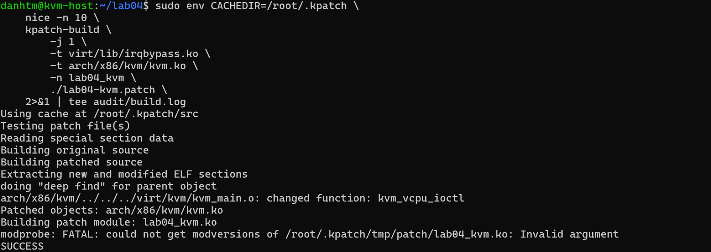
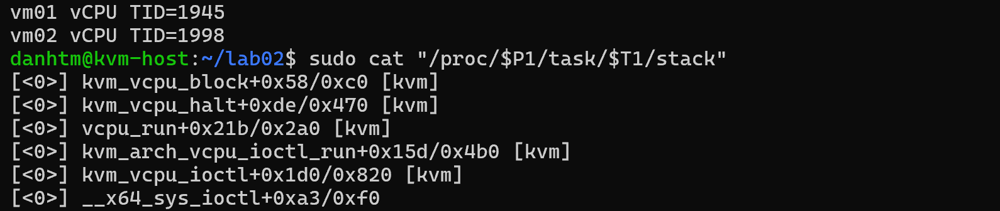
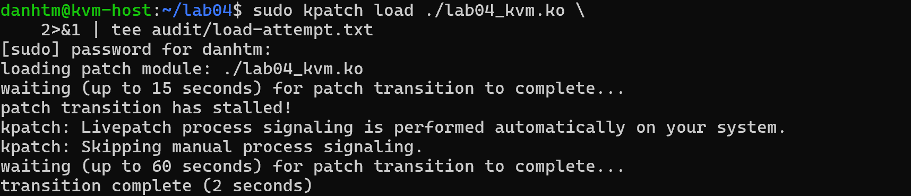
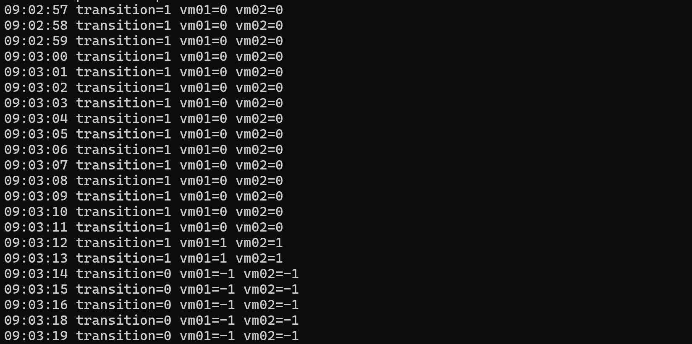
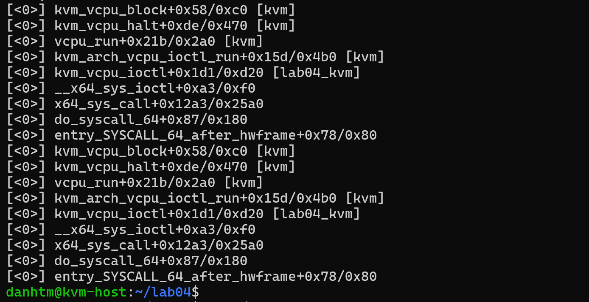
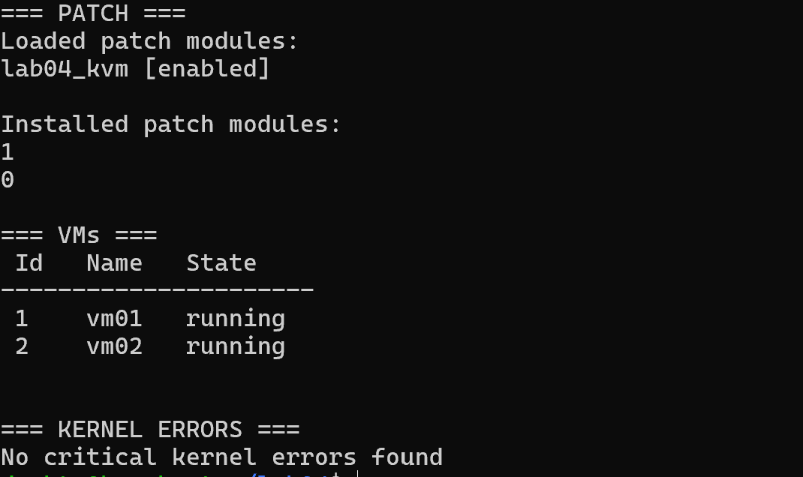
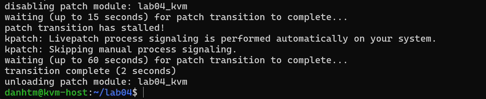

# Lab 04 - Giả lập QEMU vCPU làm livepatch transition bị stalled

## 1. Yêu cầu bài lab

Giả lập stalled process khi chạy `kpatch load` trên KVM host đang có hai VM running, trong đó các thread vCPU của hai tiến trình QEMU giữ execution context trong KVM. Bài lab cần trả lời:

- vì sao các QEMU vCPU thread chưa thể đạt safe state;
- sau bao lâu transition được xem là stalled hoặc thất bại;
- khi load thất bại, kernel có tự rollback hay không;
- các task đã chuyển sang patched state có bị “loạn ftrace” khi task khác vẫn chưa chuyển hay không.

## 2. Kết quả bài lab

| Câu hỏi | Kết quả của bài lab |
|---|---|
| Vì sao chưa có safe state? | Hai vCPU thread đang ngủ trong `kvm_vcpu_block()` nhưng frame `kvm_vcpu_ioctl()` cũ vẫn còn trên kernel stack. Đây chính là function được patch, nên stack checking chưa thể chứng minh task an toàn để đổi state. |
| Transition stalled sau bao lâu? | `kpatch` chờ 15 giây rồi in `patch transition has stalled!`. Đây là ngưỡng phát hiện stall, chưa phải load thất bại. |
| Kết quả thực tế | Automatic process signaling đánh thức các thread; transition hoàn tất thêm khoảng 2 giây sau đó, tổng thời gian quan sát khoảng 17 giây. |
| Khi nào `kpatch load` mới thất bại? | Với `kpatch 0.9.11`: chờ 15 giây, sau đó chờ thêm tối đa 60 giây. Nếu vẫn `transition=1` sau khoảng 75 giây, helper mới trả lỗi load và yêu cầu reverse/unload. |
| Kernel có tự rollback sau timeout không? | Không. Kernel livepatch có thể giữ transition pending vô hạn. Chính chương trình userspace `kpatch` áp dụng policy timeout rồi ghi disable để yêu cầu reverse transition và chỉ unload sau khi reverse hoàn tất. |
| Task đã patch có bị loạn ftrace không? | Không. Trong transition, livepatch/ftrace handler chọn implementation theo `patch_state` của từng task: state `0` đi code cũ, state `1` đi code mới. Đây là per-task consistency được thiết kế sẵn. |

Điểm quan trọng: lần thực hành này **tạo được stalled transition tạm thời nhưng không tạo load failure**. Forward transition đã hoàn tất an toàn sau automatic signaling.

## 3. Môi trường và đối tượng được patch

Lab sử dụng lại KVM host của [Lab 01](../lab-01/README.md), toolchain của [Lab 02](../lab-02/README.md) và hai VM đang chạy:

| Thành phần | Giá trị |
|---|---|
| KVM host | Ubuntu 24.04.4 LTS |
| Kernel | `6.8.0-138-generic` |
| Kpatch | `0.9.11` |
| QEMU process | Mỗi VM có một process `qemu-system-x86_64` và các vCPU thread |
| VM | `vm01` và `vm02` đều running |
| Source object thay đổi | `virt/kvm/kvm_main.o` |
| Function thay đổi | `kvm_vcpu_ioctl()` |
| Target kernel object | `arch/x86/kvm/kvm.ko` |
| Livepatch module | `lab04_kvm.ko` |
| vCPU TID quan sát | `vm01: 1945`, `vm02: 1998` |

Trong đề bài, “tiến trình `qemu_x86_64`” được hiểu là các process `qemu-system-x86_64` do libvirt khởi chạy. Blocker thực tế là **vCPU thread** bên trong mỗi process, không phải toàn bộ process QEMU cùng bị treo.

## 4. Build livepatch module cho KVM

Trong `~/lab04`:

```bash
mkdir -p audit

sudo env CACHEDIR=/root/.kpatch \
  nice -n 10 \
  kpatch-build \
    -j 1 \
    -t virt/lib/irqbypass.ko \
    -t arch/x86/kvm/kvm.ko \
    -n lab04_kvm \
    ./lab04-kvm.patch \
    2>&1 | tee audit/build.log
```



Các dòng audit quan trọng:

```text
virt/kvm/kvm_main.o: changed function: kvm_vcpu_ioctl
Patched objects: arch/x86/kvm/kvm.ko
Building patch module: lab04_kvm.ko
SUCCESS
```

`kpatch-build` nhận diện đúng một function thay đổi là `kvm_vcpu_ioctl()` và đóng gói replacement vào `lab04_kvm.ko`.

Build log vẫn có cảnh báo:

```text
modprobe: FATAL: could not get modversions of .../lab04_kvm.ko: Invalid argument
```

Tương tự Lab 02, build kết thúc bằng `SUCCESS` nhưng vẫn phải kiểm tra `vermagic`, `livepatch=Y`, changed-function list và kernel log trước khi load. Không được xem mọi cảnh báo modversions là vô hại trên host khác.

## 5. Xác định QEMU vCPU thread giữ affected function

### 5.1. Quan hệ giữa QEMU, KVM_RUN và kvm_vcpu_ioctl

Mỗi vCPU của VM thường được QEMU vận hành bằng một userspace thread. Thread gọi:

```text
ioctl(vcpu_fd, KVM_RUN)
        ↓
__x64_sys_ioctl()
        ↓
kvm_vcpu_ioctl()
        ↓
kvm_arch_vcpu_ioctl_run()
        ↓
vcpu_run()
        ↓
kvm_vcpu_halt()
        ↓
kvm_vcpu_block()
```

`KVM_RUN` có thể giữ thread trong kernel lâu khi guest đang chạy hoặc khi vCPU ngủ chờ event. Vì vậy, dù process QEMU vẫn là userspace process, một vCPU thread cụ thể có thể chưa quay lại userspace.

### 5.2. Xem kernel stack trước khi load

Sau khi xác định PID của QEMU process và TID của vCPU thread, kiểm tra từng stack:

```bash
sudo cat "/proc/$P1/task/$T1/stack"
sudo cat "/proc/$P2/task/$T2/stack"
```

Trong lần đo:

```text
vm01 vCPU TID=1945
vm02 vCPU TID=1998
```



Stack quan sát được:

```text
kvm_vcpu_block()              [kvm]
kvm_vcpu_halt()               [kvm]
vcpu_run()                    [kvm]
kvm_arch_vcpu_ioctl_run()     [kvm]
kvm_vcpu_ioctl()              [kvm]
__x64_sys_ioctl()
```

Thread đang ngủ sâu trong `kvm_vcpu_block()`, nhưng `kvm_vcpu_ioctl()` vẫn là một frame chưa return trên cùng call chain. Đây là điều kiện tạo blocker cho patch này.

## 6. Vì sao chưa thể đạt safe state?

### 6.1. Safe state không đơn giản là “task đang ngủ”

Với kernel có reliable stacktrace, livepatch core kiểm tra stack của sleeping task. Task chỉ có thể đổi patch state khi stack không còn function bị ảnh hưởng.

Trong bài lab:

```text
affected function = kvm_vcpu_ioctl()
current stack      = ... -> kvm_vcpu_ioctl() -> ... -> kvm_vcpu_block()
stack check        = affected function vẫn active
result             = chưa safe, giữ patch_state=0
```

`kvm_vcpu_block()` nằm trên đỉnh stack chỉ cho biết thread đang ngủ ở đâu. Nó không làm các frame phía dưới tự biến mất. Chừng nào `kvm_vcpu_ioctl()` chưa return, execution context của implementation cũ vẫn còn sống.

### 6.2. Tại sao kernel không đổi state ngay?

Dynamic ftrace redirect ở function entry. Một invocation của `kvm_vcpu_ioctl()` đã đi qua entry và đang thực thi code cũ không thể bị cắt giữa chừng để nhảy tùy ý sang code mới.

Nếu task được đánh dấu patched khi old function vẫn còn trên stack, các function call tiếp theo của cùng task có thể đi vào replacement trong khi lock, reference, dữ liệu tạm hoặc invariant vẫn được tạo bởi code cũ. Kernel không thể suy luận từ một source diff rằng mọi cách trộn old/new đều an toàn, nên consistency model dùng quy tắc bảo thủ: **giữ toàn bộ task ở old state cho tới khi chứng minh được safe state**.

Trong patch demo, thay đổi có thể nhỏ và ít rủi ro, nhưng livepatch core vẫn phải áp dụng cùng một consistency rule như với một bản vá CVE phức tạp.

### 6.3. Safe state xuất hiện khi nào?

Với QEMU vCPU thread, đường an toàn thường là:

1. thread được wake hoặc bị interrupt;
2. `KVM_RUN` thoát khỏi đường chạy hiện tại;
3. `kvm_vcpu_ioctl()` cũ được tháo khỏi stack;
4. task đi qua kernel-to-userspace boundary;
5. livepatch cập nhật task từ state `0` sang `1`;
6. lần gọi kernel tiếp theo của task được ftrace route sang replacement.

Vì vậy cách nói chính xác là “hai vCPU thread **chưa thể đạt safe state trong cửa sổ đầu**”, không phải “QEMU vĩnh viễn không có safe state”.

## 7. Theo dõi transition và per-task state

Trong một terminal riêng, theo dõi:

```bash
MOD=lab04_kvm

while true; do
  printf '%s transition=%s vm01=%s vm02=%s\n' \
    "$(date +%T)" \
    "$(cat /sys/kernel/livepatch/$MOD/transition 2>/dev/null)" \
    "$(cat /proc/$P1/task/$T1/patch_state 2>/dev/null)" \
    "$(cat /proc/$P2/task/$T2/patch_state 2>/dev/null)"
  sleep 1
done
```

Ý nghĩa giá trị:

| `transition` | `patch_state` | Ý nghĩa |
|---:|---:|---|
| `1` | `0` | Forward transition đang diễn ra; task vẫn dùng code cũ. |
| `1` | `1` | Task đã đạt safe state và dùng code mới, nhưng task khác có thể còn pending. |
| `0` | `-1` | Không còn transition cần biểu diễn; không được hiểu `-1` là task bị rollback. |

## 8. Load patch và quan sát forward transition

Trong terminal chính:

```bash
cd ~/lab04
sudo kpatch load ./lab04_kvm.ko \
  2>&1 | tee audit/load-attempt.txt
```



Output:

```text
waiting (up to 15 seconds) for patch transition to complete...
patch transition has stalled!
kpatch: Livepatch process signaling is performed automatically on your system.
kpatch: Skipping manual process signaling.
waiting (up to 60 seconds) for patch transition to complete...
transition complete (2 seconds)
```

Diễn biến per-task:



| Thời điểm | Patch | vm01 vCPU | vm02 vCPU | Diễn giải |
|---|---:|---:|---:|---|
| 09:02:57 - 09:03:11 | `transition=1` | `0` | `0` | Cả hai affected stack còn active; ftrace tiếp tục route chúng vào code cũ. |
| 09:03:12 - 09:03:13 | `transition=1` | `1` | `1` | Hai vCPU thread đã đạt safe state và chuyển sang code mới; livepatch core đang hoàn tất hội tụ toàn hệ thống. |
| Từ 09:03:14 | `transition=0` | `-1` | `-1` | Forward transition hoàn tất. |

Từ 09:02:57 tới 09:03:14 là khoảng 17 giây. Nó khớp với:

```text
15 giây chờ đầu
+ khoảng 2 giây trong cửa sổ sau signaling
= khoảng 17 giây tổng cộng
```

## 9. Transition thất bại sau bao lâu?

Phải phân biệt ba loại timeout:

### 9.1. Timeout của kernel livepatch core

Kernel không có policy “sau N giây tự fail”. Nếu còn task ở initial state, `/sys/kernel/livepatch/lab04_kvm/transition` có thể giữ giá trị `1` vô thời hạn.

### 9.2. Timeout của kpatch 0.9.11

Script `kpatch` dùng:

```text
POST_ENABLE_WAIT = 15 giây
POST_SIGNAL_WAIT = 60 giây
```

Timeline:

| Khoảng thời gian | Hành vi |
|---|---|
| 0-15 giây | Poll `transition` và chờ hội tụ tự nhiên. |
| Sau 15 giây | In `patch transition has stalled!` và yêu cầu signal/poke nếu hệ thống cần. Đây chưa phải failure. |
| 15-75 giây | Chờ thêm tối đa 60 giây. |
| Sau khoảng 75 giây vẫn pending | `wait_for_patch_transition()` trả lỗi; `kpatch load` coi lần load thất bại. |

Con số 75 giây là policy của đúng phiên bản `kpatch` dùng trong lab, không phải ABI cố định của Linux và có thể khác giữa distro hoặc phiên bản tool.

## 10. Nếu hết timeout thì ai rollback?

> Kernel không tự rollback chỉ vì thời gian trôi qua. Khi hết cả hai cửa sổ chờ, chương trình userspace `kpatch` chủ động yêu cầu hủy forward transition bằng cách disable patch; kernel sau đó thực hiện reverse transition theo consistency model.

Với một module mới được load, flow của `kpatch 0.9.11` là:

```text
forward transition vẫn pending sau 15 + 60 giây
        ↓
kpatch báo load failed
        ↓
kpatch yêu cầu enabled = 0
        ↓
kernel bắt đầu reverse transition: task 1 → 0
        ↓
chỉ khi reverse transition hoàn tất mới rmmod
```

Reverse transition cũng có thể stalled vì một task đã dùng replacement vẫn phải tìm safe state trước khi quay về code cũ. Nếu reverse chưa hoàn tất, module không được tháo cưỡng bức.

Nếu người vận hành dùng `insmod` hoặc ghi sysfs trực tiếp thay vì helper `kpatch load`, không nên giả định có policy 15 + 60 giây hoặc auto-cancel tương tự.

## 11. Vì sao không bị “loạn ftrace”?

### 11.1. Ftrace handler không bị thay riêng cho từng process

Livepatch đăng ký một ftrace handler cho affected function. Trong transition, handler đọc state của `current` task để chọn đích:

```text
task patch_state = 0  → original kvm_vcpu_ioctl() trong [kvm]
task patch_state = 1  → replacement kvm_vcpu_ioctl() trong [lab04_kvm]
```

Vì vậy tại cùng một thời điểm có thể tồn tại:

- vCPU thread A chưa safe, tiếp tục đi code cũ;
- task B đã safe, các lần gọi mới đi code replacement.

Đây là trạng thái hợp lệ và có chủ đích của per-task consistency. Một task không bị redirect nửa đầu invocation sang code cũ rồi nửa sau sang code mới.

### 11.2. Bằng chứng sau forward transition

Sau khi transition hoàn tất, stack của hai vCPU thread hiển thị:



```text
kvm_vcpu_ioctl+... [lab04_kvm]
```

Tag `[lab04_kvm]` chứng minh invocation mới đang resolve vào replacement function của livepatch module.

### 11.3. Khi reverse và unload

Khi disable:

- target state đổi từ `1` về `0`;
- task đã patch tiếp tục dùng code mới tới safe state;
- task đã chuyển về `0` dùng code cũ;
- ftrace/livepatch metadata vẫn tồn tại trong suốt reverse transition;
- chỉ sau khi mọi task về state `0`, livepatch core mới cho gỡ function khỏi patch stack;
- chỉ sau đó module mới được `rmmod`.

Do đó không có khoảng thời gian replacement code bị tháo trong khi task vẫn có khả năng chạy nó.

## 12. Kiểm tra hệ thống sau forward transition



Kết quả ghi nhận:

- `lab04_kvm [enabled]`;
- `enabled=1` và `transition=0`;
- `vm01` và `vm02` vẫn `running`;
- không phát hiện kernel error nghiêm trọng trong khoảng log được kiểm tra.

Lab này tập trung vào transition state của QEMU vCPU. Việc hai VM vẫn running cho thấy automatic fake signaling không kill QEMU process hoặc dừng VM.

## 13. Reverse transition và unload thực tế

```bash
sudo kpatch unload ./lab04_kvm.ko
```



Kết quả:

```text
disabling patch module: lab04_kvm
waiting (up to 15 seconds) for patch transition to complete...
patch transition has stalled!
waiting (up to 60 seconds) for patch transition to complete...
transition complete (2 seconds)
unloading patch module: lab04_kvm
```

Reverse transition cũng stalled vì các vCPU thread có thể đang ở trong replacement `kvm_vcpu_ioctl()`. Module chỉ được unload sau khi các thread thoát affected stack theo chiều ngược và transition hoàn tất.

Đây là bằng chứng runtime trực tiếp cho việc ftrace và module lifetime không bị xử lý lẫn lộn.

## 14. Lưu ý

- Không nói “QEMU không bao giờ có safe state”; log chứng minh nó đạt safe state sau signaling.
- Không nói “transition thất bại sau 15 giây”; 15 giây chỉ là stalled threshold.
- Không nói “kernel tự rollback sau 75 giây”; rollback là policy do `kpatch` userspace yêu cầu.
- Không nói `patch_state=-1` nghĩa là unpatched; nó chỉ có nghĩa không còn transition đang biểu diễn.
- Không nói mọi task dùng code mới ngay khi module vừa vào `lsmod`.
- Không `rmmod` trực tiếp module khi `transition=1`.
- Không dùng `force` chỉ để làm transition biến mất; force bỏ qua bằng chứng safe stack và làm module không thể remove an toàn trong phiên boot.

## 15. Kết luận

Bài lab đã tạo được tình huống hai QEMU vCPU thread giữ `kvm_vcpu_ioctl()` cũ trên stack trong khi ngủ tại `kvm_vcpu_block()`. Vì affected function vẫn active, livepatch core giữ hai task ở `patch_state=0` và forward transition bị báo stalled sau 15 giây.

Automatic process signaling sau đó đánh thức các thread, giúp chúng tháo old kernel context, đi qua safe boundary và chuyển sang `patch_state=1`. Forward transition hoàn tất sau khoảng 17 giây tổng cộng, không phải thất bại.

Trong suốt quá trình, ftrace handler duy trì per-task routing rõ ràng: task state `0` dùng code cũ, task state `1` dùng code mới. Reverse transition khi unload cũng phải chờ safe state theo chiều ngược trước khi module được tháo. Vì vậy không xảy ra tình trạng task đã transition bị “loạn ftrace” hoặc replacement code bị remove khi còn đang được sử dụng.

## 16. Tài liệu tham khảo

- [Linux kernel Livepatch - consistency model, stalled task và fake signal](https://docs.kernel.org/6.7/livepatch/livepatch.html#consistency-model)
- [Linux kernel Livepatch - enabling, disabling và module removal](https://docs.kernel.org/6.7/livepatch/livepatch.html#livepatch-life-cycle)
- [kpatch 0.9.11 management script - timeout và rollback policy](https://github.com/dynup/kpatch/blob/master/kpatch/kpatch)
- [Linux kernel KVM API - vCPU ioctl và KVM_RUN](https://docs.kernel.org/6.8/virt/kvm/api.html#kvm-run)
- [Kiến thức nền về stalled transition](../../docs/06-xu-ly-stalled-transition.md)
