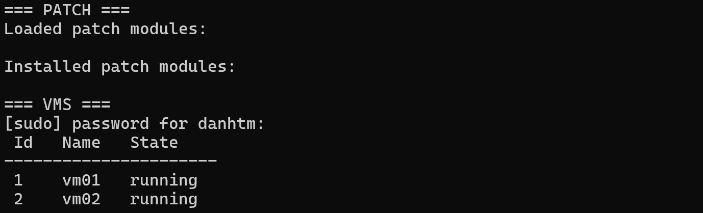
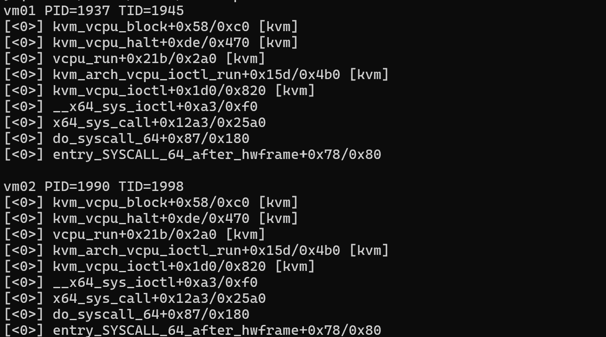
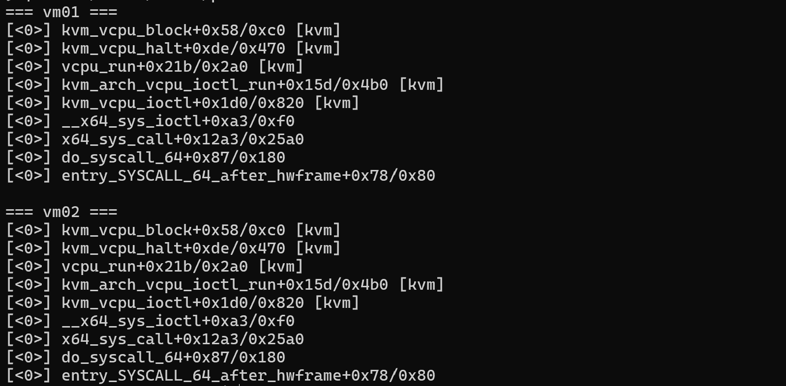
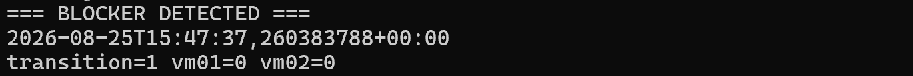
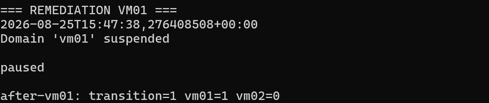
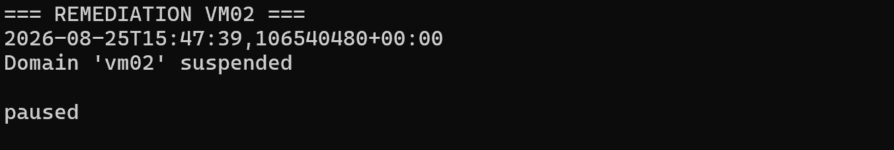
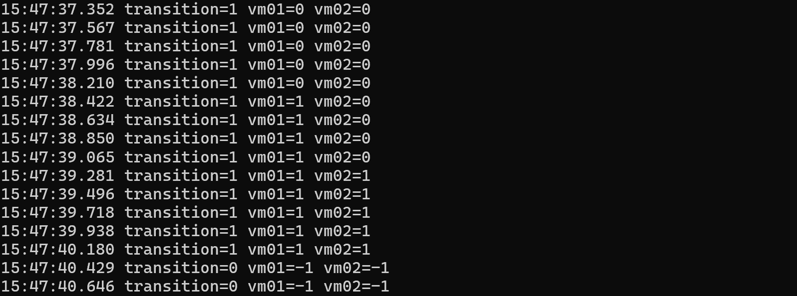
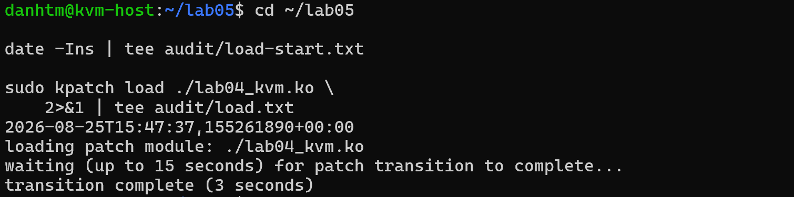
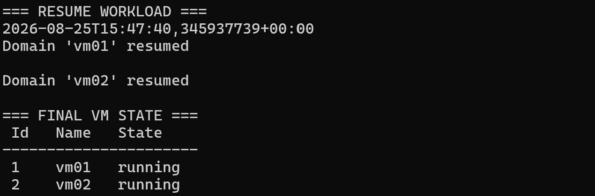
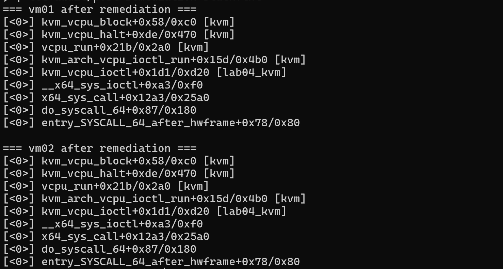

# Lab 05 - Xử lý QEMU vCPU làm kpatch transition bị stalled

## 1. Yêu cầu bài lab

Đề xuất và kiểm chứng cách xử lý khi QEMU vCPU giữ affected KVM function trên stack làm livepatch transition bị stalled như [Lab 04](../lab-04/README.md). Bài lab trả lời hai trường hợp:

- nếu transition **đang pending**, làm thế nào đưa blocker tới safe state mà không kill QEMU hoặc reboot host;
- nếu `kpatch load` **đã báo thất bại**, phải xác nhận rollback tới đâu trước khi quiesce workload và retry.

## 2. Kết quả và phương án được chọn

Hai vCPU của `vm01` và `vm02` đều giữ `kvm_vcpu_ioctl() [kvm]` trên stack và còn ở `patch_state=0`. Trong lab, suspend lần lượt từng VM và quan sát được:

```text
vm01=0, vm02=0  →  vm01=1, vm02=0  →  vm01=1, vm02=1  →  transition=0
```

Patch hoàn tất trong 3 giây với `enabled=1`, `transition=0`. Sau đó hai VM được resume về trạng thái `running`, không cần restart QEMU hoặc reboot host.

`virsh suspend` có dừng CPU và I/O của guest trong khoảng pause, vì vậy cách này có gián đoạn ngắn. Lab 04 cũng chỉ bị báo stalled rồi hoàn tất, chưa tạo ra một load failure thật sự.

## 3. Phải xác định trạng thái sau một lần load thất bại

Nếu `kpatch load` báo lỗi thì không load lại ngay. Trước tiên kiểm tra patch cũ đang forward, reverse hay đã được dọn:

```bash
sudo kpatch list
ls -1 /sys/kernel/livepatch/

MOD=lab04_kvm
sudo cat "/sys/kernel/livepatch/$MOD/enabled"
sudo cat "/sys/kernel/livepatch/$MOD/transition"
```

| `enabled` | `transition` | Cách xử lý |
|---:|---:|---|
| `1` | `1` | Forward còn pending: xử lý blocker hoặc yêu cầu reverse. |
| `1` | `0` | Patch đã áp dụng xong, không retry. |
| `0` | `1` | Reverse còn pending: tiếp tục chờ, không `rmmod`. |
| `0` | `0` hoặc entry đã mất | Kiểm tra thêm `kpatch list`, `lsmod` và `dmesg`; chỉ retry khi module cũ đã được dọn. |

`kpatch 0.9.11` chờ 15 giây, thử signaling rồi chờ thêm tối đa 60 giây. Hết thời gian này, helper yêu cầu reverse nhưng reverse vẫn có thể bị stalled. Vì vậy không được mặc định kernel đã tự rollback chỉ vì lệnh load trả lỗi.

## 4. Thứ tự xử lý an toàn

1. Ghi lại `transition`, `patch_state` và stack của task đang block.
2. Chờ signaling; nếu vẫn kẹt thì migrate VM hoặc `virsh suspend` khi SLA cho phép.
3. Chờ `transition=0` rồi mới resume workload.
4. Nếu vẫn không hội tụ, chuyển sang reverse và review lại patch.

Không kill QEMU, không `rmmod` khi đang transition và không dùng `force=1` để ép hoàn tất.

## 5. Chuẩn bị trạng thái

Lab sử dụng lại:

- KVM host Ubuntu 24.04.4 LTS, kernel `6.8.0-138-generic`;
- `vm01` và `vm02` của Lab 01;
- `lab04_kvm.ko` patch `kvm_vcpu_ioctl()` từ Lab 04.

Trước khi retry:

```bash
sudo kpatch list
sudo virsh list --all
```



Ảnh xác nhận:

- không còn loaded patch module từ lần thử trước;
- `vm01` và `vm02` đều `running`;
- không có forward hoặc reverse transition cũ cần xử lý tiếp.

Nếu module vẫn còn trong sysfs, không được giả lập trạng thái sạch bằng `rmmod -f`. Phải để reverse transition hoàn tất theo livepatch lifecycle.

## 6. Xác định lại QEMU PID, vCPU TID và affected stack

Trong lần đo:

| VM | QEMU PID | vCPU TID |
|---|---:|---:|
| `vm01` | `1937` | `1945` |
| `vm02` | `1990` | `1998` |

Gán các biến phục vụ theo dõi:

```bash
P1=1937
T1=1945
P2=1990
T2=1998

sudo cat "/proc/$P1/task/$T1/stack"
sudo cat "/proc/$P2/task/$T2/stack"
```





Hai stack đều có:

```text
kvm_vcpu_block()              [kvm]
kvm_vcpu_halt()               [kvm]
vcpu_run()                    [kvm]
kvm_arch_vcpu_ioctl_run()     [kvm]
kvm_vcpu_ioctl()              [kvm]
__x64_sys_ioctl()
```

`kvm_vcpu_ioctl()` là affected function của `lab04_kvm.ko`. Dù thread đang ngủ tại `kvm_vcpu_block()`, frame cũ vẫn active ở phía dưới stack nên task chưa thể đổi patch state bằng stack checking.

## 7. Chuẩn bị ba terminal

### 7.1. Terminal A - load livepatch

```bash
cd ~/lab05
mkdir -p audit

date -Ins | tee audit/load-start.txt
sudo kpatch load ./lab04_kvm.ko \
  2>&1 | tee audit/load.txt
```

### 7.2. Terminal B - theo dõi per-task state

Theo dõi ở chu kỳ khoảng 200 ms để thấy từng bước chuyển:

```bash
MOD=lab04_kvm
P1=1937
T1=1945
P2=1990
T2=1998

# Làm mới sudo credential trước khi bắt đầu vòng lấy mẫu.
sudo -v

while [ ! -e "/sys/kernel/livepatch/$MOD/transition" ]; do
  sleep 0.1
done

while true; do
  printf '%s transition=%s vm01=%s vm02=%s\n' \
    "$(date +%T.%3N)" \
    "$(sudo cat /sys/kernel/livepatch/$MOD/transition)" \
    "$(sudo cat /proc/$P1/task/$T1/patch_state)" \
    "$(sudo cat /proc/$P2/task/$T2/patch_state)"
  sleep 0.2
done | tee audit/state-timeline.txt
```

### 7.3. Terminal C - remediation bằng libvirt

Terminal này chỉ suspend VM sau khi đã xác nhận đúng TID đang block và `transition=1`.

Không dùng raw `kill -STOP` với QEMU process vì nó có thể group-stop các thread ngoài phạm vi mong muốn và làm trạng thái quản lý của libvirt khó đối chiếu. `virsh suspend` là thao tác lifecycle có kiểm soát và có `virsh resume` tương ứng.

## 8. Phát hiện hai blocker

Ngay sau khi load bắt đầu:



Ý nghĩa:

- patch đang trong forward transition;
- target của cả hai task là state `1`;
- vCPU của `vm01` và `vm02` vẫn state `0`;
- hai thread này là blocker đã được xác nhận bằng cả `patch_state` và kernel stack.

## 9. Quiesce từng VM blocker

### 9.1. Suspend vm01

```bash
date -Ins
sudo virsh suspend vm01
sudo virsh domstate vm01
```



Chỉ `vm01` chuyển từ state `0` sang `1`. `vm02` vẫn giữ state `0`, nên toàn patch vẫn `transition=1`. Đây là bằng chứng việc quiesce `vm01` đã giúp đúng vCPU thread đó rời affected old context; nó không cưỡng ép tất cả task đổi state đồng loạt.

### 9.2. Suspend vm02

```bash
date -Ins
sudo virsh suspend vm02
sudo virsh domstate vm02
```



Sau khi `vm02` được pause, blocker thứ hai cũng có cơ hội tháo `kvm_vcpu_ioctl()` cũ khỏi active context và chuyển sang patched state.

Suspend tuần tự được dùng để audit quan hệ nhân quả `0/0 → 1/0 → 1/1`. Trong production, thứ tự và phạm vi pause phải nằm trong runbook/SLA của workload.

## 10. Timeline remediation



| Mốc quan sát | Trạng thái | Diễn giải |
|---|---|---|
| 15:47:37.352 - 15:47:38.210 | `transition=1, vm01=0, vm02=0` | Hai QEMU vCPU cùng block forward transition. |
| Từ 15:47:38.422 | `transition=1, vm01=1, vm02=0` | `vm01` đã đạt safe state sau suspend. |
| Từ 15:47:39.281 | `transition=1, vm01=1, vm02=1` | `vm02` cũng đạt safe state. |
| Từ 15:47:40.429 | `transition=0, vm01=-1, vm02=-1` | Transition đã hội tụ toàn hệ thống. |

Chuỗi state:

```text
0/0 → 1/0 → 1/1 → -1/-1
```

`-1` không có nghĩa task bị rollback. Nó cho biết không còn transition đang diễn ra nên per-task file không cần biểu diễn old/new state nữa.

Monitor chạy theo chu kỳ khoảng 200 ms, vì vậy mốc đầu tiên nhìn thấy `transition=0` là thời điểm phát hiện, không nhất thiết là nanosecond chính xác kernel hoàn tất transition.

## 11. Kpatch load hoàn tất trước ngưỡng stalled



Không xuất hiện `patch transition has stalled!`. So sánh:

| Bài lab | Cách xử lý | Kết quả |
|---|---|---|
| Lab 04 | Chờ cơ chế automatic signaling | Báo stalled sau khoảng 15 giây, sau đó hoàn tất thêm khoảng 2 giây. |
| Lab 05 | Chủ động quiesce đúng hai blocker | Hoàn tất trong 3 giây, trước stalled threshold. |

## 12. Khôi phục workload

Chỉ resume sau khi lệnh load đã hoàn tất và trạng thái patch đã được xác nhận:

```bash
MOD=lab04_kvm
sudo cat "/sys/kernel/livepatch/$MOD/enabled"
sudo cat "/sys/kernel/livepatch/$MOD/transition"

sudo virsh resume vm01
sudo virsh resume vm02
sudo virsh list --all
```



Hai VM trở lại `running` mà không restart QEMU hoặc reboot host. Operator resume sau khi `kpatch load` trả về `transition complete`; runbook vẫn đọc trực tiếp `enabled=1`, `transition=0` trước khi resume.

Từ timestamp trong log:

| VM | Suspend | Resume | Khoảng pause phía host |
|---|---|---|---:|
| `vm01` | 15:47:38.276 | 15:47:40.345 | khoảng 2,07 giây |
| `vm02` | 15:47:39.106 | 15:47:40.345 | khoảng 1,24 giây |

Đây là **command-window ước lượng**, không phải downtime đo bên trong guest. Suspend dừng CPU và I/O; PDF không có ping/`iperf3` chạy đồng thời nên báo cáo không khẳng định zero downtime network.

## 13. Xác nhận code mới được sử dụng

Sau remediation và resume, lấy lại stack của hai vCPU:



```text
kvm_vcpu_ioctl+... [lab04_kvm]
```

Tag `[lab04_kvm]` chứng minh các invocation mới của cả hai vCPU thread đang được livepatch/ftrace route vào replacement function. Việc hai thread lại ngủ trong `kvm_vcpu_block()` sau resume là bình thường; điểm khác biệt là affected outer frame giờ thuộc module patch.

## 14. Vì sao suspend xử lý được blocker?

`virsh suspend` không sửa ftrace trực tiếp. Nó pause domain và kick/wake vCPU khỏi KVM run path, tạo cơ hội để invocation cũ của `kvm_vcpu_ioctl()` return. Livepatch core khi đó đổi task từ state `0` sang `1`; sau resume, invocation mới được route vào `kvm_vcpu_ioctl() [lab04_kvm]`.

Kết quả này đúng với blocker đã quan sát trong lab. Nếu affected stack thuộc I/O path, task `D` hoặc kthread khác thì phải điều tra theo subsystem tương ứng.

## 15. Nếu transition thất bại thì sao?

1. Lưu `patch_state`, stack, wchan và kernel log.
2. Migrate/evacuate workload nếu có thể.
3. Nếu forward không thể hội tụ an toàn, yêu cầu reverse:

```bash
echo 0 | sudo tee /sys/kernel/livepatch/lab04_kvm/enabled
sudo cat /sys/kernel/livepatch/lab04_kvm/transition
```

Ghi `enabled=0` chỉ **khởi động reverse transition**. Chỉ unload khi reverse đã về `transition=0`; sau khi helper kết thúc vẫn phải kiểm tra sysfs, module và `kpatch list`.

Các giới hạn an toàn cần nhớ:

- không `rmmod` khi `transition=1`;
- không dùng `force=1` nếu chưa có patch author/vendor phê duyệt và kế hoạch reboot;
- không kill QEMU hoặc dùng `virsh destroy` để giải phóng blocker.

Nếu vẫn kẹt, giữ lại stack để review và cân nhắc patch một leaf function hẹp hơn.

## 16. Kết luận

Trong Lab 05, suspend tuần tự `vm01` và `vm02` đưa state từ `0/0 → 1/0 → 1/1 → -1/-1`. Transition hoàn tất trong 3 giây, hai VM được resume và stack mới đi qua `kvm_vcpu_ioctl() [lab04_kvm]`.

Cách này không reboot host nhưng có pause workload. Với SLA zero/near-zero downtime nên ưu tiên migrate/evacuate VM; nếu một load thật sự thất bại thì phải kiểm tra reverse state, không mặc định kernel đã tự rollback.

## 17. Tài liệu tham khảo

- [Linux kernel 6.8 Livepatch - consistency model, signal, cancel và force](https://docs.kernel.org/6.8/livepatch/livepatch.html#consistency-model)
- [Linux kernel 6.8 Livepatch - disabling và module removal](https://docs.kernel.org/6.8/livepatch/livepatch.html#livepatch-life-cycle)
- [kpatch 0.9.11 - timeout, stalled process và rollback policy](https://github.com/dynup/kpatch/blob/v0.9.11/kpatch/kpatch)
- [Linux 6.8 source - livepatch transition và automatic fake signal](https://github.com/torvalds/linux/blob/v6.8/kernel/livepatch/transition.c)
- [libvirt - suspend và resume domain](https://wiki.libvirt.org/VM_lifecycle.html#pausing-a-guest-domain)
- [libvirt - live migration](https://www.libvirt.org/migration.html)
- [Lab 04 - nguyên nhân QEMU vCPU làm transition stalled](../lab-04/README.md)
- [Kiến thức nền - xử lý stalled transition](../../docs/06-xu-ly-stalled-transition.md)
