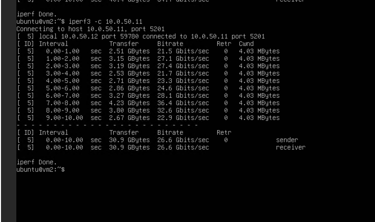
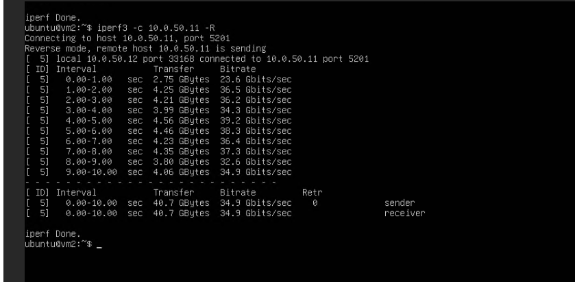
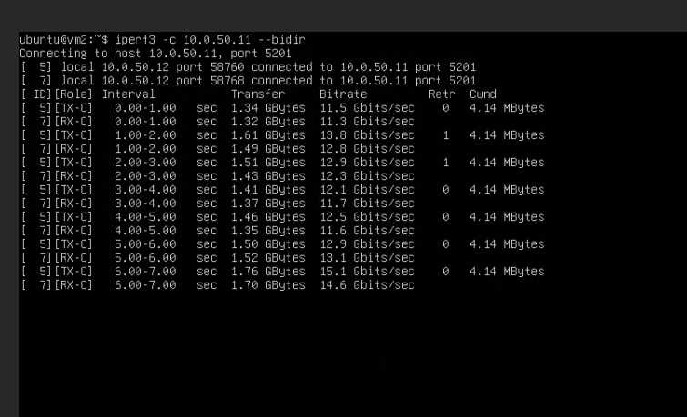

## Bước 1: Cập nhật hệ thống và cài đặt Kernel cụ thể

Đầu tiên, bạn cần tìm và cài đặt đúng phiên bản kernel 6.8.0-134-generic.

Chạy các lệnh sau trên KVM Host:

```
sudo apt update
# Tìm kiếm chính xác gói kernel trong repository
apt-cache search linux-image-6.8.0-134-generic

# Cài đặt kernel và headers
sudo apt install -y linux-image-6.8.0-134-generic linux-headers-6.8.0-134-generic
```

Sau khi cài đặt thành công, hãy khởi động lại máy (sudo reboot). Khi máy lên, kiểm tra lại bằng lệnh uname -r để chắc chắn host đang chạy kernel 6.8.0-134-generic.

## Bước 2: Chuẩn bị host:

### 2.1: Kiểm tra hỗ trợ ảo hóa phần cứng

```
egrep -c '(vmx|svm)' /proc/cpuinfo
lsmod | grep kvm
uname -r   # xác nhận 6.8.0-134-generic
```

Nếu số trả về > 0 là CPU hỗ trợ VT-x/AMD-V. Nếu = 0, cần bật Virtualization trong BIOS trước (nếu chạy trên máy vật lý). Nếu host của bạn là 1 VM lồng nhau (nested), cần bật nested virtualization ở tầng dưới.

### 2.2: Cài gói KVM/QEMU/libvirt

```
sudo apt update
sudo apt install -y qemu-kvm libvirt-daemon-system libvirt-clients \
    bridge-utils virtinst cloud-image-utils genisoimage \
    virt-manager netplan.io
```

## 2.3 Kiểm tra dịch vụ và quyền

```
sudo systemctl enable --now libvirtd
sudo systemctl status libvirtd --no-pager
sudo usermod -aG libvirt,kvm $USER
newgrp libvirt
```

## Bước 3: Tạo Linux bridge (br0) trên host

### 3.1 Xác định NIC:

```
ip a
```

- Tìm cổng ip hiện tại đang dùng để kết nối internet

### 3.2 Cấu hình netplan tạo br0

```
cat > /etc/netplan/90-kvm-lab-bridge.yaml <<'EOF'
network:
  version: 2
  renderer: networkd
  ethernets:
    eth0:
      dhcp4: no
  bridges:
    br0:
      interfaces: [eth0]
      macaddress: fa:16:3e:38:4e:e4
      dhcp4: yes
      addresses: [10.0.50.1/24]
      parameters:
        stp: false
        forward-delay: 0
EOF

chmod 600 /etc/netplan/90-kvm-lab-bridge.yaml
```

- Đổi macaddress ở trên thành macaddress của eth0
- eth0 không nhận IP trực tiếp nữa (dhcp4: no) — nó chỉ đóng vai trò "cổng" của bridge.
- br0 mới là interface nhận địa chỉ IP (dhcp4: yes)
- stp: false, forward-delay: 0: tắt Spanning Tree Protocol delay để bridge lên nhanh (không cần STP vì đây không phải mạng có loop phức tạp).

Áp dụng:

```
sudo netplan try
sudo netplan apply
```

### 3.3 Kiểm tra bridge

```
ip a show br0
bridge link show
```

Bạn phải thấy br0 ở trạng thái UP, có IP, và eth0 là member (master br0).

### 3.4 Bật Ip Forwarding + NAT:

```
sysctl -w net.ipv4.ip_forward=1
echo 'net.ipv4.ip_forward=1' > /etc/sysctl.d/99-ip-forward.conf

iptables -t nat -A POSTROUTING -s 10.0.50.0/24 -o br0 -j MASQUERADE
iptables -A FORWARD -s 10.0.50.0/24 -j ACCEPT
iptables -A FORWARD -d 10.0.50.0/24 -j ACCEPT
```

### 3.5 Save trạng thái:

```
apt install -y iptables-persistent
netfilter-persistent save
```

## Bước 4: Tạo 2 VM gán vào bridge

### 4.1: Tải cloud image Ubuntu 24.04 (Noble)

```
mkdir -p /var/lib/libvirt/images
cd /var/lib/libvirt/images

wget https://cloud-images.ubuntu.com/noble/current/noble-server-cloudimg-amd64.img

qemu-img create -f qcow2 -F qcow2 -b noble-server-cloudimg-amd64.img vm1.qcow2 20G
qemu-img create -f qcow2 -F qcow2 -b noble-server-cloudimg-amd64.img vm2.qcow2 20G
```

### 4.2: Tạo cloud-init config cho từng VM

```
mkdir -p ~/kvm-lab/vm1 ~/kvm-lab/vm2
```

- VM1:

```
cat > ~/kvm-lab/vm1/user-data <<'EOF'
#cloud-config
hostname: vm1
password: ubuntu
chpasswd: { expire: false }
ssh_pwauth: true
package_update: true
packages:
  - iperf3
EOF

cat > ~/kvm-lab/vm1/meta-data <<'EOF'
instance-id: vm1
local-hostname: vm1
EOF

cat > ~/kvm-lab/vm1/network-config <<'EOF'
version: 2
ethernets:
  id0:
    match:
      name: en*
    dhcp4: false
    addresses: [10.0.50.11/24]
EOF

genisoimage -output /var/lib/libvirt/images/vm1-seed.iso -volid cidata -joliet -rock \
    ~/kvm-lab/vm1/user-data ~/kvm-lab/vm1/meta-data ~/kvm-lab/vm1/network-config
```

- VM2:

```
cat > ~/kvm-lab/vm2/user-data <<'EOF'
#cloud-config
hostname: vm2
password: ubuntu
chpasswd: { expire: false }
ssh_pwauth: true
package_update: true
packages:
  - iperf3
EOF

cat > ~/kvm-lab/vm2/meta-data <<'EOF'
instance-id: vm2
local-hostname: vm2
EOF

cat > ~/kvm-lab/vm2/network-config <<'EOF'
version: 2
ethernets:
  id0:
    match:
      name: en*
    dhcp4: false
    addresses: [10.0.50.12/24]
EOF

genisoimage -output /var/lib/libvirt/images/vm2-seed.iso -volid cidata -joliet -rock \
    ~/kvm-lab/vm2/user-data ~/kvm-lab/vm2/meta-data ~/kvm-lab/vm2/network-config
```

## Bước 5: Tạo VM bằng virt-install, gắn bridge=br0

```
virt-install \
  --name vm1 \
  --memory 2048 \
  --vcpus 2 \
  --disk /var/lib/libvirt/images/vm1.qcow2,format=qcow2 \
  --disk /var/lib/libvirt/images/vm1-seed.iso,device=cdrom \
  --os-variant ubuntu24.04 \
  --network bridge=br0,model=virtio \
  --graphics none \
  --import \
  --noautoconsole

virt-install \
  --name vm2 \
  --memory 2048 \
  --vcpus 2 \
  --disk /var/lib/libvirt/images/vm2.qcow2,format=qcow2 \
  --disk /var/lib/libvirt/images/vm2-seed.iso,device=cdrom \
  --os-variant ubuntu24.04 \
  --network bridge=br0,model=virtio \
  --graphics none \
  --import \
  --noautoconsole
```

--network bridge=br0,model=virtio gắn thẳng VM vào bridge Linux thật, không qua NAT virbr0 mặc định của libvirt.

### 5.2: Kiểm tra VM đã lên đúng IP

```
virsh list --all
```

Cả 2 VM phải ở trạng thái running. Vào console kiểm tra IP (đợi ~30-60s cho cloud-init chạy xong lần boot đầu):

```
virsh console vm1
```

Login ubuntu / password ubuntu, sau đó:

```
ip a show enp1s0
```

Phải thấy dòng inet 10.0.50.11/24. Thoát console bằng Ctrl + ], làm tương tự với vm2 (kỳ vọng 10.0.50.12/24).

## Bước 6: Test ping giữa vm1 và vm2

Trong console (hoặc SSH nếu host có route tới 10.0.50.0/24 — thường không có nên dùng console là chắc ăn nhất) của vm1:

```
ping -c 4 10.0.50.12
```

## Bước 7: Test iperf3 (TCP, cả 2 chiều)

### Cài đặt iperf3 ở cả 2 VM:

```
virsh console vm1

sudo ip route add default via 10.0.50.1
echo "nameserver 8.8.8.8" | sudo tee /etc/resolv.conf

sudo apt update
sudo apt install -y iperf3
```

Trên vm1 (server):

```
iperf3 -s
```

- Trên VM2:

```
iperf3 -c 10.0.50.11              # chiều client -> server
iperf3 -c 10.0.50.11 -R           # chiều return: server -> client
iperf3 -c 10.0.50.11 --bidir      # cả 2 chiều cùng lúc, 1 lần chạy
```







-R đảo chiều truyền để xác nhận traffic TCP đối xứng qua bridge hoạt động tốt cả 2 hướng, không chỉ 1 chiều upload.
