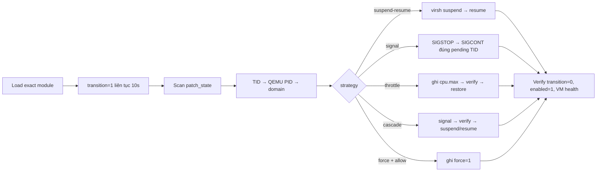

# KPATCH-RECOVERY

> Bộ hồ sơ thực nghiệm recovery Kernel Livepatch cho KVM/QEMU, dùng đúng patch mentor.

## 1. Bài toán cần trả lời

1. Có giữ được một KVM vCPU task ở old livepatch state trên hàm bị vá hay không?
2. Chương trình có tự load patch, tìm pending task, group theo domain và recovery hay không?
3. Signal, whole-domain throttle và `virsh suspend → resume` khác nhau thế nào trên cùng pending condition?
4. Điều kiện hiện tại có vượt acceptance gate `75s` hay không?

Hai mốc thời gian không được nhập làm một:

| Mốc | Vai trò | Trạng thái |
|---|---|---|
| `10s` | recovery trigger để thử và so sánh phương án trước built-in KLP signal | controlled condition đạt; suspend/resume đạt 3/3 |
| `>=75s` | acceptance gate long-stall trong yêu cầu gốc | **NOT REPRODUCED**; no-action transition hoàn tất ở `17.22s` |

```text
RECOVERY_TRIGGER_10S       = PASS
AUTO_SUSPEND_RESUME        = PASS (3/3)
SIGNAL_STRATEGY            = PASS (3/3)
CASCADE_STRATEGY           = PASS (3/3 default + 1 fallback + 1 all)
CAUSAL_SEPARATION_45S      = PASS (9 recovery runs)
POST_CLEANUP_HEALTH_CHECK  = PASS (10/10, 0% packet loss)
SCOPED_RECOVERY_STUDY      = PASS
LONG_STALL_75S             = NOT REPRODUCED
ORIGINAL_ACCEPTANCE_75S    = NOT MET IN FULL
```

Kết quả 10 giây chứng minh recovery trên controlled pending condition; nó không chứng minh đã tạo real stall 75 giây.

## 2. Artifact cố định

| Thành phần | Giá trị |
|---|---|
| Host | `datnt466-kpatch` |
| Kernel | `6.8.0-134-generic` |
| Domain / guest IP | `vm1` / `192.168.122.204` |
| Patch name | `trilogy_cve_2026_64561` |
| Source patch SHA256 | `5b155448ad83ce9b3183be9ae272dc75bd058c579bcb71feb8f0204a7ce4edec` |
| Module SHA256 | `582d5f874fedf92ca5977b66055fca2f83f17170ba0db37227ce204f0c60d011` |
| Recovery source SHA256 | `23b58272d3d77f49d48669050989abf607f73778e831e8b035baf9cd409f3cd4` |
| Matrix runner SHA256 | `521c4eafe20c47568e001198e7d1db16b8498e8323a946c2363ec67e32e09444` |

```bash
export PATCH_MODULE=/home/ubuntu/kpatch-recovery-lab/output-mentor/trilogy-cve-2026-64561.ko
export PATCH_NAME=trilogy_cve_2026_64561
export PATCH_SHA256=582d5f874fedf92ca5977b66055fca2f83f17170ba0db37227ce204f0c60d011
export DOMAIN=vm1
export GUEST_IP=192.168.122.204
```

## 3. Cấu trúc bộ tài liệu & công cụ tái hiện

Bộ hồ sơ gồm **8 deliverables cốt lõi** phục vụ báo cáo và đánh giá, cùng **3 file mã nguồn công cụ** phục vụ tái hiện lab trên host:

### 8 Deliverables cốt lõi:
| File | Chỉ làm nhiệm vụ |
|---|---|
| [`README.md`](README.md) | Bản đồ, phạm vi và trạng thái tổng quan |
| [`kpatch_recovery.py`](kpatch_recovery.py) | Automation load, scan, group, recovery (signal, suspend-resume, throttle, cascade) |
| [`real-stall-evidence.md`](real-stall-evidence.md) | Controlled blocker stack và giải trình gate 75s |
| [`automation-run.log`](automation-run.log) | Raw log đại diện một run suspend/resume đã chạy |
| [`THEORY_CGROUP_THROTTLE.md`](THEORY_CGROUP_THROTTLE.md) | Lý thuyết livepatch/cgroup chuyên sâu |
| [`cgroup-throttle-results.md`](cgroup-throttle-results.md) | Protocol và kết quả lab throttle (cả manual và automation) |
| [`recovery-comparison.md`](recovery-comparison.md) | So sánh độc lập (wait, throttle, suspend, signal) và cascade |
| [`final-demo-result.md`](final-demo-result.md) | Runbook nghiệm thu tổng hợp và ma trận gate |

### Công cụ tái hiện thực nghiệm:
| File | Vai trò tái hiện |
|---|---|
| [`run_recovery_matrix.py`](run_recovery_matrix.py) | Runner tự động hóa toàn bộ ma trận kiểm thử 10 test case trên host |
| [`inject_uffd.c`](inject_uffd.c) | Userfaultfd injector trên host tạo controlled memory fault |
| [`touch_cli.c`](touch_cli.c) | Guest client trigger fault truy cập vùng nhớ UFFD với IRQ disable |

Raw evidence chính thức của 10 test cases nằm tại [`../Docs/FINAL_EVIDENCE/recovery-v4`](../Docs/FINAL_EVIDENCE/recovery-v4). Bộ `recovery-v4` dùng UFFD hold 45 giây và kiểm tra transition trước khi nhả blocker. `recovery-v3` chỉ là lần chạy bị nhiễu bởi hold 11–14 giây và không được dùng để kết luận. Tám deliverables trên là lớp báo cáo; raw evidence là phụ lục kiểm toán.

## 4. Luồng chương trình



Cascade mặc định không chứa throttle: ba throttle treatment đã chạy không cho thấy early recovery và quota thấp có thể làm task ít CPU hơn. Muốn nghiên cứu nhánh này phải truyền rõ `--cascade-order signal,throttle,suspend-resume`.

Force không thuộc flow mặc định và bị khóa bằng `--allow-force` vì có thể làm module không còn tháo an toàn.

## 5. Kiểm tra evidence đã có

### Bước 1 — Xác nhận môi trường và artifact

**Mục đích:** loại trừ sai host, kernel hoặc module.

```bash
hostname
uname -r
sha256sum "$PATCH_MODULE"
```

**Output thực tế:**

```text
datnt466-kpatch
6.8.0-134-generic
582d5f874fedf92ca5977b66055fca2f83f17170ba0db37227ce204f0c60d011
```

### Bước 2 — Xác nhận blocker

**Mục đích:** chứng minh cùng TID vẫn ở old state và còn nằm trên affected stack.

```bash
grep -E 'CHECKPOINT|TID:|patch_state:|transition:|direct_page_fault' \
  ../Docs/FINAL_EVIDENCE/same-tid/synchronized-blocker.log
```

**Output cần đối chiếu trong raw log:** `TID 2250370`, `patch_state=0`, `transition=1`, `direct_page_fault` tại checkpoint 1/3/5/8/10 giây.

### Bước 3 — Xác nhận run suspend/resume

**Mục đích:** kiểm tra chuỗi tự động mentor yêu cầu.

```bash
grep -E 'stall_deadline_reached|pending_task|selected_domain|domain_suspend|domain_resume|patch_verified|final_result' \
  automation-run.log
```

**Output thực tế rút gọn:**

```text
stall_deadline_reached observed_seconds=10.246
pending_task tid=2250370 qemu_pid=2250361 domain="vm1"
domain_suspend returncode=0 duration_seconds=0.042
domain_resume returncode=0 duration_seconds=0.032
patch_verified transition=0 enabled=1
final_result result="recovered" exit_code=0
```

## 6. Chạy lại flow chính

**Mục đích:** tái tạo đúng run đã có evidence.

```bash
sudo python3 kpatch_recovery.py \
  --module "$PATCH_MODULE" \
  --expected-sha256 "$PATCH_SHA256" \
  --patch-name "$PATCH_NAME" \
  --deadline 10 \
  --strategy suspend-resume \
  --poll-interval 0.5 \
  --health-command "/usr/bin/ping -c 3 -W 2 $GUEST_IP" \
  --total-timeout 120 \
  --log automation-run.log \
  --output-format both
```

**Gate:** chỉ PASS khi log có mapping domain, cặp suspend/resume, `transition=0`, `enabled=1`, `domain=running` và health command return code 0.

## 7. Trạng thái thực nghiệm trên host (`recovery-v4`)

**Mục đích:** so sánh recovery tại T=10s mà không để thời điểm injector tự nhả fault tạo kết quả giả.

**Lệnh đã chạy:**

```bash
sudo python3 -u /home/ubuntu/run_recovery_matrix.py \
  --output-dir /home/ubuntu/FINAL_EVIDENCE/recovery-v4
```

**Output thực tế:**

- `suspend-resume`: PASS; transition hoàn tất sau action `0.251s`, khi UFFD mới giữ `11.115/45s`.
- `signal`: PASS 3/3; lần lượt `0.251s`, `0.501s`, `0.501s`; injector còn sống và còn hơn 33 giây hold.
- `cascade signal→suspend-resume`: PASS 3/3; signal short-circuit trong `0.501–1.253s`.
- `cascade throttle→suspend-resume`: PASS; throttle timeout 2s, quota được restore, suspend/resume hoàn tất sau `0.251s`.
- `cascade all`: PASS; short-circuit tại signal sau `0.251s`.
- `throttle standalone`: negative test PASS; sau 4s transition vẫn bằng 1, exit 7, còn `30.190s` trước natural release.
- Cleanup và ping sau khi bỏ synthetic blocker: PASS 10/10, 0% packet loss.

**Cách đọc:** recovery chỉ được gán cho action khi `injector_alive=true`, `completion_before_fault_release=true` và `fault_hold_remaining_seconds>0`. Health service được đo sau cleanup vì guest trigger cố ý disable IRQ trong lúc giữ fault.

**Gate:** `CAUSAL_SEPARATION_45S=PASS`; `MATRIX_EXECUTION=PASS (10/10)`.

Toàn bộ raw log, setup JSON, active-postcheck JSON, post-cleanup JSON và summary nằm tại [`../Docs/FINAL_EVIDENCE/recovery-v4`](../Docs/FINAL_EVIDENCE/recovery-v4).

## 8. Quy tắc báo cáo

- Mỗi phần thực nghiệm phải có: mục đích → lệnh → output thật → cách đọc → gate → cleanup.
- Không chỉnh đẹp raw log và không ghép nhiều execution vào một file.
- Timing theo polling phải viết dạng observation window.
- `running` chỉ là domain-state proof; ping mới là service-health proof.
- Không tự ý sửa kết quả thực tế để làm đẹp báo cáo.
- Mốc 75s luôn xuất hiện trong kết luận cuối dưới trạng thái `NOT REPRODUCED` cho tới khi có raw evidence ngược lại.
