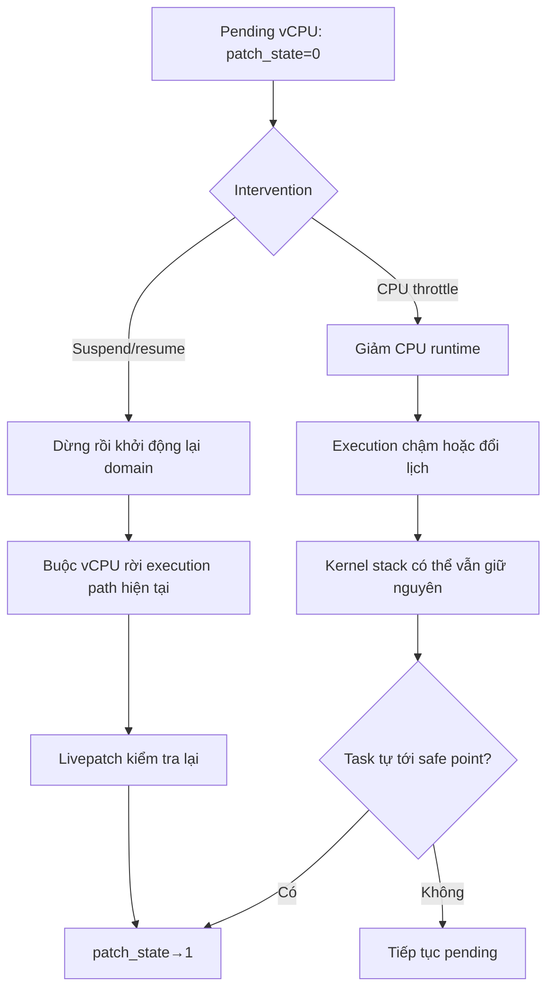

# Lý thuyết cgroup CPU throttle và livepatch transition
## Mục lục
- [1. Câu hỏi nghiên cứu](#1-câu-hỏi-nghiên-cứu)
- [2. Livepatch per-task transition](#2-livepatch-per-task-transition)
  - [2.1. `Switching opportunity` và `safe point`](#21-switching-opportunity-và-safe-point)
  - [2.2. Signal tạo opportunity bằng cách nào?](#22-signal-tạo-opportunity-bằng-cách-nào)
  - [2.3. Signal khác suspend/resume ở đâu?](#23-signal-khác-suspendresume-ở-đâu)
- [3. Vì sao KVM vCPU có thể là blocker](#3-vì-sao-kvm-vcpu-có-thể-là-blocker)
- [4. Cgroup v2 domain tree của libvirt](#4-cgroup-v2-domain-tree-của-libvirt)
  - [Kiểm tra đúng scope](#kiểm-tra-đúng-scope)
- [5. `cpu.max` điều khiển gì?](#5-cpumax-điều-khiển-gì)
- [6. Throttle tác động tới task như thế nào?](#6-throttle-tác-động-tới-task-như-thế-nào)
- [7. Ba kết quả có thể xảy ra](#7-ba-kết-quả-có-thể-xảy-ra)
  - [7.1. Có thể giúp gián tiếp](#71-có-thể-giúp-gián-tiếp)
  - [7.2. Có thể không ảnh hưởng](#72-có-thể-không-ảnh-hưởng)
  - [7.3. Có thể làm chậm](#73-có-thể-làm-chậm)
- [8. Throttle khác suspend/resume](#8-throttle-khác-suspendresume)
- [9. Hiểu đơn giản ba phương án recovery](#9-hiểu-đơn-giản-ba-phương-án-recovery)
  - [9.1. Vì sao task vẫn pending?](#91-vì-sao-task-vẫn-pending)
  - [9.2. Signal — tác động vào đúng pending task](#92-signal--tác-động-vào-đúng-pending-task)
  - [9.3. Throttle — chỉ thay đổi lịch CPU](#93-throttle--chỉ-thay-đổi-lịch-cpu)
  - [9.4. Suspend/resume — tác động toàn blocker domain](#94-suspendresume--tác-động-toàn-blocker-domain)
  - [9.5. So sánh nhanh](#95-so-sánh-nhanh)
  - [9.6. Có nên dùng recovery chain?](#96-có-nên-dùng-recovery-chain)
- [10. Protocol kiểm chứng](#10-protocol-kiểm-chứng)
  - [Bước 1 — Chụp baseline](#bước-1--chụp-baseline)
  - [Bước 2 — Áp treatment và read-back](#bước-2--áp-treatment-và-read-back)
  - [Bước 3 — Quan sát transition và impact](#bước-3--quan-sát-transition-và-impact)
  - [Bước 4 — Rollback](#bước-4--rollback)
- [11. Kết luận từ evidence hiện tại](#11-kết-luận-từ-evidence-hiện-tại)
- [12. Nguồn lý thuyết chính](#12-nguồn-lý-thuyết-chính)

## 1. Câu hỏi nghiên cứu

yêu cầu đánh giá:

> Nếu throttle toàn bộ cgroup của một VM đang chứa task pending, task đó có thêm cơ hội transition hay không? Nếu có, cơ chế là gì?

Câu trả lời ngắn:

> CPU throttle chỉ thay đổi ngân sách CPU và lịch thực thi. Nó không trực tiếp đổi `patch_state`, không tự unwind kernel stack và không bảo đảm transition hoàn tất. Hiệu quả chỉ có thể kết luận bằng thực nghiệm trên cùng blocker condition.

## 2. Livepatch per-task transition

Khi một livepatch được enable, Linux đặt target state mới nhưng không chuyển mọi task cùng lúc. Mỗi task chỉ được chuyển khi kernel xác định stack của task không còn sử dụng hàm bị thay thế.

Với patching:

```text
target state = 1

task an toàn       → patch_state = 1
task chưa an toàn  → patch_state = 0
```

Transition hoàn tất khi không còn task pending:

```text
transition=1
    ↓
mọi task đạt target state
    ↓
transition=0
```

Nếu một task vẫn giữ affected function trên kernel stack, stack check có thể tiếp tục từ chối chuyển task đó.

### 2.1. `Switching opportunity` và `safe point`
Pending task
    |
    +-- A. Đang chạy rất lâu trong affected kernel path
    |
    +-- B. Đang sleep/wait trong affected path
    |
    +-- C. Function ngắn nhưng bị re-enter liên tục
    |
    +-- D. QEMU vCPU ở KVM_RUN/guest loop rất lâu
    |
    +-- E. Task thiếu CPU / bị scheduler starvation
`Switching opportunity` là thời điểm mà livepatch có thể nói:

> “Execution của task đang ở một ranh giới phù hợp để tôi thử kiểm tra và chuyển consistency state.”

Ví dụ về các ranh giới như vậy là khi task đang ngủ và stack có thể được kiểm tra tin cậy, hoặc khi task đi qua kernel-exit path để trở về userspace. Kernel không tùy ý chuyển state tại một instruction bất kỳ trong lúc task vẫn đang thực thi affected code.

```text
task đang thực thi kernel code
             |
             v
không thể tùy ý đổi consistency state
             |
             v
đi tới switching opportunity
             |
             v
livepatch được phép thử kiểm tra/chuyển task
```

Sau khi có opportunity, livepatch vẫn phải xác định task có **safe** hay không. Trong trường hợp dựa trên stack check, điều kiện quan trọng là không còn affected old-function frame khiến việc chuyển state tạo ra nguy cơ trộn old/new execution.

```text
switching opportunity
         |
         v
livepatch kiểm tra safety condition
         |
    +----+----+
    |         |
   SAFE    NOT SAFE
    |         |
    v         v
patch_state   vẫn giữ old state
= target      và tiếp tục pending
```

Quan hệ giữa hai khái niệm:

> Opportunity cho phép livepatch **thử chuyển**. Safety condition quyết định task **có được chuyển hay không**. Chỉ khi đạt điều kiện an toàn thì `patch_state` mới đổi sang target.

### 2.2. Signal tạo opportunity bằng cách nào?

Signal không chọn một safe point và cũng không làm task nhảy khỏi affected function ngay tại instruction đang chạy. Nó đánh dấu rằng task có một event cần xử lý. Kernel chỉ phản ứng tại những nơi execution có thể bị đánh thức, ngắt hoặc đổi sang return/exit path một cách hợp lệ.

```text
signal tới task
      |
      v
signal được đánh dấu pending
      |
      v
task đang chạy tiếp hoặc được đánh thức/ngắt
      |
      v
đi tới signal-aware / wait / return boundary
      |
      v
kernel xử lý effect của signal
      |
      v
control flow có thể đi tới kernel-exit path
```

Nếu control flow mới làm affected frames biến mất khỏi stack hoặc đưa task qua consistency boundary phù hợp, livepatch mới có opportunity kiểm tra và chuyển state. Nếu affected frame vẫn còn, task vẫn pending.

Cách nhớ ngắn gọn:

> Signal giống như gọi một người lại: “Hãy dừng công việc hiện tại tại chỗ hợp lệ rồi xử lý việc này.”

Signal tạo nhu cầu thay đổi control flow; kernel quyết định khi nào có thể xử lý nhu cầu đó an toàn.

### 2.3. Signal khác suspend/resume ở đâu?

```text
SIGNAL
→ nhắm vào pending task
→ yêu cầu task đổi nhịp/control flow tại boundary hợp lệ

SUSPEND/RESUME
→ nhắm vào toàn bộ VM domain
→ phối hợp pause toàn bộ vCPU rồi resume
→ tạo một quiescence/execution break rộng hơn
```

Cách nhớ ngắn gọn:

> Signal: “Một người dừng công việc ở chỗ hợp lệ để xử lý event.”

> Suspend: “Toàn bộ phòng tạm dừng khi hệ thống đã đưa hoạt động về trạng thái có thể pause.”

Suspend không phải “signal có quyền cao hơn”. Đây là cơ chế điều khiển VM ở tầng libvirt/QEMU, có phạm vi tác động lớn hơn và khả năng gây gián đoạn dịch vụ rộng hơn. Cả hai cuối cùng vẫn chỉ tạo điều kiện để livepatch kiểm tra lại; chúng không tự thay thế safety decision.

## 3. Vì sao KVM vCPU có thể là blocker

QEMU tạo các thread vCPU và gọi `KVM_RUN`. Khi xử lý page fault, một vCPU có thể đi qua:

```text
KVM_RUN
  → handle_ept_violation
  → kvm_mmu_page_fault
  → kvm_tdp_page_fault
  → direct_page_fault
  → kvm_faultin_pfn
  → handle_userfault
```

Trong evidence hiện tại, `direct_page_fault` là affected function của mentor patch. Controlled UFFD harness giữ cùng vCPU thread chờ ở `handle_userfault`, trong khi `direct_page_fault` vẫn nằm phía dưới trên stack. Vì vậy task giữ `patch_state=0` và toàn patch giữ `transition=1`.

Chi tiết runtime evidence nằm trong [`real-stall-evidence.md`](real-stall-evidence.md).

## 4. Cgroup v2 domain tree của libvirt

Một domain không chỉ có QEMU main thread. Libvirt tổ chức các thread thành một cây:

```text
machine-qemu\x2d6\x2dvm1.scope
└── libvirt
    ├── emulator
    ├── vcpu0
    ├── vcpu1
    └── iothread...
```

Nếu chỉ ghi quota vào `libvirt/emulator`, các vCPU child cgroup có thể không chịu cùng giới hạn. Vì vậy treatment của bài lab được đặt tại scope cha:

```text
/sys/fs/cgroup/machine.slice/machine-qemu\x2d6\x2dvm1.scope/cpu.max
```

Quota ở parent áp dụng theo hierarchy cho toàn bộ descendant của domain.

### Kiểm tra đúng scope

**Mục đích:** tránh hard-code sai instance ID và tránh throttle nhầm một thread con.

```bash
QEMU_PID=$(cat /run/libvirt/qemu/vm1.pid)
cat /proc/$QEMU_PID/cgroup
find /sys/fs/cgroup/machine.slice -maxdepth 1 -type d -name '*vm1.scope'
find "$CGROUP_DIR" -maxdepth 2 -type f -name cpu.max -print
```

**Output đại diện:**

```text
0::/machine.slice/machine-qemu\x2d6\x2dvm1.scope/libvirt/emulator
/sys/fs/cgroup/machine.slice/machine-qemu\x2d6\x2dvm1.scope
```

**Cách đọc:** `/proc` cho biết QEMU đang ở descendant `libvirt/emulator`; treatment phải ghi vào scope cha vừa resolve.

## 5. `cpu.max` điều khiển gì?

`cpu.max` có định dạng:

```text
QUOTA PERIOD
```

Ví dụ:

```text
max 100000      không giới hạn
40000 100000    tối đa 0.4 CPU
20000 100000    tối đa 0.2 CPU
1000 100000     tối đa 0.01 CPU
```

Với VM có 2 vCPU, các mức trên tương ứng xấp xỉ 20%, 10% và 0.5% tổng capacity danh nghĩa của VM.

`cpu.stat` dùng để xác nhận treatment thực sự có hiệu lực:

| Counter | Ý nghĩa |
|---|---|
| `nr_periods` | Số period đã đi qua |
| `nr_throttled` | Số period cgroup bị hết quota |
| `throttled_usec` | Tổng thời gian bị throttle |

Chỉ ghi `cpu.max` chưa đủ; phải có read-back và counter delta.

## 6. Throttle tác động tới task như thế nào?

Khi một CFS cgroup dùng hết runtime, scheduler ngừng cho các runnable entity trong cgroup đó chạy cho đến khi runtime được cấp lại. Điều này làm thay đổi:

- thời điểm vCPU được chạy;
- tần suất QEMU/KVM tiếp tục xử lý;
- tiến độ của emulator, I/O thread và helper thread trong cùng domain tree.

Nhưng throttle không thực hiện các thao tác sau:

```text
không ghi patch_state
không xóa affected frame khỏi stack
không bắt buộc KVM_RUN exit
không tạo quiescent state
không thay thế livepatch safety check
```

Đối với blocker đang ngủ trong `handle_userfault`, giảm CPU quota cũng không trực tiếp giải quyết page fault đang chờ.

## 7. Ba kết quả có thể xảy ra

### 7.1. Có thể giúp gián tiếp

Nếu blocker chỉ cần một thay đổi scheduling nhỏ để return khỏi affected function, việc thay đổi CPU budget có thể tạo execution order thuận lợi hơn. Khi task quay lại safe point, livepatch có thể chuyển `patch_state`.

### 7.2. Có thể không ảnh hưởng

Nếu task đang chờ một event độc lập với CPU budget, throttle không làm event đó xuất hiện và stack vẫn giữ nguyên.

### 7.3. Có thể làm chậm

Nếu task hoặc helper cần CPU để hoàn tất công việc và return, quota thấp làm tiến độ chậm hơn, từ đó kéo dài pending window.

Vì cả ba khả năng đều hợp lý, không được kết luận chỉ từ lý thuyết.

## 8. Throttle khác suspend/resume



Điểm khác biệt cốt lõi:

```text
Throttle       → thay CPU budget, không bảo đảm rời stack
Suspend/resume → thay trạng thái chạy của domain và tạo cơ hội rời KVM path
```

## 9. Hiểu đơn giản ba phương án recovery

### 9.1. Vì sao task vẫn pending?

`transition=1` chỉ có nghĩa là patch đang chờ ít nhất một task chuyển sang target state. Nguyên nhân trực tiếp là task đó **chưa được livepatch đánh giá là an toàn để chuyển**.

```text
                 LIVEPATCH ĐANG TRANSITION
                            |
                            v
             Có task chưa ở target patch_state
                            |
                            v
              Vì sao task chưa chuyển được?
                            |
          +-----------------+-----------------+
          |                 |                 |
          v                 v                 v
   Affected function   Task liên tục      Task ở lâu trong
   còn trên stack      quay lại path cũ    KVM/kernel path
          |                 |                 |
          +-----------------+-----------------+
                            |
                            v
                Task chưa có trạng thái an toàn
                            |
                            v
                       STILL PENDING
```

Ba recovery method không tự ghi `patch_state=target`. Chúng chỉ thay đổi cách task/VM tiếp tục thực thi, với hy vọng tạo ra một thời điểm để livepatch kiểm tra lại.

```text
                        STILL PENDING
                              |
          +-------------------+-------------------+
          |                   |                   |
          v                   v                   v
       SIGNAL             THROTTLE          SUSPEND/RESUME
   dừng rồi tiếp tục    giảm CPU budget       pause rồi resume
   đúng pending task     của domain tree      toàn blocker VM
          |                   |                   |
          v                   v                   v
   thay control flow     thay lịch chạy       tạo execution break
          |                   |                   |
          +-------------------+-------------------+
                              |
                              v
                 Livepatch có dịp kiểm tra lại
                              |
                      +-------+-------+
                      |               |
                      v               v
             Stack/state an toàn   Vẫn chưa an toàn
                      |               |
                      v               v
             patch_state=target   tiếp tục pending
                      |
                      v
          Mọi task ở target → transition=0
```

Điểm quan trọng nhất: recovery chỉ **tạo cơ hội kiểm tra lại**. Quyết định `SAFE` hay `NOT SAFE` vẫn thuộc consistency mechanism của livepatch.

### 9.2. Signal — tác động vào đúng pending task

```text
pending task
→ SIGSTOP: dừng execution hiện tại
→ SIGCONT: cho task tiếp tục
→ task có cơ hội đi qua kernel-exit/switching boundary
→ livepatch kiểm tra lại
```

Cách hiểu ngắn gọn:

> “Cho đúng task đang kẹt ngắt nhịp thực thi hiện tại rồi chạy tiếp, để nó có cơ hội đi qua điểm mà livepatch có thể chuyển state.”

Signal không sửa stack và không bảo đảm task sẽ an toàn. Vì `SIGSTOP` có thể làm gián đoạn QEMU, chương trình phải luôn gửi `SIGCONT` trong cleanup.

Linux livepatch còn có fake signal nội bộ qua `klp_send_signals()`. Trên kernel của lab, cơ chế này tự chạy theo `SIGNALS_TIMEOUT=15`. Nó khác với experiment chủ động `SIGSTOP/SIGCONT` tại `T=10s`.

`kpatch signal` cũng không mặc nhiên là một active experiment: nếu kernel không có `/sys/kernel/livepatch/<patch>/signal`, CLI có thể chỉ báo rằng kernel tự signaling và không thực hiện mutation mới.

### 9.3. Throttle — chỉ thay đổi lịch CPU

```text
pending VM domain
→ giảm cpu.max
→ vCPU/emulator/helper chạy theo timeline khác
→ có thể thay đổi thứ tự hoặc thời điểm task rời KVM path
→ livepatch kiểm tra lại nếu task đi tới switching opportunity
```

Cách hiểu ngắn gọn:

> “Thay đổi cách CPU được phân cho cả VM và đo xem lịch chạy mới có vô tình đưa blocker tới trạng thái an toàn sớm hơn hay không.”

Đây là tác động gián tiếp nhất. Nếu task đang chờ event không phụ thuộc CPU, throttle không giải quyết được điều kiện chờ. Nếu task/helper cần CPU để thoát path, throttle còn có thể làm transition chậm hơn.

### 9.4. Suspend/resume — tác động toàn blocker domain

```text
blocker domain
→ virsh suspend: pause toàn bộ vCPU execution
→ virsh resume ngay
→ tạo một execution discontinuity mạnh ở cấp VM
→ các vCPU tiếp tục qua một nhịp thực thi mới
→ livepatch kiểm tra lại
```

Cách hiểu ngắn gọn:

> “Tạm dừng toàn bộ VM chứa blocker rồi resume ngay để tạo một điểm ngắt thực thi mạnh hơn signal trên một task.”

Suspend/resume vẫn không trực tiếp ép `patch_state`. Nó chỉ tạo điều kiện runtime thuận lợi hơn. Trong evidence hiện tại, transition hoàn tất 3/3 run sau action; điều đó không biến phương án thành bảo đảm phổ quát cho mọi loại blocker.

### 9.5. So sánh nhanh

| Method | Thay đổi cái gì? | Không thay đổi trực tiếp | Khi có thể giúp |
|---|---|---|---|
| Signal | control flow của đúng pending task | affected stack và `patch_state` | task có thể đi qua kernel-exit boundary sau khi tiếp tục |
| Throttle | CPU budget và scheduling của domain tree | điều kiện chờ, stack, `patch_state` | timeline mới vô tình đưa task tới safe point sớm hơn |
| Suspend/resume | trạng thái chạy của toàn VM/vCPU | livepatch safety decision | nhịp pause/resume làm blocker rời hoặc không quay lại unsafe path |

### 9.6. Có nên dùng recovery chain?

Có, nếu mục tiêu là xử lý một incident. Chương trình thử phương án nhẹ trước, kiểm tra `transition`, rồi mới fallback:

```text
pending liên tục 10s
→ xác nhận pending TID và blocker domain
→ SIGNAL
→ đợi/verify tối đa 2s
   ├─ transition=0 → kiểm tra health → dừng
   └─ vẫn pending  → SUSPEND/RESUME
                     → verify + health
                     ├─ transition=0 → hoàn tất
                     └─ vẫn pending  → dừng, chuyển xử lý thủ công
```

Throttle không nằm trong chain mặc định vì lab chưa quan sát thấy early recovery và quota thấp có thể làm task ít cơ hội chạy hơn. Nó chỉ được bật như một nhánh nghiên cứu. Force không tự chạy nếu thiếu phê duyệt rõ.

Chain dùng để chứng minh fallback automation, không dùng để xếp hạng các method. Muốn so sánh công bằng phải reset condition và chạy từng method độc lập.

## 10. Protocol kiểm chứng

Thực nghiệm phải giữ cố định exact patch, blocker condition và recovery trigger `T=10s`.

### Bước 1 — Chụp baseline

**Mục đích:** lưu quota để rollback.

```bash
ORIGINAL_CPU_MAX=$(cat "$CGROUP_DIR/cpu.max")
cat "$CGROUP_DIR/cpu.stat" > cpu-stat-before.txt
```

### Bước 2 — Áp treatment và read-back

```bash
printf '%s\n' '1000 100000' | sudo tee "$CGROUP_DIR/cpu.max"
cat "$CGROUP_DIR/cpu.max"
```

**Output hợp lệ:**

```text
1000 100000
```

### Bước 3 — Quan sát transition và impact

Phải ghi thời điểm action, `transition`, blocker `patch_state`, `cpu.stat` delta và VM health. Một transition hoàn tất sau mốc KLP signal không được tự động gán nguyên nhân cho throttle.

### Bước 4 — Rollback

```bash
printf '%s\n' "$ORIGINAL_CPU_MAX" | sudo tee "$CGROUP_DIR/cpu.max"
cat "$CGROUP_DIR/cpu.max"
```

**Output cần khớp:** quota sau cleanup bằng quota trước treatment.

## 11. Kết luận từ evidence hiện tại

Ba treatment 20%, 10% và 0.5% đã được áp vào parent domain cgroup. Run cực đoan có `nr_throttled +65` và `throttled_usec +5,298,456`, chứng minh throttle thực sự xảy ra. Tuy nhiên cả ba run chỉ hoàn tất quanh `16.54s`, sau cửa sổ KLP signaling, và không tạo early recovery trước signal.

Kết luận được phép:

```text
WHOLE_DOMAIN_THROTTLE_TREATMENT = PASS
EARLY_TRANSITION_HELP           = NOT OBSERVED
UNIVERSAL_CLAIM_THROTTLE_FAILS  = NOT PROVEN
```

Số liệu và cleanup đầy đủ nằm trong [`cgroup-throttle-results.md`](cgroup-throttle-results.md).

## 12. Nguồn lý thuyết chính

- [Linux 6.8 Livepatch documentation](https://docs.kernel.org/6.8/livepatch/livepatch.html): per-task consistency, stack/kernel-exit switching, `SIGSTOP/SIGCONT`, fake signal 15 giây và cảnh báo force.
- [Linux 6.8 cgroup v2 documentation](https://docs.kernel.org/6.8/admin-guide/cgroup-v2.html): hierarchy, CPU controller, `cpu.max` và `cpu.stat`.
- [Kpatch CLI manual](https://github.com/dynup/kpatch/blob/master/man/kpatch.1): điều kiện để `kpatch signal` có tác dụng và trường hợp lệnh là no-op.
