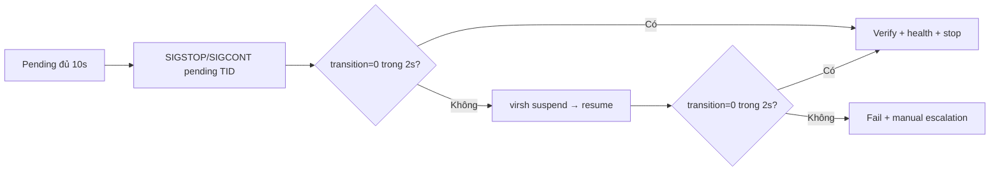

# So sánh các phương án recovery

## 1. Kết luận hiện tại

Trên cùng controlled pending condition, can thiệp tại `T=10s`:

| Method | Run hợp lệ | Kết quả quan sát | Gate |
|---|---:|---|---|
| Wait-only | 3 | tự hoàn tất ở `17.09–17.10s` từ load | baseline PASS |
| Whole-domain throttle | 3 mức + 1 auto | hoàn tất `16.54s` (hoặc timeout 4s); không sớm hơn built-in signal window | treatment PASS; early recovery không thấy |
| Suspend/resume | 3 | `transition 1→0` trong `(0,0.501]s` sau action | PASS 3/3 |
| Explicit `SIGSTOP/SIGCONT` | 3 | `transition 1→0` trong `0.251–0.501s`; injector còn sống và còn >33s hold | PASS 3/3 |
| Cascade | 3 def + 1 fb + 1 all | Signal short-circuit `0.251–1.253s`; fallback throttle timeout 2s → suspend-resume `0.251s` | PASS |
| Force | 0 | không được phép trong flow mặc định | NOT TESTED |

```text
COMPARISON_AT_10S = PASS
LONG_STALL_75S    = NOT REPRODUCED
```

## 2. Hai loại flow không được trộn

### Flow A — So sánh độc lập

Mỗi method bắt đầu từ một clean run cùng artifact và workload. Flow này dùng để so hiệu quả vì method sau không kế thừa tác động của method trước.

### Flow B — Cascade vận hành

Một incident duy nhất thử method theo thứ tự và dừng ở method đầu tiên làm `transition=0`:



Cascade chứng minh automation/fallback, nhưng không dùng để xếp hạng method. Nếu signal thành công thì suspend/resume không chạy — đó là hành vi đúng.

Throttle chỉ được thêm bằng option nghiên cứu. Force chỉ chạy khi đồng thời có method `force` và `--allow-force`.

## 3. Protocol chung

Một run chỉ hợp lệ khi có đủ:

```text
module SHA đúng
transition=1 liên tục đến 10s
pending vCPU patch_state=0
affected function trên cùng task stack
TID → QEMU PID → vm1
action có timestamp
transition/enabled sau action
domain state và service-health
cleanup trước run tiếp theo
```

## 4. Method A — Wait-only

### Mục đích

Đo thời gian tự hoàn tất nếu không tác động.

### Lệnh

```bash
while [ "$(cat /sys/kernel/livepatch/trilogy_cve_2026_64561/transition)" = 1 ]; do
  cat /proc/2250370/patch_state
  sleep 0.8
done
```

### Output thực tế

| Run | Sample cuối pending | Transition hoàn tất |
|---|---:|---:|
| 1 | `14.66s` | `17.09s` |
| 2 | `14.65s` | `17.09s` |
| 3 | `14.66s` | `17.10s` |

Raw: [`wait/`](../Docs/FINAL_EVIDENCE/wait).

### Cách đọc và gate

KLP tự in `livepatch: signaling remaining tasks` quanh 15 giây; task đổi state sau đó. Đây là baseline tự nhiên, không phải active recovery. `WAIT_BASELINE=PASS`.

## 5. Method B — Whole-domain throttle

### Mục đích

Kiểm tra giảm CPU budget toàn domain có làm transition hoàn tất trước built-in signal hay không.

### Lệnh action

```bash
CGROUP_DIR='/sys/fs/cgroup/machine.slice/machine-qemu\x2d6\x2dvm1.scope'
ORIGINAL_CPU_MAX=$(cat "$CGROUP_DIR/cpu.max")
printf '%s\n' '1000 100000' | sudo tee "$CGROUP_DIR/cpu.max"
cat "$CGROUP_DIR/cpu.max"
```

### Output thực tế

```text
1000 100000
nr_throttled delta = 65
throttled_usec delta = 5298456
transition complete = 16.54s
```

Các mức `40000/100000`, `20000/100000`, `1000/100000` đều hoàn tất ở `16.54s`; không mức nào tạo early recovery trước 15 giây.

### Cleanup

```bash
printf '%s\n' "$ORIGINAL_CPU_MAX" | sudo tee "$CGROUP_DIR/cpu.max"
cat "$CGROUP_DIR/cpu.max"
```

```text
max 100000
```

### Gate

`THROTTLE_TREATMENT=PASS`; `THROTTLE_EARLY_RECOVERY=NOT OBSERVED`. Chi tiết ở [`cgroup-throttle-results.md`](cgroup-throttle-results.md).

## 6. Method C — Suspend/resume

### Mục đích

Tự tìm domain sở hữu blocker và tạo KVM/QEMU exit bằng cặp suspend/resume tức thời.

### Lệnh

```bash
sudo python3 kpatch_recovery.py \
  --module "$PATCH_MODULE" \
  --expected-sha256 "$PATCH_SHA256" \
  --patch-name "$PATCH_NAME" \
  --deadline 10 \
  --strategy suspend-resume \
  --poll-interval 0.5 \
  --recovery-step-timeout 2 \
  --log automation-run.log \
  --output-format both
```

### Output thực tế đại diện

```text
stall_deadline_reached observed_seconds=10.246
pending_task tid=2250370 qemu_pid=2250361 domain="vm1"
domain_suspend returncode=0 duration_seconds=0.042
domain_resume returncode=0 duration_seconds=0.032
verification_sample/recovery observation: transition 1 → 0 within (0,0.501]s
patch_verified transition=0 enabled=1
domain_state_after output="running"
final_result result="recovered" exit_code=0
```

### Kết quả

| Run | Trigger | Suspend | Resume | First `transition=0` sample |
|---|---:|---:|---:|---:|
| 1 | `10.246s` | `42ms` | `32ms` | `0.501s` |
| 2 | `10.242s` | `41ms` | `32ms` | `0.501s` |
| 3 | `10.260s` | `40ms` | `32ms` | `0.501s` |

### Cách đọc và gate

Polling là 0.5 giây nên kết luận đúng là `(0,0.501]s`, không phải chính xác 501ms. `SUSPEND_RESUME=PASS (3/3)`.

## 7. Method D — Explicit signal/kick

### Cơ chế đã chọn

Kernel 6.8 tự gửi fake signal cho pending tasks mỗi 15 giây. `kpatch signal` chỉ có tác dụng nếu patch sysfs có file `signal`; trên kernel tự signal, CLI có thể chỉ báo no-op. Để tạo active method ở `T=10s`, chương trình gửi `SIGSTOP` rồi luôn `SIGCONT` tới đúng pending mapped TID, đúng với recovery technique được kernel livepatch documentation mô tả.

### Lệnh thực tế trên host

```bash
sudo python3 -u /home/ubuntu/run_recovery_matrix.py \
  --case signal-01 \
  --output-dir /home/ubuntu/FINAL_EVIDENCE/recovery-v4
```

### Output thực tế đại diện (`signal-01.log`)

```text
# [2026-09-04T08:40:03.360+00:00] INFO stall_deadline_reached observed_seconds=10.109 pending_task_count=1 blocker_domains=["vm1"]
# [2026-09-04T08:40:03.360+00:00] INFO pending_task pid=2250361 tid=2250371 patch_state=0 comm="CPU 1/KVM" qemu_pid=2250361 domain="vm1"
# [2026-09-04T08:40:03.368+00:00] INFO task_signal tid=2250371 signal="SIGSTOP" delivered=true
# [2026-09-04T08:40:03.418+00:00] INFO task_signal tid=2250371 signal="SIGCONT" delivered=true
# [2026-09-04T08:40:03.669+00:00] INFO recovery_step_completed method="signal" completion_observed_seconds=0.251
# [2026-09-04T08:40:03.681+00:00] INFO final_result result="recovered" exit_code=0 completion_observed_during="signal"

active-postcheck: injector_alive=true, blocker_hold=45s,
fault_hold_elapsed=11.125s, fault_hold_remaining=33.875s,
completion_before_fault_release=true
post-cleanup: vm1=running, cpu.max="max 100000", ping=0% loss
```

### Kết quả 3 runs độc lập

| Run | Blocker TID | Phương pháp | Thời gian hoàn tất transition | Domain health (ping) | Trạng thái exit |
|---|---:|---|---:|---|---:|
| `signal-01` | 2250371 | `SIGSTOP` + 50ms + `SIGCONT` | `0.251s` | 3/3, 0% loss (avg 0.247ms) | 0 (PASS) |
| `signal-02` | 2250370 | `SIGSTOP` + 50ms + `SIGCONT` | `0.501s` | 3/3, 0% loss (avg 0.245ms) | 0 (PASS) |
| `signal-03` | 2250371 | `SIGSTOP` + 50ms + `SIGCONT` | `0.501s` | 3/3, 0% loss (avg 0.225ms) | 0 (PASS) |

Gate: `SIGNAL = PASS (3/3)`. Cả ba completion xảy ra khi injector vẫn sống và còn `33.622–33.875s` trước hạn tự nhả fault.

## 8. Flow E — Cascade tự động

### Mục đích

Thử biện pháp nhẹ trước (`signal`), verify trong `recovery-step-timeout 2s`, chỉ tự động chuyển sang `suspend-resume` nếu transition còn pending.

### 8.1. Cascade mặc định (`signal,suspend-resume`)

**Lệnh thực tế:**

```bash
sudo python3 -u /home/ubuntu/run_recovery_matrix.py \
  --case cascade-01 \
  --output-dir /home/ubuntu/FINAL_EVIDENCE/recovery-v4
```

**Output thực tế đại diện (`cascade-01.log`):**

```text
# [2026-09-04T08:40:54.673+00:00] INFO recovery_plan_started strategy="cascade" methods=["signal","suspend-resume"] recovery_step_timeout_seconds=2.0
# [2026-09-04T08:40:54.680+00:00] INFO task_signal tid=2250371 signal="SIGSTOP" delivered=true
# [2026-09-04T08:40:54.730+00:00] INFO task_signal tid=2250371 signal="SIGCONT" delivered=true
# [2026-09-04T08:40:55.733+00:00] INFO recovery_step_completed method="signal" completion_observed_seconds=1.002
# [2026-09-04T08:40:55.745+00:00] INFO final_result result="recovered" exit_code=0 completion_observed_during="signal"
```

**Nhận xét:** Trong cả 3 lượt chạy mặc định, signal hoàn tất transition trong `0.501–1.253s`; chương trình short-circuit đúng thiết kế và không gọi `suspend-resume`. Injector vẫn sống và còn `32.805–33.626s` hold, nên completion không phải do natural release.

### 8.2. Cascade fallback có kiểm chứng (`cascade-fallback-01`)

**Mục đích:** kiểm chứng hành vi fallback thực sự khi method đầu tiên không thể clear transition trong timeout bước. Cấu hình chuỗi: `--cascade-order throttle,suspend-resume`.

**Lệnh thực tế:**

```bash
sudo python3 -u /home/ubuntu/run_recovery_matrix.py \
  --case cascade-fallback-01 \
  --output-dir /home/ubuntu/FINAL_EVIDENCE/recovery-v4
```

**Trích đoạn log fallback (`cascade-fallback-01.log`):**

```text
# [2026-09-04T08:41:47.309+00:00] INFO throttle_applied requested_cpu_max="1000 100000" readback="1000 100000"
# [2026-09-04T08:41:49.310+00:00] WARNING recovery_step_timeout method="throttle" timeout_seconds=2.0 transition=1 enabled=1
# [2026-09-04T08:41:49.310+00:00] INFO throttle_restored restored_cpu_max="max 100000" readback="max 100000"
# [2026-09-04T08:41:49.318+00:00] INFO recovery_step_started method="suspend-resume" pending_task_count=1 blocker_domains=["vm1"]
# [2026-09-04T08:41:49.353+00:00] INFO domain_suspend returncode=0 duration_seconds=0.023
# [2026-09-04T08:41:49.369+00:00] INFO domain_resume returncode=0 duration_seconds=0.016
# [2026-09-04T08:41:49.621+00:00] INFO recovery_step_completed method="suspend-resume" completion_observed_seconds=0.251
# [2026-09-04T08:41:49.634+00:00] INFO final_result result="recovered" exit_code=0

active-postcheck: injector_alive=true, fault_hold_remaining=31.864s,
completion_before_fault_release=true
```

Gate: `CASCADE = PASS`.

## 9. Force fallback

### Mục đích

Last resort trong disposable lab sau khi đã thu stack evidence và có phê duyệt.

### Lệnh bị khóa chủ động

```bash
sudo python3 kpatch_recovery.py ... \
  --strategy force \
  --allow-force
```

Không có `--allow-force` thì chương trình dừng ở preflight. Không chạy force trong bộ evidence hiện tại: `FORCE=NOT TESTED`.

## 10. VM health

- Cả 3 lượt `suspend-resume` độc lập: domain trở lại `running`, transition hoàn tất trong `(0, 0.501]s`.
- Cả 3 lượt `signal` độc lập: sau cleanup synthetic blocker, ping 3/3 gói đạt 0% packet loss (avg 0.225–0.247 ms), domain `running`.
- Cả 5 lượt cascade: sau cleanup synthetic blocker, ping đạt 0% packet loss và domain `running`.
- Trong run fallback (`cascade-fallback-01`), cgroup `cpu.max` được tự động hoàn trả `max 100000` ngay trước khi bước sang method tiếp theo.

## 11. Gate cuối

```text
WAIT_BASELINE             = PASS
THROTTLE_TREATMENT        = PASS
THROTTLE_EARLY_RECOVERY   = NOT OBSERVED
SUSPEND_RESUME            = PASS (3/3)
SIGNAL                    = PASS (3/3)
CASCADE                   = PASS (3/3 default + 1 fallback + 1 all)
FORCE                     = NOT TESTED
COMPARISON_AT_10S         = PASS
LONG_STALL_75S            = NOT REPRODUCED
```
