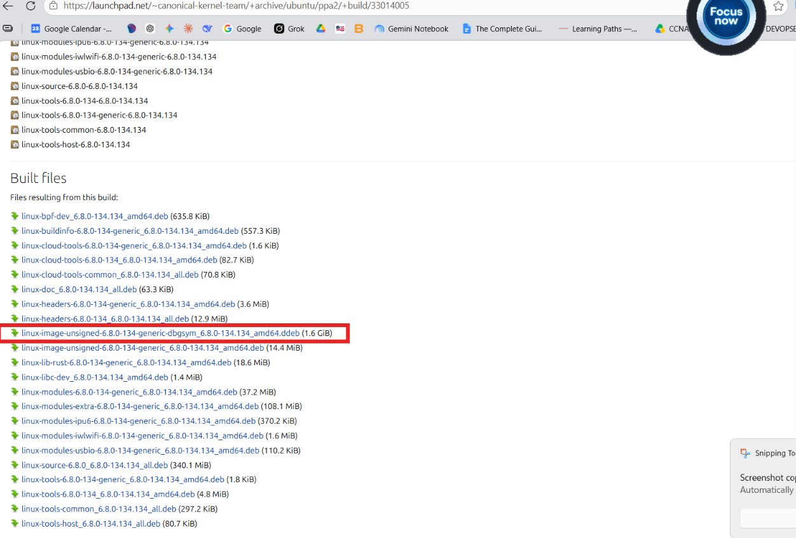
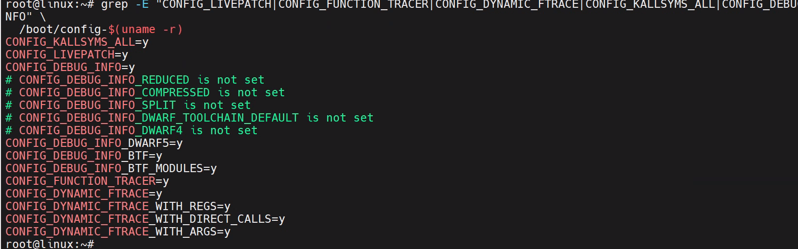
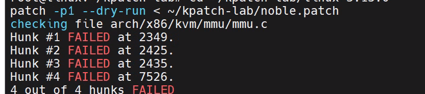
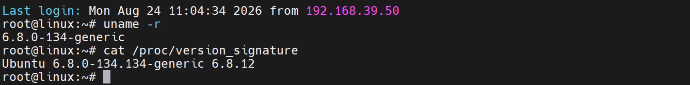
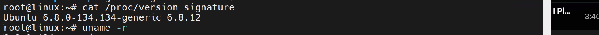
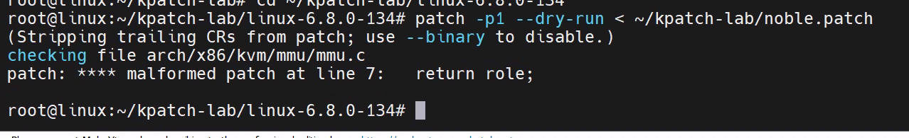
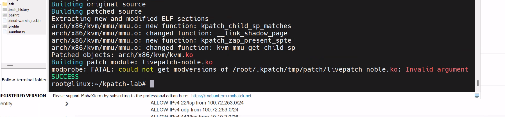

# Lab 2 — kpatch-build noble.patch cho kernel host Lab 1

**Mục tiêu:** Dùng `kpatch-build` + `noble.patch` (vá 2 hàm `kvm_mmu_get_child_sp()` và `__link_shadow_page()` trong `arch/x86/kvm/mmu/mmu.c`) để sinh ra 1 file `.ko` có thể live-patch vào đúng kernel đang chạy trên host Lab 1.

**Host đang dùng (bản audit này):** Ubuntu Noble, kernel `6.8.0-134.134-generic` (đã đổi từ hướng ban đầu là Jammy/kernel 5.15 — lý do đổi ghi ở mục "Ghi chú quan trọng" cuối file).

---

## PHẦN 1 — DANH SÁCH MATERIAL CẦN THIẾT

Đây là phần quan trọng nhất để audit: liệt kê từng thứ **bắt buộc phải có**, dùng để làm gì, và vì sao thiếu là không build được.

### 1.1. Kernel config đã bật đúng flag livepatch

```bash
grep -E "CONFIG_LIVEPATCH|CONFIG_FUNCTION_TRACER|CONFIG_DYNAMIC_FTRACE|CONFIG_KALLSYMS_ALL|CONFIG_DEBUG_INFO" \
  /boot/config-$(uname -r)
```


| Flag | Dùng để làm gì | Vì sao thiếu là hỏng |
|---|---|---|
| `CONFIG_LIVEPATCH` | Bật API kernel để **nhận, quản lý, theo dõi** patch module — tạo `/sys/kernel/livepatch/<tên>/` | Thiếu thì kernel coi file `.ko` chỉ là module thường, không hiểu khái niệm "patch", không có transition state |
| `CONFIG_FUNCTION_TRACER` | Bật cơ chế ftrace cơ bản — chèn sẵn điểm hook `__fentry__` ở đầu mỗi hàm lúc compile | Không có điểm hook thì không có chỗ để redirect sang hàm mới |
| `CONFIG_DYNAMIC_FTRACE` | Cho phép bật/tắt điểm hook **lúc runtime** (NOP ↔ CALL) | Thiếu thì ftrace chỉ trace cố định, không redirect được |
| `CONFIG_DYNAMIC_FTRACE_WITH_REGS` | Khi redirect, truyền đầy đủ **register context** giống hệt gọi hàm thật | Thiếu thì không patch được hàm có tham số phức tạp |
| `CONFIG_DYNAMIC_FTRACE_WITH_DIRECT_CALLS` | Gọi thẳng (direct call) tới hàm thay thế, không qua nhiều lớp trampoline | Quan trọng vì hàm MMU nằm trong hot path (gọi liên tục khi VM chạy) — redirect càng nhẹ càng tốt |
| `CONFIG_KALLSYMS_ALL` | Xuất **toàn bộ symbol table** kể cả hàm `static` ra `/proc/kallsyms` | 2 hàm trong `noble.patch` đều là `static` trong `mmu.c` — thiếu flag này, kpatch không tìm được địa chỉ hàm lúc load |
| `CONFIG_DEBUG_INFO` (+ DWARF5) | Giữ thông tin debug (tên biến, số dòng, struct layout) khi build | `create-diff-object` (lõi của kpatch-build) cần cái này để so sánh object gốc và object đã patch ở mức symbol |

**Lưu ý:** kernel hiện đại thường bật song song cả `DWARF5` và `BTF` (`CONFIG_DEBUG_INFO_BTF=y`). `kpatch-build` (dự án `dynup/kpatch`, đã deprecated) được thiết kế đọc DWARF, không đọc BTF — nhưng có `DWARF5=y` thì không sao, chỉ cần lưu ý nếu sau này lỗi `create-diff-object` không parse được symbol thì đây là điểm đầu tiên cần kiểm tra lại.

### 1.2. Build dependencies (gói cài trên host)

```bash
sudo apt update
sudo apt install -y build-essential devscripts ccache gawk libelf-dev libssl-dev dpkg-dev git bison flex
```

| Gói | Vai trò |
|---|---|
| `build-essential` | gcc, make, binutils — công cụ compile cơ bản |
| `ccache` | Cache object đã compile → build lần 2 (sau khi áp patch) nhanh hơn nhiều vì phần lớn code không đổi |
| `libelf-dev` | kpatch-build cần đọc/ghi định dạng ELF (`.o`, `.ko`) |
| `dpkg-dev` | Công cụ lấy source package Ubuntu (`dpkg-source`) |

### 1.3. Kernel source code — đúng version đang chạy trên host

**Vì sao bắt buộc phải đúng version:** kpatch-build build lại **toàn bộ kernel** 2 lần (bản gốc + bản đã patch) rồi so sánh diff ở mức object code. Nếu source không khớp bit-for-bit với kernel đang chạy trên host (thiếu đúng các patch riêng của Ubuntu cho đúng bản `-134.134`), object code sinh ra sẽ lệch — patch tạo ra không tương thích ABI với kernel thật, load vào có thể crash.

**Cách lấy (theo đúng thứ tự ưu tiên):**

```bash
# Bật deb-src trong sources (Ubuntu mặc định tắt)
sudo sed -i 's/^Types: deb$/Types: deb deb-src/' /etc/apt/sources.list.d/ubuntu.sources
sudo apt update

mkdir -p ~/kpatch-lab && cd ~/kpatch-lab
apt-get source linux-image-unsigned-$(uname -r)
```

Nếu bản cụ thể (VD `6.8.0-134.134`) đã bị gỡ khỏi repo hiện hành (repo Ubuntu chỉ giữ vài bản mới nhất), tải trực tiếp từ Launchpad — nơi lưu **mọi** bản build lịch sử:

```bash
cd ~/kpatch-lab
wget https://launchpad.net/ubuntu/+archive/primary/+sourcefiles/linux/6.8.0-134.134/linux_6.8.0-134.134.dsc
wget https://launchpad.net/ubuntu/+archive/primary/+sourcefiles/linux/6.8.0-134.134/linux_6.8.0-134.134.diff.gz
wget https://launchpad.net/ubuntu/+archive/primary/+sourcefiles/linux/6.8.0-134.134/linux_6.8.0.orig.tar.gz

dpkg-source -x linux_6.8.0-134.134.dsc linux-6.8.0-134
```

**3 file tải về này là gì:**
- `linux_6.8.0.orig.tar.gz` — source **gốc** từ thượng nguồn kernel.org, chưa có patch riêng của Ubuntu
- `linux_6.8.0-134.134.diff.gz` — toàn bộ patch riêng mà Ubuntu áp thêm lên trên bản gốc để ra đúng bản `-134.134`
- `linux_6.8.0-134.134.dsc` — file mô tả, dùng để `dpkg-source` biết cách áp `diff.gz` lên `orig.tar.gz` đúng cách

**Verify bắt buộc sau khi giải nén:**

```bash
head -n 1 ~/kpatch-lab/linux-6.8.0-134/debian/changelog
```

Phải ra đúng: `linux (6.8.0-134.134) noble; urgency=medium` — nếu số version ở đây không khớp `uname -r`, dừng lại ngay, không build tiếp.

### 1.4. File `.config` khớp đúng kernel đang chạy

```bash
cp /boot/config-$(uname -r) ~/kpatch-lab/linux-6.8.0-134/.config
```

**Dùng để làm gì:** config quyết định layout bộ nhớ, feature nào được compile vào, struct nào có field nào (VD `CONFIG_KVM`, `CONFIG_PREEMPT` bật/tắt sẽ đổi struct `kvm_mmu_page`). Dùng đúng file config này để build lại, đảm bảo struct/offset trong bản build khớp với bản đang chạy thật trong RAM.

**Tuyệt đối không tự sửa config:** dù chỉ bật/tắt 1 option không liên quan, struct layout có thể dịch chuyển (padding, alignment) → object code sinh ra không tương thích ABI với kernel đang chạy → load module fail hoặc crash.

### 1.5. File `vmlinux` — kernel đã build sẵn, có đầy đủ debug info

**vmlinux là gì (phân biệt với source code):** source code là mã nguồn dạng text (chưa build). `vmlinux` là **kết quả sau khi biên dịch** toàn bộ kernel — 1 file nhị phân ELF chứa toàn bộ kernel + symbol table + debug info, chưa nén, chưa strip (khác với `vmlinuz` trong `/boot/` — bản đã nén, đã strip để boot thật).

kpatch-build cần file này để "hiểu" cấu trúc binary của kernel gốc, từ đó so sánh với bản đã patch, tính ra đúng phần code thay đổi.

**Cách có được — 3 hướng, đúng thứ tự ưu tiên (đã sửa theo review của anh Duy):**

- **Hướng A — `ddebs.ubuntu.com` (nhanh nếu còn):** cài gói `linux-image-unsigned-<version>-dbgsym`. **Nhược điểm lớn:** kho này do 1 team nhỏ duy trì, **deprecate (gỡ) package rất nhanh** — thực tế đã gặp đúng trường hợp bản `6.8.0-134` bị gỡ, không tìm thấy qua `apt-cache madison`.

- **Hướng B — Launchpad Librarian (ƯU TIÊN THỰC TẾ, nên dùng làm hướng chính):** vì Hướng A hay bị gỡ nhanh, cách đáng tin cậy hơn là lấy trực tiếp từ Launchpad — nơi Canonical lưu **vĩnh viễn mọi artifact build lịch sử**, kể cả khi `ddebs.ubuntu.com` đã xoá:
```
sudo apt install ubuntu-dev-tools
pull-lp-ddebs linux-image-unsigned-6.8.0-134-generic 6.8.0-134.134 noble ( auto tìm dbgsym mà k cần gõ)
```
- Lúc đầu em cũng làm thế do tai

  1. Vào `https://launchpad.net/ubuntu/+source/linux/6.8.0-134.134`
  2. Chọn build kiến trúc `amd64`, vào mục **Downloads**
  3. Tải file `linux-image-unsigned-6.8.0-134-generic-dbgsym_6.8.0-134.134_amd64.ddeb` (link thật host trên `launchpadlibrarian.net`)
  4. Giải nén lấy vmlinux debug bên trong:
     ```bash
     ar x linux-image-unsigned-6.8.0-134-generic-dbgsym_*.ddeb
     tar xf data.tar.* 
     # file cần dùng nằm ở: usr/lib/debug/boot/vmlinux-6.8.0-134-generic
     ```

- **Hướng C — tự `make vmlinux` (CHỈ dùng khi bất khả kháng, KHÔNG phải hướng mặc định):**

  ⚠️ **Cảnh báo quan trọng (theo đúng góp ý cần sửa):** `make vmlinux` chạy trực tiếp trên source đã giải nén **không phải là quy trình build chính thức của Ubuntu kernel**. Quy trình thật Canonical dùng là `fakeroot debian/rules binary-generic` — script này tự gộp config từ nhiều fragment trong `debian.master/config/`, tự gán đúng số ABI (`-134`), và **tài liệu chính thức của Ubuntu Kernel Team cảnh báo thẳng: không được tự set `CONFIG_LOCALVERSION` — làm vậy sẽ hỏng build**. `make vmlinux` bỏ qua toàn bộ lớp quy trình riêng này — về bản chất nó chỉ chạy đúng kbuild thuần (chuẩn build chung của mọi kernel Linux, kể cả bản chưa qua tay Ubuntu), **không phải build "kiểu Ubuntu"** dù dùng đúng source/config của Ubuntu. Rủi ro: object code sinh ra có thể không khớp bit-for-bit với bản Canonical build thật, khiến `create-diff-object` so sánh sai.

  Chỉ dùng hướng này nếu cả A và B đều không lấy được, và nếu dùng, nên đi đúng `fakeroot debian/rules binary-generic` thay vì `make vmlinux` trần để giảm rủi ro lệch ABI.

**Verify sau khi có vmlinux (từ bất kỳ hướng nào):**

```bash
strings vmlinux | grep "vermagic="
```

`vermagic=` phải khớp đúng `uname -r` của host.

### 1.6. File patch — `noble.patch`

**Nội dung:** sửa 2 hàm trong `arch/x86/kvm/mmu/mmu.c` — `kvm_mmu_get_child_sp()` và `__link_shadow_page()`, thêm logic kiểm tra/dọn shadow page table entries kỹ hơn khi có tranh chấp GFN (guest frame number) — tránh để sót tham chiếu "ma" (stale SPTE) khi 1 shadow page cũ bị thay bằng shadow page mới.

**Format:** unified diff chuẩn (`diff --git a/... b/...`) — áp được trực tiếp bằng `patch -p1` hoặc `git apply` lên đúng source đã tải ở mục 1.3.

**Lưu ý thực tế đã gặp — lỗi định dạng dòng (CRLF vs LF):** nếu file patch được soạn/copy qua Windows rồi chuyển sang máy Linux, dòng kết thúc có thể ở dạng CRLF thay vì LF, khiến `patch` báo lỗi không áp được dù nội dung đúng. Sửa bằng:

```bash
dos2unix ~/kpatch-lab/noble.patch
# hoặc nếu không có dos2unix:
sed -i 's/\r$//' ~/kpatch-lab/noble.patch
```

**Bắt buộc dry-run trước khi build thật** — tránh mất 20-40 phút build rồi mới phát hiện patch không áp được:

```bash
cd ~/kpatch-lab/linux-6.8.0-134
patch -p1 --dry-run < ~/kpatch-lab/noble.patch
```

Output phải có dòng `checking file arch/x86/kvm/mmu/mmu.c` và **không có dòng nào báo FAILED**.

---

## PHẦN 2 — CÁC BƯỚC THỰC HIỆN THEO ĐÚNG THỨ TỰ

```bash
# 1. Cài dependencies
sudo apt update
sudo apt install -y build-essential devscripts ccache gawk libelf-dev libssl-dev dpkg-dev git bison flex

# 2. Lấy đúng kernel source
sudo sed -i 's/^Types: deb$/Types: deb deb-src/' /etc/apt/sources.list.d/ubuntu.sources
sudo apt update
mkdir -p ~/kpatch-lab && cd ~/kpatch-lab
apt-get source linux-image-unsigned-$(uname -r)
# (nếu không có sẵn trong repo, dùng Launchpad như mục 1.3)

# 3. Verify version source khớp host
head -n 1 ~/kpatch-lab/linux-6.8.0-134/debian/changelog

# 4. Copy config đang chạy + cấp quyền script
cp /boot/config-$(uname -r) ~/kpatch-lab/linux-6.8.0-134/.config
chmod -R +x ~/kpatch-lab/linux-6.8.0-134/scripts/

# 5. Dry-run patch trước khi build thật
cd ~/kpatch-lab/linux-6.8.0-134
patch -p1 --dry-run < ~/kpatch-lab/noble.patch
# nếu lỗi định dạng dòng: dos2unix ~/kpatch-lab/noble.patch rồi chạy lại

# 6. KHÔNG tự build vmlinux — tải sẵn từ Launchpad Librarian (mục 1.5, Hướng B):
#    vào https://launchpad.net/ubuntu/+source/linux/6.8.0-134.134 → build amd64
#    → Downloads → tải file .ddeb về ~/kpatch-lab/, rồi giải nén:
cd ~/kpatch-lab
ar x linux-image-unsigned-6.8.0-134-generic-dbgsym_*.ddeb
tar xf data.tar.*
# file thật nằm ở: usr/lib/debug/boot/vmlinux-6.8.0-134-generic
strings usr/lib/debug/boot/vmlinux-6.8.0-134-generic | grep "vermagic="   # verify khớp uname -r

# 7. Chạy kpatch-build — bước trung tâm
#    Thêm -j để tăng tốc build song song, -n/-o để tường minh tên + vị trí
#    output (dễ tự động hoá script sau này)
#    LƯU Ý: -n chỉ truyền "noble" (không phải "livepatch_noble") — vì
#    kpatch-build tự thêm tiền tố "livepatch-" vào tên file, truyền dư
#    sẽ ra file tên lặp chữ "livepatch-livepatch_noble.ko"
cd ~/kpatch-lab
sudo kpatch-build \
  -t vmlinux \
  --sourcedir ~/kpatch-lab/linux-6.8.0-134 \
  --config ~/kpatch-lab/linux-6.8.0-134/.config \
  --vmlinux ~/kpatch-lab/usr/lib/debug/boot/vmlinux-6.8.0-134-generic \
  -j "$(nproc)" \
  -n noble \
  -o ~/kpatch-lab/output \
  noble.patch
# → Kết quả: ~/kpatch-lab/output/livepatch-noble.ko
#   (tên module thật lúc load sẽ tự đổi "-" thành "_" → livepatch_noble,
#   khớp đúng với đường dẫn /sys/kernel/livepatch/livepatch_noble/ ở Bước 9)

#    Chỉ khi build FAIL và cần debug, thêm tạm 2 flag sau (KHÔNG bật mặc định):
#    --skip-compiler-check  → loại trừ khả năng lỗi do gcc lệch version với
#                              gcc Canonical dùng build kernel thật (cat /proc/version)
#    --skip-cleanup         → giữ lại thư mục build tạm để soi log chi tiết
#                              khi cần tìm nguyên nhân lỗi

# 8. Nạp module vào kernel đang chạy
sudo kpatch load ~/kpatch-lab/output/livepatch-noble.ko

# 9. Xác minh đã nạp thành công
sudo kpatch list
cat /sys/kernel/livepatch/livepatch_noble/enabled
```

### Bên trong lệnh `kpatch-build` làm gì (hiểu, không chỉ chạy)

```
1. Copy source vào 2 thư mục tạm: "orig" và "patched"
2. Build "orig" BÌNH THƯỜNG (chưa áp patch)
   → sinh arch/x86/kvm/mmu/mmu.o (bản GỐC)
3. Áp noble.patch vào "patched", build lại
   → sinh arch/x86/kvm/mmu/mmu.o (bản ĐÃ SỬA)
4. "create-diff-object" so sánh 2 file .o này ở mức symbol/section,
   phát hiện: chỉ mmu.o thay đổi, cụ thể 2 hàm
   kvm_mmu_get_child_sp và __link_shadow_page
5. Recompile riêng các object có thay đổi với
   -ffunction-sections -fdata-sections
   → tách mỗi hàm thành 1 section riêng, để "cắt" đúng hàm
     cần patch, không mang theo nguyên cả file .o
6. "link-vmlinux-syms" — link các section đã cắt thành 1 module
   .ko hoàn chỉnh, kèm bảng ánh xạ symbol (để lúc load, kernel
   biết "hàm này thay thế cho hàm nào ở địa chỉ nào" — chính là
   bảng ftrace_ops registration)
```

**Vì sao phải build TOÀN BỘ kernel 2 lần** thay vì chỉ compile riêng `mmu.c`: file này include rất nhiều header, macro, inline function từ phần khác của kernel — compiler cần đủ context để sinh object code chính xác giống hệt kernel thật. Đây là lý do bước build tốn 15-40 phút và cần ~15GB disk (nhờ `ccache`, lần build thứ 2 trở đi nhanh hơn nhiều vì phần lớn object không đổi).

---

## GHI CHÚ QUAN TRỌNG — các vấn đề thực tế đã gặp trong quá trình làm

1. **Đổi hướng từ Jammy/kernel 5.15 sang Noble/kernel 6.8.0-134:** ban đầu thử lấy source `5.15.0-185.195` (bản đã bị gỡ khỏi repo hiện hành, phải dùng `pull-lp-source` từ Launchpad). Sau đó xác nhận lại host thật đang chạy `6.8.0-134-generic` (Noble gốc), nên chuyển hẳn về đúng bản này — xoá pin/repo Jammy cũ, reboot lại kernel default, làm lại từ đầu với source đúng version đang chạy.

2. **`ddebs.ubuntu.com` không có sẵn dbgsym cho bản `6.8.0-134`:** đã thử cả kho `jammy` lẫn `noble` trên ddebs, `apt-cache madison`/`apt-cache search` đều ra rỗng — xác nhận repo cộng đồng này không mirror đủ cho bản kernel cụ thể này (đây chính là lý do Hướng A không dùng được). Giải pháp đúng: chuyển sang **Hướng B — tải trực tiếp từ Launchpad Librarian** (mục 1.5), không phải tự build tay — vì tự build (Hướng C) có rủi ro ABI như đã cảnh báo ở mục 1.5.

3. **Lỗi 404 dòng `noble-security` trên `ddebs.ubuntu.com`:** kho ddebs không có pocket `security` riêng (chỉ có `noble` và `noble-updates`) — xoá dòng này khỏi file repo để `apt update` chạy sạch, không ảnh hưởng tới việc tìm dbgsym (vì bản cần tìm vốn không có ở bất kỳ pocket nào).

4. **File patch bị lỗi định dạng dòng (CRLF) khi copy từ Windows sang Linux qua SCP/clipboard:** `patch --dry-run` báo lỗi dù nội dung đúng — luôn chạy `dos2unix` trên file patch trước khi dry-run nếu patch được soạn/chỉnh sửa trên Windows.

---

## Tham khảo

- Ubuntu Kernel docs — Build kernel: https://ubuntu.com/kernel/docs/how-to/develop-customise/build-kernel/
- Matthew Ruffell — Everything You Wanted to Know About Kernel Livepatch in Ubuntu: https://ruffell.nz/programming/writeups/2020/04/20/everything-you-wanted-to-know-about-kernel-livepatch-in-ubuntu.html
- kpatch chính thức (dynup/kpatch), GitHub
- Launchpad — trang build lịch sử của package `linux`: https://launchpad.net/ubuntu/+source/linux (tra đúng version cần, vào Downloads để lấy link `.ddeb` trên `launchpadlibrarian.net`)



---

- Lỗi do không bản patch cho 1 kernel version khác :v



## Làm lại từ đầu , chuyển về kernel version trước 




---





# Tham khảo 
- [Everything You Wanted to Know About Kernel Livepatch in Ubuntu · Matthew Ruffell](https://ruffell.nz/programming/writeups/2020/04/20/everything-you-wanted-to-know-about-kernel-livepatch-in-ubuntu.html)
