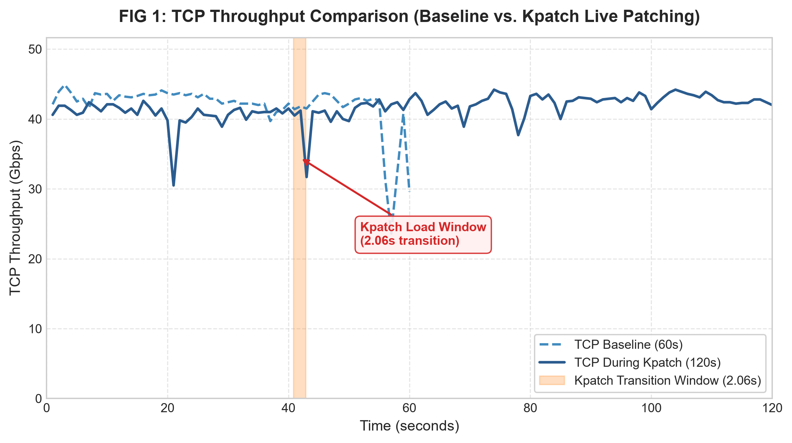
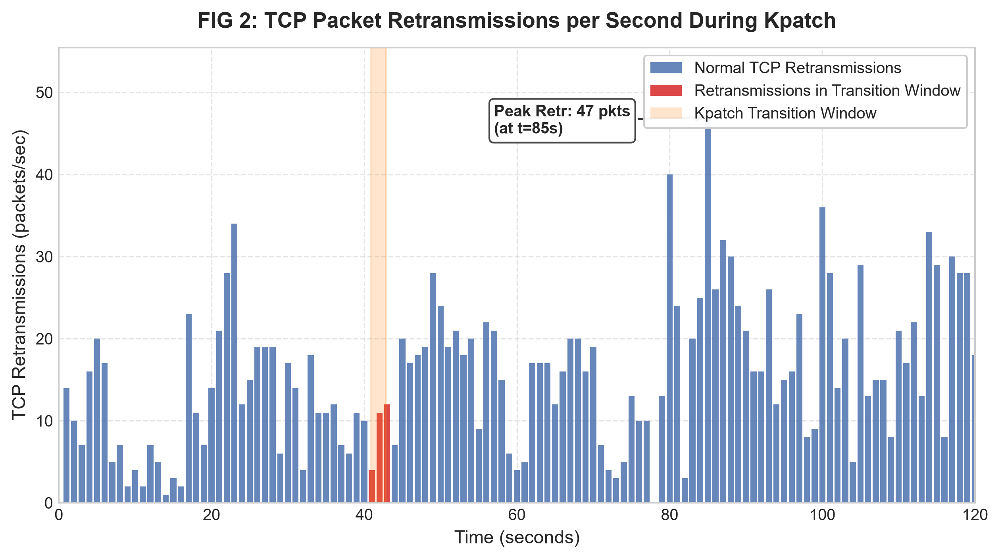
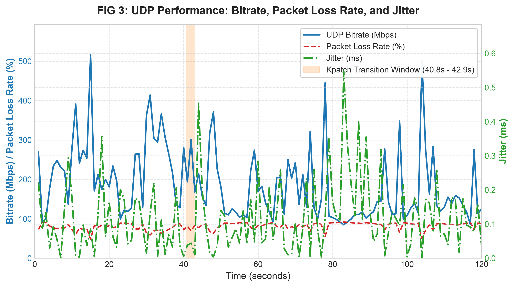
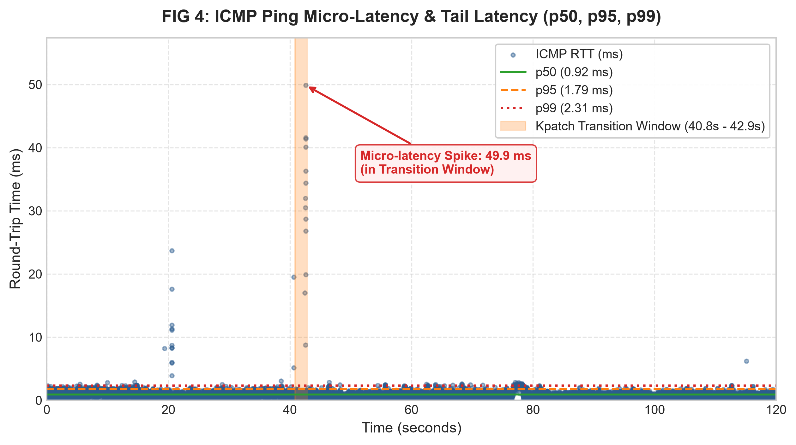

**1. Giai đoạn TRƯỚC khi vá (Before / Baseline): Từ giây 0 đến giây 40.8**
- **Trạng thái:** KVM Host chạy bình thường, chưa nạp patch.
- **Biểu hiện:**
    - TCP Throughput (Hình 1) chạy đều ở mức ~40–44 Gbps.
    - Ping Latency (Hình 4) nằm bẹp dưới đáy, độ trễ cực thấp < 1ms.
**2. Giai đoạn TRONG khi vá (During Transition): Vùng màu cam (giây 40.8 đến 42.9)**
- **Trạng thái:** Đúng 2.06 giây Host thực thi lệnh nạp patch và Kernel thực hiện tráo hàm (`ftrace`).
- **Biểu hiện gián đoạn:**
    - TCP Throughput (Hình 1) bị **võng xuống 34 Gbps**.
    - Ping Latency (Hình 4) xuất hiện **Spike bắn vọt lên 49.9 ms** (mất trọn vẹn trong khoảng màu cam).
**3. Giai đoạn SAU khi vá (After / Steady State): Từ giây 42.9 đến giây 120**
- **Trạng thái:** Quá trình chuyển tiếp hoàn tất (`transition complete`), Host đã chạy trên mã nguồn Kernel mới.
- **Biểu hiện:**
    - Băng thông TCP hồi phục ngay về mức đỉnh 40–44 Gbps.
    - Độ trễ Ping quay trở lại trạng thái bình thường (< 1ms).
### Riêng đường nét đứt ở Hình 1 (FIG 1)

- **Đường nét đứt `TCP Baseline (60s)`:** Là dữ liệu của bài test 60 giây chạy riêng trước đó. AI đã vẽ đè (overlay) nó lên cùng hệ trục với bài test 120s để bạn thấy: Lúc chưa vá (nét đứt) và lúc đang vá (nét liền) thì băng thông cơ bản không đổi, chỉ suy giảm đúng khoảnh khắc 2 giây ở vùng màu cam.

[Fast and Live Hypervisor Replacement](https://kartikgopalan.github.io/publications/doddamani19fast.pdf)

