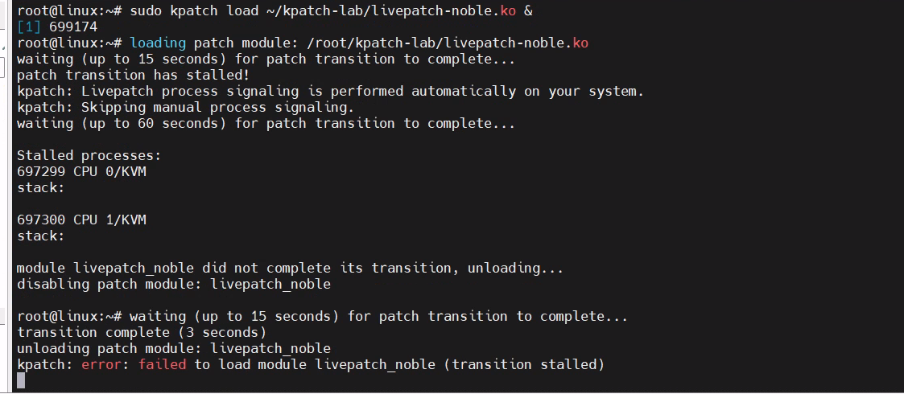
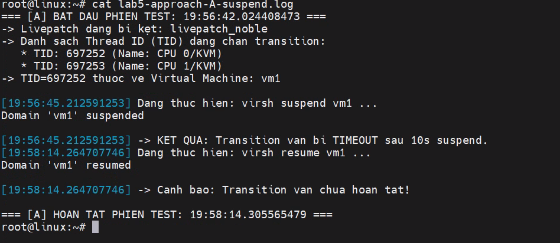
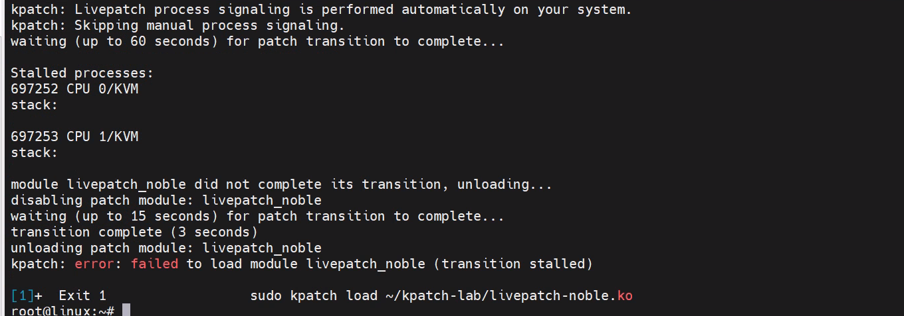
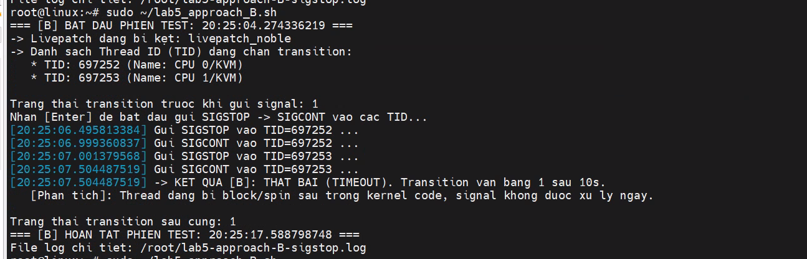

# Báo Cáo Thực Nghiệm Lab 5: Đánh Giá Các Cơ Chế Can Thiệp Khi Livepatch Transition Bị Kẹt

---

## 1. Thiết Lập Tiền Đề & Cấu Hình An Toàn

Trước khi kích hoạt kịch bản stall thời gian dài (120s), hệ thống bắt buộc cấu hình 2 cờ kernel sysctl để tránh Kernel Panic do cơ chế phát hiện treo CPU của Linux:

```bash
sysctl kernel.softlockup_panic
sysctl kernel.panic_on_rcu_stall
```

**Trạng thái môi trường:**

- Module `stall_sim.ko` được sửa timeout an toàn lên **120 giây** (dễ quan sát/test hơn), build lại (`make`) trước khi nạp.
- test

## 2. Vòng 5 — Cơ Chế `virsh suspend` / `resume`

### 2.1. Câu hỏi thực nghiệm

Libvirt có sẵn cơ chế `suspend`/`continue` (tạm dừng/tiếp tục 1 VM). Khi 1 VM đang là nguyên nhân gây stall transition, dùng `virsh suspend` rồi `virsh resume` ngay lập tức có giúp task đang kẹt có cơ hội chuyển patch không? Đồng thời đánh giá tradeoff về gián đoạn khi dùng cách này.

### 2.2. Cơ chế kỹ thuật

```bash
virsh suspend <vm-name>
```

Lệnh này gửi lệnh `stop` xuống QEMU monitor của đúng VM đó — yêu cầu **toàn bộ vCPU của VM dừng lại**, guest bị đóng băng hoàn toàn cho tới khi `virsh resume`.

### 2.3. Script thực nghiệm

```bash
cat << 'EOF' > ~/lab5_approach_A.sh
#!/bin/bash
# ===================================================================
# Lab 5 — Phuong an A: virsh suspend / resume
# ===================================================================

if [ "$(id -u)" -ne 0 ]; then
    echo "ERROR: Script yeu cau quyen root. Vui long chay: sudo bash $0"
    exit 1
fi

LOGFILE=~/lab5-approach-A-suspend.log
echo "=== [A] BAT DAU PHIEN TEST: $(date '+%H:%M:%S.%N') ===" | tee "$LOGFILE"

calc_diff() {
    awk -v end="$1" -v start="$2" 'BEGIN { printf "%.4f", end - start }'
}

is_timeout() {
    awk -v val="$1" -v limit="$2" 'BEGIN { if (val > limit) print 1; else print 0 }'
}

find_stalled_patch() {
    for t in /sys/kernel/livepatch/*/transition; do
        [ -r "$t" ] || continue
        val=$(cat "$t" 2>/dev/null)
        if [ "$val" = "1" ]; then
            dirname "$t"
            return 0
        fi
    done
    return 1
}

PATCH_DIR=$(find_stalled_patch)
if [ -z "$PATCH_DIR" ]; then
    echo "ERROR: Khong co patch nao dang o trang thai transition=1." | tee -a "$LOGFILE"
    echo "-> Hay chac chan da kich hoat stall va chay 'kpatch load' truoc." | tee -a "$LOGFILE"
    exit 1
fi
PATCH_NAME=$(basename "$PATCH_DIR")
echo "-> Livepatch dang bi ket: $PATCH_NAME" | tee -a "$LOGFILE"

find_blocking_tids() {
    for f in /proc/[0-9]*/task/[0-9]*/patch_state; do
        [ -r "$f" ] || continue
        state=$(cat "$f" 2>/dev/null)
        if [ "$state" = "0" ]; then
            echo "$f" | cut -d/ -f5
        fi
    done
}

BLOCKING_TIDS=$(find_blocking_tids)
if [ -z "$BLOCKING_TIDS" ]; then
    echo "ERROR: Khong tim thay vCPU thread nao co patch_state=0." | tee -a "$LOGFILE"
    exit 1
fi

echo "-> Danh sach Thread ID (TID) dang chan transition:" | tee -a "$LOGFILE"
for tid in $BLOCKING_TIDS; do
    comm=$(cat /proc/"$tid"/comm 2>/dev/null)
    echo "   * TID: $tid (Name: $comm)" | tee -a "$LOGFILE"
done

FIRST_TID=$(echo "$BLOCKING_TIDS" | head -1)

find_domain_for_tid() {
    local target_tid=$1
    for dom in $(virsh list --name --state-running 2>/dev/null); do
        [ -z "$dom" ] && continue

        local dom_pid=""
        if [ -f "/run/libvirt/qemu/${dom}.pid" ]; then
            dom_pid=$(cat "/run/libvirt/qemu/${dom}.pid" 2>/dev/null)
        elif [ -f "/var/run/libvirt/qemu/${dom}.pid" ]; then
            dom_pid=$(cat "/var/run/libvirt/qemu/${dom}.pid" 2>/dev/null)
        else
            dom_pid=$(pgrep -f "qemu.*${dom}" | head -1)
        fi

        [ -z "$dom_pid" ] && continue

        if [ -d "/proc/$dom_pid/task/$target_tid" ]; then
            echo "$dom"
            return 0
        fi
    done
    return 1
}

DOMAIN=$(find_domain_for_tid "$FIRST_TID")
if [ -z "$DOMAIN" ]; then
    echo "ERROR: Khong the map TID=$FIRST_TID ve Domain VM nao qua libvirt." | tee -a "$LOGFILE"
    exit 1
fi
echo "-> TID=$FIRST_TID thuoc ve Virtual Machine: $DOMAIN" | tee -a "$LOGFILE"

wait_transition_clear() {
    local timeout=$1
    local start=$(date +%s.%N)

    while true; do
        val=$(cat "$PATCH_DIR/transition" 2>/dev/null)
        if [ "$val" = "0" ]; then
            local end=$(date +%s.%N)
            calc_diff "$end" "$start"
            return 0
        fi

        now=$(date +%s.%N)
        elapsed=$(calc_diff "$now" "$start")
        if [ "$(is_timeout "$elapsed" "$timeout")" = "1" ]; then
            echo "TIMEOUT"
            return 1
        fi
        sleep 0.1
    done
}

echo "" | tee -a "$LOGFILE"
read -p "Nhan [Enter] de bat dau gui lenh suspend VM '$DOMAIN'..."

t0=$(date '+%H:%M:%S.%N')
echo "[$t0] Dang thuc hien: virsh suspend $DOMAIN ..." | tee -a "$LOGFILE"
virsh suspend "$DOMAIN" 2>&1 | tee -a "$LOGFILE"

res_suspend=$(wait_transition_clear 10)
if [ "$res_suspend" != "TIMEOUT" ]; then
    echo "[$t0] -> KET QUA: Transition da duoc giai phong sau ${res_suspend} giay!" | tee -a "$LOGFILE"
else
    echo "[$t0] -> KET QUA: Transition van bi TIMEOUT sau 10s suspend." | tee -a "$LOGFILE"
fi

echo "[$t0] Mo phong thoi gian gian doan (Downtime): Sleep 3 giay..."
sleep 3

t1=$(date '+%H:%M:%S.%N')
echo "[$t1] Dang thuc hien: virsh resume $DOMAIN ..." | tee -a "$LOGFILE"
virsh resume "$DOMAIN" 2>&1 | tee -a "$LOGFILE"

final_status=$(cat "$PATCH_DIR/transition" 2>/dev/null)
if [ "$final_status" = "0" ]; then
    echo "[$t1] -> Trang thai he thong: ON DINH (transition=0, VM running)." | tee -a "$LOGFILE"
else
    echo "[$t1] -> Canh bao: Transition van chua hoan tat!" | tee -a "$LOGFILE"
fi

echo "" | tee -a "$LOGFILE"
echo "=== [A] HOAN TAT PHIEN TEST: $(date '+%H:%M:%S.%N') ===" | tee -a "$LOGFILE"
echo "File log chi tiet: $LOGFILE"
EOF
```





### 2.4. Kết quả thực nghiệm thực tế

```text
=== [A] BAT DAU PHIEN TEST: 19:56:42.024408473 ===
-> Livepatch dang bi ket: livepatch_noble
-> Danh sach Thread ID (TID) dang chan transition:
   * TID: 697252 (Name: CPU 0/KVM)
   * TID: 697253 (Name: CPU 1/KVM)
-> TID=697252 thuoc ve Virtual Machine: vm1

[19:56:45.212591253] Dang thuc hien: virsh suspend vm1 ...
Domain 'vm1' suspended
[19:56:45.212591253] -> KET QUA: Transition van bi TIMEOUT sau 10s suspend.

[19:58:14.264707746] Dang thuc hien: virsh resume vm1 ...
Domain 'vm1' resumed
[19:58:14.264707746] -> Canh bao: Transition van chua hoan tat!

=== [A] HOAN TAT PHIEN TEST: 19:58:14.305565479 ===
```

### 2.5. Phân tích nguyên nhân kỹ thuật

**Kết luận: KHÔNG THÀNH CÔNG.** Lệnh `virsh suspend` không thể giải phóng transition khi task bị kẹt sâu trong kernel space.

**Nguyên nhân chi tiết:**

1. `virsh suspend` chỉ có thể tác động vào vCPU thread **tại thời điểm nó đang ở guest mode** (đang chạy code của guest OS) — nó hoạt động bằng cách đặt cờ (`cpu->stop = true`) thông qua QEMU monitor.
2. Cờ này chỉ được vCPU thread **tự đọc** ở 1 số điểm nhất định giữa các lần vào/ra guest mode (chuẩn bị tái nhập hoặc thoát khỏi `ioctl(KVM_RUN)`).
3. Khi vCPU thread đang bị `stall_sim.ko` giữ cứng bên trong kernel space của host (hàm `kvm_mmu_get_child_sp`), luồng này **không còn ở guest mode nữa**, và **chưa thể trở về userspace (QEMU)** để nhận biết lệnh suspend.
4. Call stack của hàm bị vá không được unwind (xả sạch) → livepatch engine (`klp_check_and_switch_task`) tiếp tục đọc thấy hàm cũ trên stack và duy trì `patch_state = 0`, khiến `transition` giữ nguyên giá trị `1` (TIMEOUT).

**Tradeoff gián đoạn:** Dù không giải quyết được vấn đề gốc, `virsh suspend` vẫn gây gián đoạn **toàn bộ VM** trong suốt thời gian suspend (mọi vCPU, mọi tiến trình guest đều đứng hình) — chi phí gián đoạn cao nhưng không mang lại lợi ích tương xứng cho tình huống stall trong kernel host. Lệnh `suspend` chỉ thực sự dừng được VM **sau khi** vCPU thread tự thoát ra khỏi vùng đang kẹt — không hề rút ngắn được thời gian kẹt.

---

## 3. Vòng 6 — `SIGSTOP` / `SIGCONT` dưới host thay cho `force`

### 3.1. Câu hỏi thực nghiệm

Có thể dùng `kill -SIGSTOP`/`kill -SIGCONT` trực tiếp lên đúng thread đang kẹt (thay vì ghi `1` vào `force`) để ép transition hoàn tất không?

### 3.2. Cơ chế kỹ thuật

```bash
kill -SIGSTOP <TID_đang_kẹt>
kill -SIGCONT <TID_đang_kẹt>
```

Gửi tín hiệu tạm dừng rồi tiếp tục ngay cho đúng **thread ID** (không phải PID của tiến trình QEMU, mà đúng TID của vCPU thread cụ thể).

### 3.3. Script thực nghiệm

```bash
cat << 'EOF' > ~/lab5_approach_B.sh
#!/bin/bash
# ===================================================================
# Lab 5 — Phuong an B: SIGSTOP / SIGCONT truc tiep vao vCPU Thread
# Co che: Gui tin hieu dung (STOP) va chay tiep (CONT) vao dung Thread ID
#         dang chan transition de xem signal co ep task di qua safe point
#         thay the duoc co 'force' hay khong.
# ===================================================================

if [ "$(id -u)" -ne 0 ]; then
    echo "ERROR: Script yeu cau quyen root. Vui long chay: sudo bash $0"
    exit 1
fi

LOGFILE=~/lab5-approach-B-sigstop.log
echo "=== [B] BAT DAU PHIEN TEST: $(date '+%H:%M:%S.%N') ===" | tee "$LOGFILE"

calc_diff() {
    awk -v end="$1" -v start="$2" 'BEGIN { printf "%.4f", end - start }'
}

is_timeout() {
    awk -v val="$1" -v limit="$2" 'BEGIN { if (val > limit) print 1; else print 0 }'
}

find_stalled_patch() {
    for t in /sys/kernel/livepatch/*/transition; do
        [ -r "$t" ] || continue
        val=$(cat "$t" 2>/dev/null)
        if [ "$val" = "1" ]; then
            dirname "$t"
            return 0
        fi
    done
    return 1
}

PATCH_DIR=$(find_stalled_patch)
if [ -z "$PATCH_DIR" ]; then
    echo "ERROR: Khong co patch nao dang o trang thai transition=1." | tee -a "$LOGFILE"
    echo "-> Hay chac chan da kich hoat stall_sim va load livepatch truoc." | tee -a "$LOGFILE"
    exit 1
fi
PATCH_NAME=$(basename "$PATCH_DIR")
echo "-> Livepatch dang bi ket: $PATCH_NAME" | tee -a "$LOGFILE"

find_blocking_tids() {
    for f in /proc/[0-9]*/task/[0-9]*/patch_state; do
        [ -r "$f" ] || continue
        state=$(cat "$f" 2>/dev/null)
        if [ "$state" = "0" ]; then
            echo "$f" | cut -d/ -f5
        fi
    done
}

BLOCKING_TIDS=$(find_blocking_tids)
if [ -z "$BLOCKING_TIDS" ]; then
    echo "ERROR: Khong tim thay Thread ID (TID) nao co patch_state=0." | tee -a "$LOGFILE"
    exit 1
fi

echo "-> Danh sach Thread ID (TID) dang chan transition:" | tee -a "$LOGFILE"
for tid in $BLOCKING_TIDS; do
    comm=$(cat /proc/"$tid"/comm 2>/dev/null)
    echo "   * TID: $tid (Name: $comm)" | tee -a "$LOGFILE"
done

wait_transition_clear() {
    local timeout=$1
    local start=$(date +%s.%N)

    while true; do
        val=$(cat "$PATCH_DIR/transition" 2>/dev/null)
        if [ "$val" = "0" ]; then
            local end=$(date +%s.%N)
            calc_diff "$end" "$start"
            return 0
        fi

        now=$(date +%s.%N)
        elapsed=$(calc_diff "$now" "$start")
        if [ "$(is_timeout "$elapsed" "$timeout")" = "1" ]; then
            echo "TIMEOUT"
            return 1
        fi
        sleep 0.1
    done
}

echo "" | tee -a "$LOGFILE"
echo "Trang thai transition truoc khi gui signal: $(cat "$PATCH_DIR/transition")" | tee -a "$LOGFILE"
read -p "Nhan [Enter] de bat dau gui SIGSTOP -> SIGCONT vao cac TID..."

for tid in $BLOCKING_TIDS; do
    t0=$(date '+%H:%M:%S.%N')
    echo "[$t0] Gui SIGSTOP vao TID=$tid ..." | tee -a "$LOGFILE"
    kill -STOP "$tid" 2>/dev/null

    sleep 0.5

    t1=$(date '+%H:%M:%S.%N')
    echo "[$t1] Gui SIGCONT vao TID=$tid ..." | tee -a "$LOGFILE"
    kill -CONT "$tid" 2>/dev/null
done

res_signal=$(wait_transition_clear 10)
if [ "$res_signal" != "TIMEOUT" ]; then
    echo "[$t1] -> KET QUA [B]: THANH CONG! Transition da giai phong sau ${res_signal} giay!" | tee -a "$LOGFILE"
else
    echo "[$t1] -> KET QUA [B]: THAT BAI (TIMEOUT). Transition van bang 1 sau 10s." | tee -a "$LOGFILE"
    echo "   [Phan tich]: Thread dang bi block/spin sau trong kernel code, signal khong duoc xu ly ngay." | tee -a "$LOGFILE"
fi

final_status=$(cat "$PATCH_DIR/transition" 2>/dev/null)
echo "" | tee -a "$LOGFILE"
echo "Trang thai transition sau cung: $final_status" | tee -a "$LOGFILE"
echo "=== [B] HOAN TAT PHIEN TEST: $(date '+%H:%M:%S.%N') ===" | tee -a "$LOGFILE"
echo "File log chi tiet: $LOGFILE"
EOF

chmod +x ~/lab5_approach_B.sh
sudo ~/lab5_approach_B.sh
# chạy khi đã stress VM, chạy stall_sim, và đã kpatch load
```


### 3.4. Đánh giá — có thay thế được `force` không

**Kết luận: KHÔNG thay thế được `force` — trong đúng kịch bản lab đang mô phỏng (`stall_sim.ko` giữ cứng task).**

**Lý do 1 — bản chất tín hiệu là "xin phép", không phải "ép buộc":** kernel chỉ thực sự xử lý tín hiệu đang chờ tại **những điểm kiểm tra cố định** (chủ yếu lúc task chuẩn bị return về userspace, hoặc lúc task tự nguyện gọi các hàm kiểm tra work-pending). Task đang chạy liên tục trong 1 vòng lặp kernel không tự nguyện dừng lại để "nhìn" tín hiệu — `SIGSTOP` gửi tới **vẫn phải đợi đúng điểm kiểm tra đó**, giống hệt hạn chế mà cơ chế tự động của chính livepatch (gửi "fake signal" định kỳ) đã gặp phải.

**Lý do 2 — về bản chất, đây là việc kernel livepatch đã tự làm sẵn:** cơ chế "gửi signal cho task treo" (bao gồm cả `SIGSTOP`/`SIGCONT`) là hành vi mà chính công cụ `kpatch load` **đã tự động thực hiện** khi phát hiện transition treo quá thời gian chờ, trước khi quyết định rollback. Tự tay làm lại việc này bằng `kill` không tạo ra tác dụng gì mới, không "mạnh" hơn cơ chế đã có sẵn.

**Khác biệt bản chất với `force`:** `force` **không cố ép** task thoát ra khỏi vị trí đang đứng — nó **bỏ qua hẳn** bước kiểm tra, trực tiếp đánh dấu hành chính "coi như task đã chuyển", bất kể vị trí thực tế của task. Đây là lý do `force` là cơ chế **duy nhất** thực sự "làm được việc" khi task bị kẹt cứng không có cách nào tự thoát ra (như tình huống `stall_sim.ko` mô phỏng) — đồng thời cũng là lý do `force` **nguy hiểm hơn** (chấp nhận rủi ro thay vì xác minh thật).

### 3.5. Lưu ý trung thực — điểm chưa chắc chắn 100%, cần đo thêm

Kết luận "SIGSTOP không giúp gì" ở trên **chắc chắn đúng cho đúng kịch bản `stall_sim.ko`** (task bị giữ cứng bằng vòng lặp ngay trong hàm, không đi qua bất kỳ điểm kiểm tra nào). Nhưng với **1 vCPU thread thật đang chạy tải nặng bình thường** (không bị `stall_sim` giữ), vòng lặp `vcpu_run` của KVM có đoạn code **tự kiểm tra và xử lý công việc đang chờ** (`xfer_to_guest_mode_work`) giữa các lần vào guest mode — hiện **chưa xác nhận được** liệu đoạn này có xử lý luôn tín hiệu `SIGSTOP` đang chờ hay không, hay chỉ xử lý riêng tín hiệu nội bộ của livepatch. Đây là câu hỏi cần **tự đo thực nghiệm trên host thật** (không dùng `stall_sim`, để VM chạy tải nặng bình thường rồi thử SIGSTOP), không nên khẳng định chắc 100% chỉ dựa vào suy luận.

---

## 4. Bảng So Sánh Tổng Hợp — Vị Trí Của Từng Phương Án Trong Thang Xử Lý

|Phương án|Bản chất|Có ép được task thoát khỏi vị trí kẹt cứng không|
|---|---|---|
|Chờ tự nhiên / fake-signal của kernel|Xin phép, đợi checkpoint|Không|
|`virsh suspend`/`resume`|Xin phép, chỉ tác động ở guest mode|Không|
|`SIGSTOP`/`SIGCONT` tay|Xin phép, cùng cơ chế checkpoint|Không (đã xác nhận với `stall_sim.ko`; với vCPU thật tải nặng vẫn là câu hỏi mở, xem Mục 3.5)|
|`force`|Bỏ qua kiểm tra, đánh dấu hành chính|Có (nhưng đánh đổi bằng rủi ro an toàn)|

**Khuyến nghị đưa vào quy trình xử lý sự cố thật:** nên thử đủ 3 phương án "xin phép" trước (đã có bằng chứng đo đạc), sau đó ưu tiên **rollback an toàn** (`echo 0 > enabled`, huỷ transition, quay về bản gốc) trước khi cân nhắc `force` — vì rollback không có rủi ro, còn `force` cần được nhà phát hành patch phê duyệt trước khi dùng trên production thật.