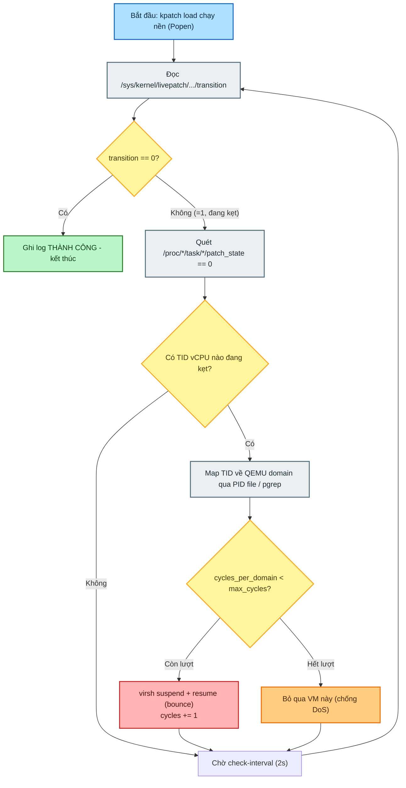

# Lab 5 — Domain-Aware Livepatch Auto-Mitigation Engine

**Loại:** Script tự động hóa (Python + bash wrapper) **Bối cảnh:** Kpatch/livepatch trên KVM MMU CVE, ràng buộc zero-downtime, môi trường có nhiều VM chạy song song. **File:** `auto_patch_monitor.py`

---

## 1. Mục tiêu & vấn đề giải quyết

**Vấn đề thực tế:** Khi nạp bản vá nhân KVM bằng `kpatch load`, nếu các luồng vCPU của VM đang chạy tải nặng hoặc không chịu thoát ra userspace, quá trình chuyển đổi (transition) livepatch bị kẹt vô thời hạn ở tầng kernel, hoặc bị `kpatch` tự động hủy sau khi hết timeout.

**Thao tác thủ công trước đây:**

- Mở thêm terminal, dùng `grep`/`bash` lùng sục từng file `/proc/*/task/*/patch_state` để tìm TID mang giá trị `0`.
- So sánh PID để xác định TID đó thuộc VM nào.
- Tự tay gõ lệnh can thiệp (suspend/resume, signal...).

**Tính năng này giải quyết:** Tự động nạp patch → tự động phát hiện kẹt → tự động khoanh vùng chính xác VM gây nghẽn → tự động thực hiện kỹ thuật giải phóng với downtime ở mức mili-giây, có rate-limit để không lạm dụng.

---

## 2. Kiến trúc — 4 trụ cột kỹ thuật

### 2.1. Async Loader & Polling Engine

- `kpatch load` được tách thành tiến trình con bất đồng bộ qua `subprocess.Popen`, tránh việc script chính bị block khi lệnh này stall.
- Script poll trực tiếp `/sys/kernel/livepatch/<patch_name>/transition` theo chu kỳ `--check-interval` (mặc định 2s):
    - `1` → đang kẹt, kích hoạt chuỗi phản ứng giải cứu.
    - `0` → toàn bộ hệ thống đã chuyển patch xong, kết thúc phiên an toàn.
    - Ngoài ra còn theo dõi `enabled` — nếu về `0` nghĩa là patch đã bị abort/rollback, dừng script ngay.

### 2.2. Kernel Introspection & Domain Mapping

Không can thiệp mù quáng vào toàn hệ thống mà nhắm đúng nguồn gây nghẽn:

- **Quét cấp thấp** (`find_stalled_domain_vcpus`): đọc `/proc/<PID>/task/<TID>/patch_state` của toàn bộ VM đang chạy (`virsh list --name --state-running`), lọc các TID mang giá trị `0` **và** có `comm` chứa cả `"CPU"` lẫn `"KVM"` — tức chỉ nhắm đúng thread vCPU, không đụng vào emulator/iothread hay các thread khác của QEMU.
- **Ánh xạ ngược về domain**: lấy PID tiến trình QEMU của domain qua `/run/libvirt/qemu/<domain>.pid` (hoặc fallback `pgrep -f 'qemu.*<domain>'`), rồi kiểm tra TID có nằm trong `/proc/<QEMU_PID>/task/` hay không.
- **Gom nhóm** theo domain dạng `{"vm1": ["697252", "697253"], "vm2": ["698110"]}` — chỉ tương tác với VM thực sự đang gây nghẽn.

### 2.3. Kỹ thuật can thiệp "Bounce" suspend/resume (micro-downtime)

Thay cho cách thử nghiệm ban đầu dùng `sleep 3s` (gây đóng băng VM rõ rệt):

```bash
virsh suspend <domain> && virsh resume <domain>
```

- `virsh suspend` đặt cờ `cpu->stop = true` trong QEMU monitor, cưỡng bức vCPU thread thoát khỏi guest mode và ra khỏi vòng lặp sự kiện userspace của QEMU.
- Ngay khi vCPU chạm ranh giới userspace, host kernel stack của thread đó được giải phóng sạch (không còn frame của các hàm KVM MMU đang patch) — đây chính là điểm mà livepatch coi là an toàn để flip `patch_state`.
- `resume` được gọi ngay sau đó nên downtime cảm nhận được ở phía guest chỉ ở mức mili-giây.

> Lưu ý kỹ thuật: cơ chế này về bản chất cùng họ với hướng "ép task rời CPU tại một điểm rồi kỳ vọng stack sạch" đã phân tích ở phần throttle cgroup / SIGSTOP-SIGCONT trước đó — khác biệt là suspend/resume ép thoát hẳn ra userspace boundary (checkpoint tường minh, đáng tin hơn) thay vì ép dequeue ở một tick ngẫu nhiên (checkpoint xác suất). Đây là lý do bounce có tỷ lệ thành công cao hơn throttle cgroup thuần túy trong thực nghiệm.

### 2.4. Cơ chế tự vệ chống DoS máy ảo (Anti-DoS & rate limiting)

Nếu không giới hạn, một VM kẹt sâu (deadlock/lock contention thật trong kernel host) sẽ bị bounce liên tục hàng trăm lần, có nguy cơ làm gián đoạn dịch vụ bên trong guest:

- `cycles_per_domain`: đếm số lần can thiệp trên từng VM riêng biệt.
- `--max-cycles-per-domain` (mặc định 10): khi vượt ngưỡng mà vẫn kẹt, script đưa VM vào diện bỏ qua, chuyển sang quan sát thụ động — coi đây là tín hiệu lỗi kernel sâu hơn (deadlock/lock contention) chứ không phải do vCPU bận tải bình thường.
- `--global-timeout` (mặc định 40s trong ví dụ chạy, tài liệu gốc ghi 120s): đảm bảo script không chạy vô tận nếu hệ thống gặp sự cố không tự khắc phục được.

---

## 3. Luồng quyết định



---

## 4. Script đầy đủ

```python
#!/usr/bin/env python3
# ===================================================================
# Lab 5: Auto Livepatch Mitigation — Quet Dich Danh vCPU cua tung VM
# ===================================================================

import argparse
import os
import re
import subprocess
import sys
import time
from collections import defaultdict


def log(msg, logfile):
    ts = time.strftime("%H:%M:%S") + f".{int((time.time() % 1) * 1e6):06d}"
    line = f"[{ts}] {msg}"
    print(line)
    logfile.write(line + "\n")
    logfile.flush()


def run(cmd, timeout=3):
    """Chay lenh shell voi timeout 3s de tranh bi block khi vCPU bi lock."""
    try:
        result = subprocess.run(cmd, shell=True, capture_output=True, text=True, timeout=timeout)
        return result.returncode, (result.stdout or "").strip(), (result.stderr or "").strip()
    except subprocess.TimeoutExpired:
        return -1, "", f"COMMAND_TIMEOUT (Lenh bi treo qua {timeout}s)"


def patch_name_from_ko(ko_path):
    base = os.path.basename(ko_path)
    base = re.sub(r"\.ko$", "", base)
    return base.replace("-", "_")


def load_patch(ko_path, logfile):
    log(f"Dang chay: kpatch load {ko_path}", logfile)
    return subprocess.Popen(
        ["sudo", "kpatch", "load", ko_path],
        stdout=subprocess.PIPE,
        stderr=subprocess.STDOUT,
        text=True,
    )


def read_sysfs(path):
    try:
        with open(path) as f:
            return f.read().strip()
    except (FileNotFoundError, PermissionError):
        return None


def get_running_domains():
    rc, out, _ = run("virsh list --name --state-running", timeout=3)
    if rc != 0:
        return []
    return [d for d in out.splitlines() if d.strip()]


def get_domain_pid(domain):
    for path in (f"/run/libvirt/qemu/{domain}.pid", f"/var/run/libvirt/qemu/{domain}.pid"):
        if os.path.isfile(path):
            try:
                with open(path) as f:
                    return f.read().strip()
            except (FileNotFoundError, PermissionError):
                pass
    rc, out, _ = run(f"pgrep -f 'qemu.*{domain}'", timeout=3)
    if rc == 0 and out:
        return out.splitlines()[0].strip()
    return None


def find_stalled_domain_vcpus():
    """
    CHI QUET DICH DANH CAC VM DANG CHAY.
    Loc chinh xac cac luong vCPU (CPU */KVM) co patch_state == 0.
    """
    stalled_by_domain = defaultdict(list)
    running_domains = get_running_domains()

    for domain in running_domains:
        dom_pid = get_domain_pid(domain)
        if not dom_pid:
            continue

        task_dir = f"/proc/{dom_pid}/task"
        if not os.path.isdir(task_dir):
            continue

        try:
            tid_list = os.listdir(task_dir)
        except (FileNotFoundError, PermissionError):
            continue

        for tid in tid_list:
            state_path = f"{task_dir}/{tid}/patch_state"
            comm_path = f"{task_dir}/{tid}/comm"

            try:
                with open(state_path) as f:
                    state = f.read().strip()

                # Chi kiem tra neu thread chua duoc switch (state = 0)
                if state == "0":
                    with open(comm_path) as f:
                        comm = f.read().strip()

                    # Chi xac nhan day la luong vCPU cua VM can can thiep
                    if "CPU" in comm and "KVM" in comm:
                        stalled_by_domain[domain].append(f"{tid}({comm})")
            except (FileNotFoundError, PermissionError):
                continue

    return stalled_by_domain


def suspend_resume_domain(domain, logfile):
    rc1, out1, err1 = run(f"virsh suspend {domain}", timeout=3)
    log(f"virsh suspend {domain} -> rc={rc1} out={out1!r} err={err1!r}", logfile)

    rc2, out2, err2 = run(f"virsh resume {domain}", timeout=3)
    log(f"virsh resume {domain} (ngay lap tuc) -> rc={rc2} out={out2!r} err={err2!r}", logfile)

    return rc1 == 0 and rc2 == 0


def main():
    parser = argparse.ArgumentParser(description="Targeted vCPU Livepatch Monitor")
    parser.add_argument("ko_path", help="Duong dan file .ko cua livepatch")
    parser.add_argument("--global-timeout", type=float, default=40, help="Timeout tong (giay)")
    parser.add_argument("--check-interval", type=float, default=2.0, help="Chu ky quet (giay)")
    parser.add_argument("--max-cycles-per-domain", type=int, default=10, help="So lan can thiep toi da / VM")
    args = parser.parse_args()

    if os.geteuid() != 0:
        print("Can chay bang sudo.")
        sys.exit(1)

    logpath = os.path.expanduser("~/auto-patch-monitor.log")
    logfile = open(logpath, "a")
    log("=== BAT DAU PHIEN TU DONG HOA (TARGETED vCPU) ===", logfile)

    patch_name = patch_name_from_ko(args.ko_path)
    proc = load_patch(args.ko_path, logfile)

    transition_path = None
    enabled_path = f"/sys/kernel/livepatch/{patch_name}/enabled"
    wait_start = time.time()
    while transition_path is None and (time.time() - wait_start) < 10:
        path = f"/sys/kernel/livepatch/{patch_name}/transition"
        if os.path.isfile(path):
            transition_path = path
            break
        time.sleep(0.2)

    if transition_path is None:
        log(f"ERROR: khong tim thay node transition cho patch {patch_name} sau 10s.", logfile)
        sys.exit(1)

    cycles_per_domain = defaultdict(int)
    start_time = time.time()
    resolved = False

    while (time.time() - start_time) < args.global_timeout:
        val = read_sysfs(transition_path)
        enabled_val = read_sysfs(enabled_path)

        # Neu kpatch load that bai va bat dau rollback go bo, dung ngay lap tuc
        if enabled_val == "0":
            log("[-] Phat hien Livepatch da bi abort/rollback (enabled=0). Ngung script.", logfile)
            break

        if val == "0":
            log("Transition da HOAN TAT — khong con bi ket.", logfile)
            resolved = True
            break

        if val is None:
            log("Khong doc duoc transition (patch da bi go). Dung.", logfile)
            break

        # Quet dich danh vCPU cac VM dang chay
        stalled_domains = find_stalled_domain_vcpus()
        total_stalled_tids = sum(len(tids) for tids in stalled_domains.values())

        if total_stalled_tids == 0:
            time.sleep(args.check_interval)
            continue

        log(f"Phat hien {total_stalled_tids} vCPU dang chan: {dict(stalled_domains)}", logfile)

        for domain, tids in stalled_domains.items():
            if cycles_per_domain[domain] >= args.max_cycles_per_domain:
                log(f"Domain '{domain}' dat gioi han {args.max_cycles_per_domain} lan -> Bo qua de tranh DoS.", logfile)
                continue

            log(f"Domain '{domain}' co {len(tids)} vCPU dang chan -> Bounce suspend/resume (Lan {cycles_per_domain[domain] + 1})", logfile)
            suspend_resume_domain(domain, logfile)
            cycles_per_domain[domain] += 1

        # Do lai sau can thiep
        after_stalled = find_stalled_domain_vcpus()
        after_total = sum(len(tids) for tids in after_stalled.values())
        log(f"Truoc can thiep: {total_stalled_tids} vCPU -> Sau can thiep con: {after_total} vCPU ket", logfile)

        time.sleep(args.check_interval)

    log("", logfile)
    log("=== TONG KET ===", logfile)
    log(f"Ket qua cuoi cung: {'DA GIAI QUYET' if resolved else 'VAN CON KET (Timeout hoac Abort)'}", logfile)
    log(f"Tong thoi gian chay: {time.time() - start_time:.2f}s", logfile)

    if proc.poll() is None:
        log("Luu y: kpatch load van dang cho trong nen.", logfile)
    else:
        out, _ = proc.communicate()
        log(f"Output kpatch load: {out}", logfile)

    logfile.close()


if __name__ == "__main__":
    main()
```

---

## 5. Cách chạy

```bash
sudo python3 ~/auto_patch_monitor.py ~/kpatch-lab/livepatch-noble.ko \
    --global-timeout 40 \
    --check-interval 2.0 \
    --max-cycles-per-domain 10
```

- Quét mỗi 2 giây.
- Mỗi VM tối đa 10 lần bounce.
- Tổng thời gian script chạy tối đa 40 giây trước khi tự dừng dù chưa xong.

Log ghi tại `~/auto-patch-monitor.log`.

---

## 6. Ranh giới khả năng & giới hạn thực tế

|Tình huống thực tế|Phản ứng của script|Kết quả|
|---|---|---|
|Guest VM chạy tải tính toán nặng (`stress-ng`)|Bounce 1–2 lần để kéo vCPU ra userspace|Thành công — transition về `0` nhanh|
|Kẹt sâu trong nhân host (deadlock/lock contention thật)|Bounce đủ 10 chu kỳ mà transition không đổi, dừng can thiệp VM đó|Báo kẹt an toàn — tín hiệu cho biết đây là lỗi kernel sâu, không phải do tải, tránh crash VM do bounce vô tội vạ|
|Livepatch ảnh hưởng tới daemon userspace ngoài host|Nhận diện TID không map được vào domain nào (`unmapped`), không gửi lệnh nhầm vào VM|An toàn — không đụng vào VM vô can|

**Giới hạn cần lưu ý khi đánh giá:**

1. Bounce suspend/resume vẫn là kỹ thuật "ép qua checkpoint", không phải bằng chứng patch đã an toàn về mặt semantic — nếu patch thay đổi invariant giữa old/new function (không chỉ sửa lỗi logic đơn thuần), một vCPU vừa thoát khỏi old code path ngay trước lúc suspend vẫn có thể để lại trạng thái không nhất quán.
2. Rate-limit theo domain bảo vệ khỏi DoS nhưng không phân biệt được "VM đang tải nặng bình thường" với "VM đang thực sự deadlock" — cả hai đều có thể chạm ngưỡng `max-cycles` như nhau, cần đọc log thủ công để phân loại.
3. Bộ lọc `"CPU" in comm and "KVM" in comm` phụ thuộc vào quy ước đặt tên thread của QEMU (`CPU N/KVM`) — nếu QEMU version khác đổi format tên thread, bộ lọc này sẽ không bắt được vCPU thread nữa, cần verify lại bằng `cat /proc/<pid>/task/*/comm` trước khi tin tưởng script trên môi trường khác.